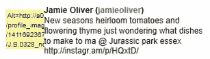
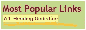
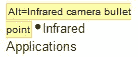
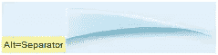
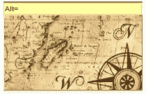
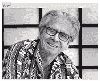
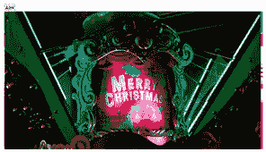
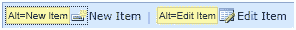
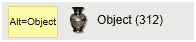
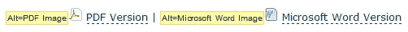

# WCAG2 的隐藏金块:何时不使用 ALT 属性

> 原文：<https://www.sitepoint.com/the-hidden-nuggets-of-wcag2-when-not-to-use-alt-attributes/>

那么，什么时候应该使用 ALT 属性呢？

简而言之:从来没有。

如果你有一个 IMG 元素，你必须 ***总是*** 有一个 ALT 属性。一直都是。没有如果，没有但是，没有可能。

### 但是 WCAG2 说…

有开发人员来找我，坚持说 WCAG2 说没有`ALT`属性也没关系。他们指的是成功标准 1.1.1 的一节，其中说:

> **修饰，格式化，不可见:**如果非文本内容是纯修饰，仅用于可视化格式化，或者不呈现给用户，那么它是以一种可以被辅助技术忽略的方式实现的。

这些开发者认为这意味着当元素实际上没有意义时，可以省略 ALT 属性。事实上，WCAG2 非常明确地指出，如果图像没有传达任何信息，那么就应该对其进行编码，以便辅助技术可以忽略它。

这并不意味着不应该有 ALT 属性，而是意味着 ALT 属性应该为空。

H67 的[具体手法是:](https://www.w3.org/TR/2010/NOTE-WCAG20-TECHS-20101014/H67)

> 对于 at(辅助技术)应该忽略的图像，在 img 元素上使用空 alt 文本和无 title 属性

根据 WCAG2，如果你有一个空的(或“null”)ALT 属性，你只能让一个辅助技术忽略你的图像——也就是:`alt=""`。WCAG2 通过纳入[故障 38](https://www.w3.org/TR/2010/NOTE-WCAG20-TECHS-20101014/F38) 强调了这一点:

> 由于省略了 HTML 中仅用于装饰目的的非文本内容的 alt-属性，未能达到成功标准 1.1.1

### 什么时候应该使用空的 ALT 属性？

当图像没有传达任何信息时，应该使用空的 ALT 属性。但是要小心——我见过有人将这种做法推向极端。只有像边框或间隔图像这样的图像才应该有空的 ALT 属性。在大多数情况下，一个图像需要一个 ALT 属性——如果你不确定是否应该有一个 ALT 属性，为了谨慎起见，还是使用一个吧。

下面是一些图片应该具有空 ALT 属性的例子:

间隔 GIF:

下划线功能:

要点:

装饰图像:

然而，在上面的所有例子中，最好遵循技术 C9: [使用 CSS 来包含装饰图像](https://www.w3.org/TR/2010/NOTE-WCAG20-TECHS-20101014/C9)。

### 什么是装饰图像？

最后一个例子是用于纯粹装饰的图像。WCAG2 将纯装饰定义为:

> 仅用于美学目的，不提供任何信息，没有任何功能
> 
> *注意:*如果文字可以在不改变其用途的情况下重新排列或替换，则文字只是纯粹的装饰。
> 
> *例子:*字典的封面，背景中很浅的文字里有随机的词。

以下是一些具有空 ALT 属性的图像示例。在所有这些例子中，图像没有传达很多信息，但它们仍然是**而不是** *纯粹的装饰*。它们传达一些信息，需要描述性的 ALT 属性。

ALT 属性应为“旧样式地图”

ALT 属性应为“戴眼镜的老人对着镜头微笑”

ALT 属性应为“圣诞快乐”

### 制定规则的例外

唯一的例外是当你有一个链接到一个页面的图片，旁边有一个链接到同一个页面的文本链接。在这种情况下，图像和文本应该包含在同一个 HREF 元素中，并且 ALT 属性应该为空。例如，以下内容应该都有空的 ALT 属性:

希望这将帮助您做出正确的选择，什么时候给图像一个空的 ALT 属性，以便屏幕阅读器忽略它，或者给图像一个有意义的信息来帮助用户。

然而，这并不是 ALT 属性的全部内容。

下周，我会有更多关于 ALT 属性的怪异而奇妙的世界。

## 分享这篇文章