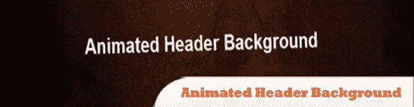
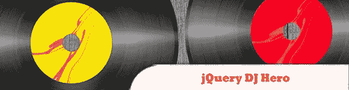
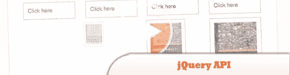
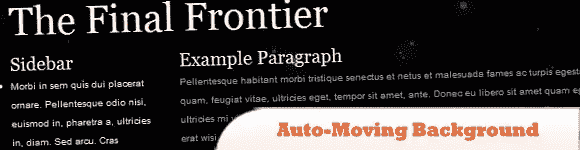
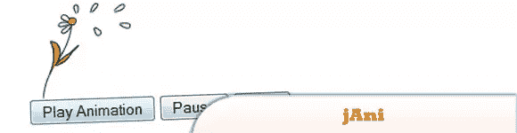
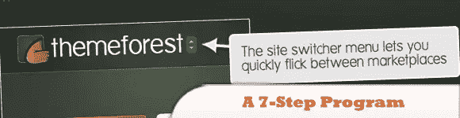
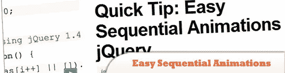
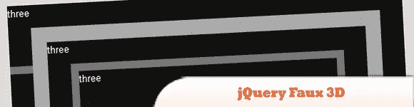
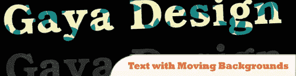
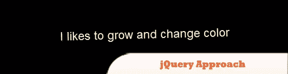

# 10 个令人惊叹的 jQuery 移动效果

> 原文：<https://www.sitepoint.com/10-awesome-jquery-moving-effects/>

今天的插件列表涵盖了 jQuery 移动特效，这些特效要么是为了好玩，要么是为了美化网站的外观。有什么比用 jQuery 让事情动起来更好的呢？**这确实是迄今为止最好的 jQuery 插件/脚本列表之一**。一定要看看第八条。尽情享受吧！

相关帖子:

*   **jQuery 视差动画背景演示**
*   [**10 酷 jQuery 动画教程**](http://www.jquery4u.com/tutorials/10-cool-jquery-animation-tutorials/)

## 1.动画标题背景

本教程将向你展示如何使用 jQuery 来制作标题背景图片的动画，给你的网站增添一些额外的东西。

  
[源+演示](http://www.devirtuoso.com/2009/07/how-to-build-an-animated-header-in-jquery/)

## 2.jQuery DJ 英雄

使用 jQuery 和 CSS3 重新创建 DJ Hero 功能。

  
[源+演示](http://www.jquerycode.com/videos/jquery-dj-hero/)

## 3.jQuery API

其中包括常用的简单、标准的动画，以及制作复杂的自定义效果的能力。在这一章中，我们将仔细检查每个效果方法，揭示 jQuery 为用户提供可视化反馈的所有机制。

  
[源+演示](http://api.jquery.com/category/effects/)

## 4.自动移动视差背景

如果你查看演示，你会看到背景星星在移动。

[演示](http://css-tricks.com/examples/StarryNightMoving/)

## 5 .杰米

是一个简单的 jQuery 插件，允许你制作背景图片动画。这个插件基本上是动画 GIF 的替代品，但是有几个好处。

[演示](http://www.ajaxblender.com/script-sources/jani/demo/index.html)

## 6.jQuery 动画:7 步程序

NetTuts+的家伙们提供了很好的 jQuery 技巧，在这里可以找到一些优雅的效果。

  
[来源](http://net.tutsplus.com/tutorials/javascript-ajax/jquery-animations-a-7-step-program/)
[演示](http://nettuts.s3.amazonaws.com/532_animations/demo/code.html)

## 7.jQuery 中简单的连续动画

对初学者有用的 jQuery 技巧，帮助他们开始制作自己的效果。

  
[来源](http://net.tutsplus.com/tutorials/javascript-ajax/quick-tip-easy-sequential-animations-in-jquery/)
[演示](http://jsbin.com/idizi)

## 8.jQuery 假 3D

通过简单地将不同的盒子一个接一个地放置，您可以用纯 jQuery 生成一个漂亮的 3D 动画。

  
[源+演示](http://nemoorange.com/newmoon/jquery-faux-3d-viewport#9)

## 9.背景移动的文本

很棒的特效，一个被文字掩盖的移动背景，非常好的主意。

  
[来源](http://www.gayadesign.com/diy/text-with-moving-backgrounds-with-jquery/)
[演示](http://www.gayadesign.com/scripts/textmovingbg/)

## 10.jQuery 方法

也许你还记得自己在 Flash 中这样做，看到它与纯 jQuery 一起工作是很棒的。

  
[源+演示](http://srobbin.com/jquery-plugins/jquery-approach/#demo)

## 分享这篇文章