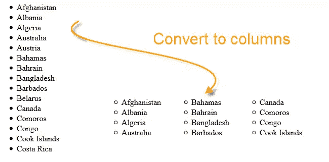

# jQuery 将列表转换为列–$ . List 2 Columns()

> 原文：<https://www.sitepoint.com/convert-list-columns-jquery-function/>



我想我会和你分享一个 jQuery 函数，我写这个函数是为了**将一个列表(UL 或 OL)转换成列**。如果你的列表是从上到下阅读的话，它会把列表项分成垂直间隔的列，这会非常有用。


## 代码

```
$.fn.extend(
{
    list2Columns: function(numCols)
    {
        var listItems = $(this).html().match(/(*   。+)/IgM)；/*获取列表数据*/ var listHeader = $(this)。html()。匹配(/(')；} /*将项目追加到列*/ $中。each(listItems，function (i，v){ if(currentItemNumber Usage[js]$(' # countries '). list 2 columns(4)；
    ');
            }

            /* append the items to the columns */
            $.each(listItems, function (i, v)
            {
                if (currentItemNumber Usage
    [js]
    $('#countries').list2Columns(4);
```

## 演示

*   阿富汗
*   阿尔巴尼亚
*   阿尔及利亚
*   澳大利亚
*   奥地利
*   巴哈马
*   巴林
*   孟加拉国
*   巴巴多斯
*   白俄罗斯
*   加拿大
*   科摩罗
*   刚果
*   库克群岛
*   哥斯达黎加

<button id="convert-list-btn">转换 2 列</button>

## 分享这篇文章