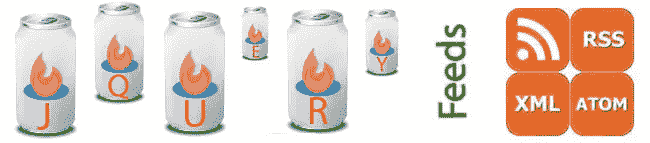

# RSS 阅读器中的 10 个 jQuery 提要

> 原文：<https://www.sitepoint.com/10-jquery-feeds-rss-reader/>

这里有一个 10 个 jQuery 提要的列表，让你的 RSS 阅读器能够跟上 jQuery 世界的发展。

## 10 个 jQuery RSS 提要

1.  [jQuery 官方博客](http://jquery.com/blog/feed/)——jQuery 新闻第一名。
2.  [官方 jQuery 论坛](http://forum.jquery.com/using-jquery/feed)——捕捉最新 jQuery 问题并提供答案的好地方。
3.  [stack overflow jQuery](http://stackoverflow.com/feeds/tag?tagnames=jquery&sort=newest)–获得各种 jQuery 问题和答案的好地方。
4.  [jQuery 4u Blog](http://www.jquery4u/feed/)–日常 jQuery 插件&代码片段。
5.  Addy Osmani–Addy 提供了关于 JavaScript 和 jQuery 的非常详细的文章和教程。
6.  本·纳达尔的博客——本分享了 Coldfusion 和 jQuery 的文章，这些文章通常非常有趣和深入。
7.  David Walsh 博客——尽管 David 主要在 Mootools 中开发，但偶尔他会发布一篇非常好的 jQuery 文章。
8.  John Resig 博客——jQuery 的创始人。
9.  [学习 jQuery](http://feeds.feedburner.com/LearningJquery)——虽然最近不经常更新，但还是会不时出现一篇好的 jQuery 帖子。
10.  官方 jQuery 移动博客——随着移动变得越来越流行，你可能需要跟上发展的步伐。

如果你想出现在这里与我联系，并证明你的要求！

## 分享这篇文章