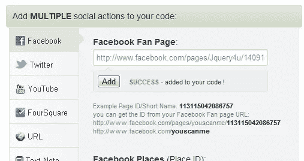
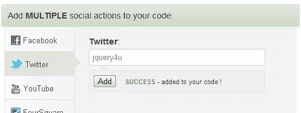
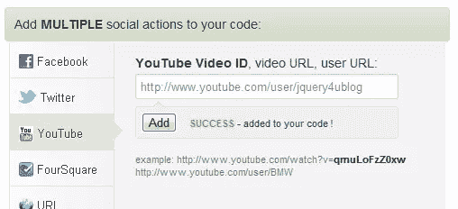
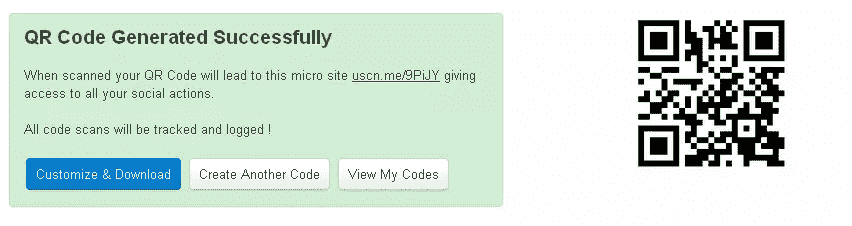

# 创建你自己的手机条形码

> 原文：<https://www.sitepoint.com/create-mobile-phone-barcode-thingy/>

所以今天我终于决定为 jQuery 4u 博客“创建我自己的手机条形码”,也就是通用二维码。它允许使用移动应用程序快速扫描，将用户直接带到 twitter、facebook 和 youtube 等社交网络。

## jQuery4u 博客 QR

## 简单的设置

选择您的社交网络…

点击生成！就是这样！

## 什么是 QR？

> QR 码(快速响应码的缩写)是一种矩阵条形码(或二维码)，最初是为汽车行业设计的。最近，由于其快速的可读性和相对较大的存储容量，该系统在行业外变得流行起来。该代码由白色背景上排列成正方形的黑色模块组成。编码的信息可以由任何种类的数据组成(例如，二进制、字母数字或汉字符号)。[1]
> 由丰田子公司 Denso Wave 于 1994 年创建，用于在制造过程中跟踪车辆，[2][不可靠的来源？]QR 码是最受欢迎的二维条形码类型之一。它被设计成允许其内容被高速解码。[3]

来源:[维基百科](https://en.wikipedia.org/wiki/QR_code)

## 为什么要用 QR？

> 在您的活动中使用二维码是一种独特且吸引人的与客户互动的方式。将二维码放在您的名片、公司文具、促销贴纸、产品包装、产品目录、直邮广告、印刷和杂志广告、广告牌和咖啡杯上，将观众引向特定的操作视频，让他们查看您的场地，让他们在 Twitter 和脸书上关注您，或者将他们引向推广新活动的移动友好登录页面。

[创造你自己！](https://youscan.me/)

## 分享这篇文章