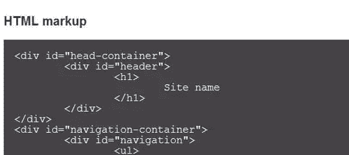
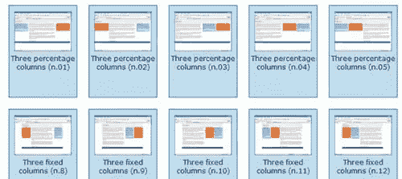
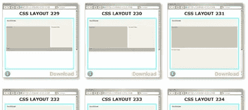
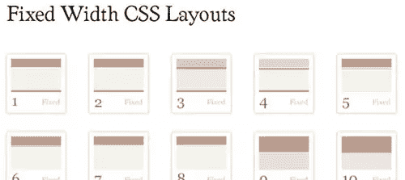
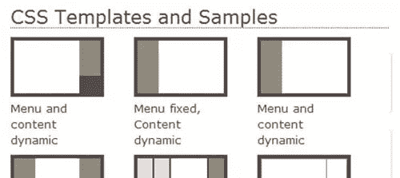
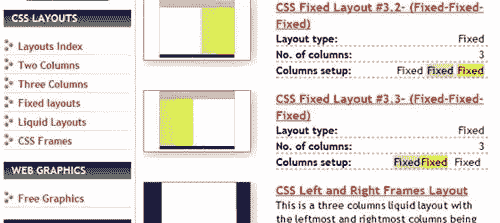
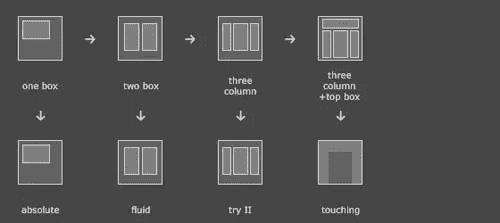
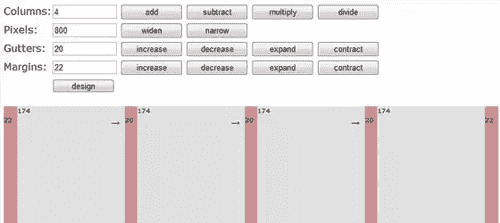
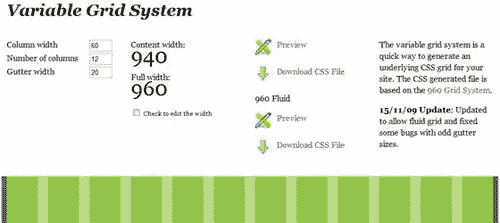

# 450+ CSS Layouts

> 原文：<https://www.sitepoint.com/450-css-layouts/>

你需要选择。任何参与过网页设计项目的人都知道，每个开发人员都有他们自己的过程——即使是观察到的最佳实践，在技术上也有变化。所以你的 CSS 库应该给你不止一种解决问题的方法。

网站布局可能是一个严重的痛苦，但 CSS 在如何处理布局问题上给了你很大的灵活性。通常主页需要一个网格设计，而文章页面有三列布局，其他格式的自定义页面。CSS 布局已经就绪，您可以快速实现布局并根据需要进行更改。

以下是一组布局库，您可以使用多列静态和动态布局将它们添加到自己的库中。尽情享受，让我们知道你最喜欢哪些！

### MaxDesign 的 20 多个 CSS 布局

有了**出色的标记漫游**和页面上的 CSS 样本，这组 CSS 布局将很容易看到效果，并且几乎同样容易实现。

* * *

### 40 个 CSS 布局按布局联欢晚会

每种格式都有预览，你甚至可以在一个文件中下载整个收藏。

* * *

### 免费 CSS 的 250 多种布局

这是一个庞大的列表，包含了几乎所有可以想象的布局。预览，再次点击下载。CSS 被去掉了，所以有很大的调整空间。

* * *

### 50+固定宽度布局的代码吸

点击预览，点击下载。这些布局很简单，有很好的空白。**值得一查，易于修改。**

* * *

### Intensiv 站的 10 多种独特 CSS 布局

虽然在数量上有些稀少，但这个系列包括一些令人印象深刻的技巧，如**浮动菜单和动态居中框**值得手头拥有。

* * *

### 动态驱动的 40 多个 CSS 布局

这个网站通过**两栏、三栏、固定、流动和框架**来组织他们的 CSS 布局。每个都有很好的描述和下载前预览的能力。

* * *

### 面条事件的 15+有趣的 CSS 布局

这个网站以独特的方式引导你完成**挑选你想要的布局**的过程。按照箭头指示，选择您的设计，然后下载。

* * *

### 网格设计者定制的静态 CSS 网格生成器

没有比这更容易的了。只需使用页面上的工具设置您想要的网格**，并下载您的模板**。

* * *

### Spry Soft 定制的流体/可变 CSS 网格生成器

静电对你来说不够好吗？！没问题。**流体/可变网格很容易用这个网站制作**。

* * *

## 分享这篇文章