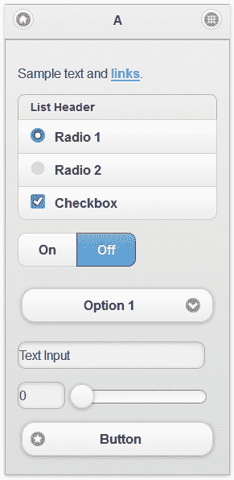

# jQuery Mobile 1.0 最终发布

> 原文：<https://www.sitepoint.com/jquery-mobile-1-released/>

经过 125 名贡献者一年的彻底测试和调试，jQuery Mobile 的最终黄金版已经发布。如果你正在为 iOS、Android、Blackberry、Bada、Windows、WebOS、Symbian 或 MeeGo 开发移动应用程序，你当然应该研究一下 jQuery Mobile 提供了什么。

在我们继续之前，我应该澄清一些困惑。尽管名为 jQuery Mobile，但它并不是手机版的 jQuery！这是一个需要标准 jQuery 核心的接口框架(目前支持 1.6.4)。它可以被比作移动设备的 [jQuery UI](http://jqueryui.com/) ，或者更准确地说，像 [Sencha Touch](http://www.sencha.com/products/touch/) 这样的项目。



本质上，jQuery mobile 帮助您使用 HTML5 构建跨平台的移动 web 应用程序。页面、工具栏、对话框、列表、导航和表单字段等常见元素都经过了样式化处理，并转化为一个极具吸引力的 iPhone 风格的移动界面。

令人印象深刻的是，jQuery Mobile 为所有现代平台提供 A 级支持，包括:iOS 3.2+，Android 2.1+，Windows Phone 7+，Blackberry 6+，WebOS 1.4+，Firefox Mobile，Opera Mobile 11，Meego 1.2，Kindle 3 和 Kindle Fire。诸如 Blackberry 5、Opera Mini 和 Symbian 之类的次要浏览器也能工作，但 Ajax 导航等功能可能会被禁用。旧的浏览器仍然会收到功能性的、非增强的纯 HTML 体验。

a 级支持还扩展到 IE (7+)、Chrome、Firefox 和 Opera 的桌面版。这应该会让开发人员的测试变得更加容易。

## 如何使用 jQuery Mobile

jQuery 文档令人印象深刻:

*   [快速入门指南](http://jquerymobile.com/demos/1.0/docs/about/getting-started.html)
*   [文档和演示](http://jquerymobile.com/demos/1.0/)
*   [jQuery 手机图库](http://www.jqmgallery.com/)

有一点 HTML 经验的人可以单独使用标记实现基本的多页面模板和转换:

```
 <!DOCTYPE html> 
<html> 
	<head> 
	<title>My Page</title> 
	<meta name="viewport" content="width=device-width, initial-scale=1"> 
	<link rel="stylesheet" href="https://code.jquery.com/mobile/1.0/jquery.mobile-1.0.min.css" />
	<script type="text/javascript" src="https://code.jquery.com/jquery-1.6.4.min.js"></script>
	<script type="text/javascript" src="https://code.jquery.com/mobile/1.0/jquery.mobile-1.0.min.js"></script>
</head> 
<body> 

<div id="one" data-role="page">

	<div data-role="header">
		<h1>Page One</h1>
	</div>

	<div data-role="content">	
		<p>Hello world</p>
		<p><a href="#two" data-role="button"data-transition="slide">Show page 2</a></p>		
	</div>

</div>

<div id="two" data-role="page">

	<div data-role="header">
		<h1>Page Two</h1>
	</div>

	<div data-role="content">	
		<p>Hello again</p>
		<p><a href="#one" data-role="button">Show page 1</a></p>		
	</div>

</div>

</body>
</html> 
```

那些需要更复杂的人可以[访问 API](http://jquerymobile.com/demos/1.0/docs/api/) 来配置默认值、定义事件和修改主题。

## 构建您自己的主题

如果你对微妙的蓝色和灰色 iPhone 设计不感兴趣，可以使用 CSS 调整主题。如果这有点费力，试试[主题滚轮应用](http://jquerymobile.com/themeroller/)。整个设计可以通过拖动颜色到界面元素和下载定制的 CSS 文件来修改。

## 合适的文件大小？

jQuery Mobile 的 JavaScript 代码包含在一个 24KB 的压缩文件中。CSS 主题还需要 7KB，jQuery 1.6.4 核心还需要 32KB。总共 63KB——对于最慢的连接来说，这是一个合理的下载量。不要忘记你可能也需要更少的图形。

[jQuery Mobile](http://jquerymobile.com/) 看起来很棒。它不会神奇地将你现有的项目转换成移动应用程序，但它会使任务变得更容易、更可靠，并且可以在多种设备上工作。

你打算在你的下一个项目中使用 jQuery Mobile 吗？

## 分享这篇文章