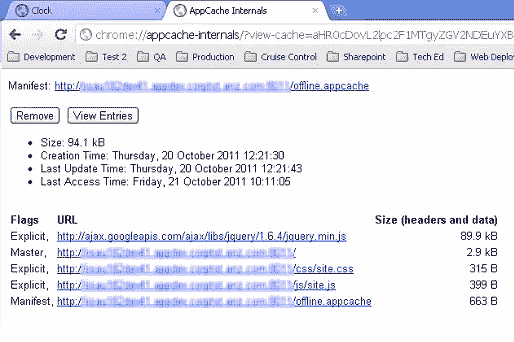

# 深入探究 HTML5 离线浏览

> 原文：<https://www.sitepoint.com/diving-deeper-into-html5-offline-browsing/>

最近，我发表了一篇文章，介绍了 HTML5 中的一个新功能，名为[在 HTML 5 中使用 ApplicationCache](https://www.sitepoint.com/offline-browsing-in-html5-with-applicationcache/) 进行离线浏览。

对那篇文章的反应很好，我被要求进一步阐述一些观点，包括:

*   如何决定缓存哪些文件
*   缓存这些文件的含义
*   调试应用程序缓存

所以，这就是本文的起点:上一篇文章的终点。如果你没有，你可能应该在这篇文章之前阅读一下[上一篇文章](https://www.sitepoint.com/offline-browsing-in-html5-with-applicationcache/)。

让我们深入了解哪些资源应该*而不是*添加到应用程序缓存中。

你应该缓存什么？

从技术上讲，在 ApplicationCache 中添加和移除资源并不困难。您可以在`CACHE:`部分指定想要缓存的资源，就这样。

有时，很难决定哪些资源应该添加到 ApplicationCache，哪些不应该添加。

对我来说，明显需要缓存的资源如下:

*   CSS 文件
*   JavaScript 文件
*   形象
*   录像

这些都是离线缓存的完美候选。当您脱机工作时看到丢失的图像，或者更糟糕的是，丢失的 CSS 文件导致页面无法正确呈现时，没有什么比这更令人沮丧的了。

现在，如何处理远程文件呢？应该如何处理它们呢？当你处理远程文件时，事情有两个方面。

如果网站不在 SSL 下运行，可以缓存远程资源。在下面的场景中，本地资源以及远程 jQuery 库都被添加到 ApplicationCache 中。

```
CACHE MANIFEST

# Created on 20 October 2011
CACHE:
clock.css
clock.js

# Caching the remote file
https://ajax.googleapis.com/ajax/libs/jquery/1.6.4/jquery.min.js
```

但是，如果网站通过 SSL 运行，ApplicationCache 中列出的资源必须是本地资源。注意 Google Chrome 是这个[规则](https://www.w3.org/TR/html5/offline.html)的例外——Chrome 仍然会缓存远程资源，只要它们也是通过 SSL 提供的。

迷茫？我希望所有的浏览器都遵循同样的规则。

让我们回到决定哪些资源应该或不应该被缓存。

重要的是要制定一个计划，让用户在离线时可以使用哪些功能。例如，如果你的网站与数据库交互——目前大多数网站都有某种数据库连接——与数据库交互的页面不适合离线缓存，因为一旦它们试图连接到数据库，就会失败。

这就是制定计划的切入点。如果您确实缓存了这些页面，而用户处于离线状态，那么您需要将用户的数据存储在另一个位置。该位置可以是类似于 cookie 的东西，或者您可以将它存储在 [localStorage](http://dev.w3.org/html5/webstorage/) 中。这是 HTML5 的另一个非常酷的地方！

一旦决定了要缓存哪些页面，就需要确保缓存页面运行所需的任何资源，即页面呈现的任何引用的 CSS、JavaScript、图像、视频或 flash 小部件。

如果你不这样做，那么当用户离线时，他们会看到一个破碎的页面…没有人希望这样。

那你不应该缓存什么呢？

对于*而不是*缓存，显而易见的选择是:

*   与数据库存储交互的页面
*   与 web 服务交互的页面
*   需要验证的页面

尽管 ApplicationCache 很好，但实际上您需要与外部系统通信才能继续工作。在企业领域尤其如此。一个离线网站是伟大的，直到有些东西不工作，业务停止赚钱。

**调试缓存清单**

现在您已经在缓存中获得了资源，如果您需要调试它，您如何找到那里有什么呢？

幸运的是，谷歌浏览器有一个地址，你可以导航到这个地址来查看缓存。在 Chrome 中导航到`chrome://appcache-internals`会打开 *AppCache Internals* 页面。



如您所见，该页面列出了缓存清单的当前大小、创建时间、更新时间，最棒的是它列出了缓存中的资源。当您需要查看您在缓存中究竟存储了什么时，这是非常宝贵的。

我发现，通过清除你的临时互联网文件，缓存中的资源也被删除，但取决于你去哪个网站，它可能会建议否则。通过 Chrome 清除缓存的一个可靠方法是点击**移除**。这保证了所有资源都将被删除。

**我不喜欢 ApplicationCache 的地方**

尽管 ApplicationCache 很好，但它也有我不喜欢的地方。

在我的列表中，最重要的是它需要一个特殊的 MIME 类型的清单文件。如果您可以访问您的 web 服务器，这是没问题的，但是在共享服务器上，有时这是不可能的。如果你不创建 MIME 类型，你将一事无成。

使用 ApplicationCache 的另一个副作用是当缓存的文件被使用时，与它们不被使用时相比。以一个叫做`default.html`的页面为例。如果这个页面被缓存，即使用户在线，他们也会使用这个文件。那么如何通知浏览器更新缓存呢？您需要通知用户，并且页面需要刷新。我们生活在一个 Ajax 和 T2 成为规范的世界里。一定有更好的方法。

缓存 CSS 文件是没问题的，但是如果你从 CSS 文件中引用任何图像，它们不会被自动缓存。必须在清单中显式引用它们。

ApplicationCache 大小的限制也各不相同。虽然规范对应用程序缓存的大小没有限制，但是不同的浏览器和不同的设备有不同的限制。目前，这些限制是:

*   Safari 桌面浏览器(Mac 和 Windows)没有限制
*   移动 Safari 有 10MB 的限制
*   Chrome 有 5MB 的限制
*   Android 浏览器对应用缓存大小没有限制
*   Firefox 桌面没有应用程序缓存大小的限制
*   Opera 的应用程序缓存限制可以由用户管理，但默认大小为 50MB

**清单验证**

清单文件很容易创建，甚至更容易出错。

错误地引用文件会让你头疼。幸运的是，有一个[缓存清单验证器](http://manifest-validator.com/)可以帮助减轻在清单文件中调试错误的痛苦。这是一个很棒的工具，所以请将它加入书签并使用它。

**一起带来**

最后一个想法。我的很多工作都专注于与大型企业客户合作。一旦一个应用程序离线，警报就开始响起！肯定有问题。

HTML5 中通过 ApplicationCache 实现的离线功能当然有很大的潜力，但它还没有涵盖所有的基础。任何打算提供离线浏览服务的人都应该记住一些用户已经根深蒂固的习惯。

## 分享这篇文章