# Photoshop 技巧、提示和窍门

> 原文：<https://www.sitepoint.com/photoshop-techniques-tips-and-tricks/>

在设计领域，创新和创意至关重要。为了向客户传达你的创新和创意，将它们转化为他们可以看到的东西，你可能需要创建一个可视化的模型。

Photoshop 仍然是这类练习的最佳选择，它提供了一系列令人眼花缭乱的创建和处理图像的工具。事实上，Photoshop 是一个如此复杂的软件，以至于很难精确地计算出如何实现特定的效果。

与此同时，你的模型看起来高度专业也很重要——它们是一种销售工具，告诉你的客户你有多好，不仅仅是在创意的产生方面，还有你执行创意的方式。

如果你想知道更多关于如何用 Photoshop 得到令人印象深刻的效果，这篇文章是给你的。

在本教程中，我们将学习如何创建一个光滑，干净的 RSS 提要窗口小部件的视觉设计。也许它是一个网站，可以放在桌面上，或者作为任务栏中的一个小悬浮屏幕。

这不是关于如何*开发*或*程序*这样一个小部件，这只是关于使用基本的 Photoshop 技术和一些现代网页设计原则创建一个视觉设计。你将最终创造出一个令人印象深刻的设计，更重要的是，对你可以应用于其他项目的技术感到舒适。

这里描述的技术是我称之为“没有其他方法”的技术。那是因为我也遇到过不知如何是好的情况，所以我想出了一个办法来达到我想要的效果。对我来说，没有正确或错误的方法，只有可行的方法。

让我们开始吧。启动 Photoshop。

### 启动

我们将开始建立一个新的文档—***文件—>新的*** ，当然。我选择了这些设置(见下图)，但由于我们将在背景中使用渐变，任何大小都是可能的。然而，建议使用较小的尺寸，这样您可以轻松地添加细节，并获得更紧凑的结果。将其命名为 *RSS Feed Widget* 或类似的名称。

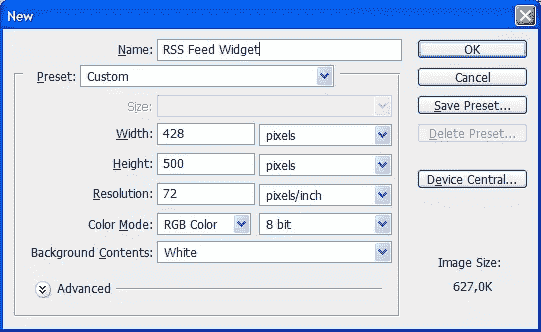

### 背景

开始设计时，给它一个像样的背景。马上，这可能会让你吃惊:毕竟，背景并不重要，重要的是小部件，对吗？事实是，一个有深度和纹理的背景会让你的图像看起来更真实。所涉及的技术非常基本，可以用于许多目的，但效果却令人印象深刻。

如果我们在背景和小部件之间使用颜色对比，我们将使最终的小部件看起来更强烈。在配色方案中，**橙色**与**蓝色**相反。所以我们将制作一个蓝色的背景。

抓取 ***渐变工具*** ，打开 ***渐变编辑器*** (通过点击左上角的渐变条)。让我们也选择 ***径向渐变*** ，因为这是我们设置渐变后需要的。

[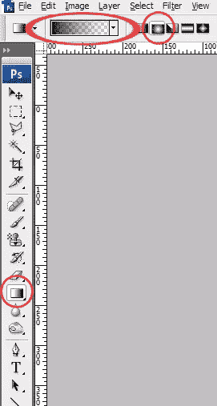](https://www.sitepoint.com/wp-content/uploads/2011/11/2.png)

在 ***渐变编辑器*** 中，我们将使用紫色和蓝绿色制作渐变。我不打算使用全蓝色，因为我们希望它平衡，但不会淹没 RSS 提要的橙色。我做了这个渐变(见下面截图)。颜色和位置如下:

```
#695699 at 0%
#0d605d at 56%
#06302f at 80%
#022120 at 100%
```

[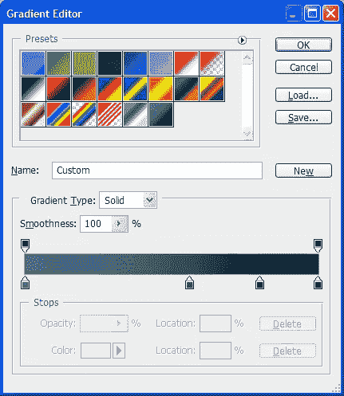](https://www.sitepoint.com/wp-content/uploads/2011/11/3.png)

现在让我们点击 ***确定*** 。记得选择 ***径向渐变*** ，从左下角到右下角画渐变。尝试一下位置:试着在角落里有一个相当大的紫色斑点，变成绿色，流出大量深绿色。将图层命名为*渐变* 1 或者类似的名称。

我的看起来像这样:

[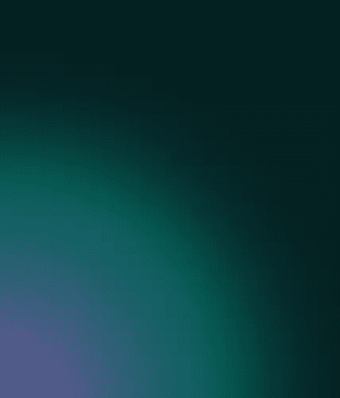](https://www.sitepoint.com/wp-content/uploads/2011/11/4.png)

我们将重复绘制两次以上的梯度。第二个是从上到下的渐变，大概是这样的(一定要放在一个新图层上，把那个图层叫做 *Gradient 2* ！):

[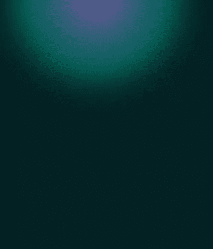](https://www.sitepoint.com/wp-content/uploads/2011/11/5.png)

…第三个，也在一个新的图层上，我们称之为*渐变 3* (!)，看起来大概是这样的(从右下角到左上角一个大的):

[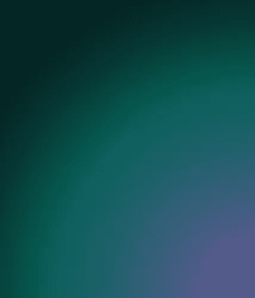](https://www.sitepoint.com/wp-content/uploads/2011/11/6.png)

我们现在要做的是改变两个图层的不透明度:*渐变 2* 的不透明度为 50%，*渐变 3* 的不透明度为 28%左右。我们应该有这样的东西:

[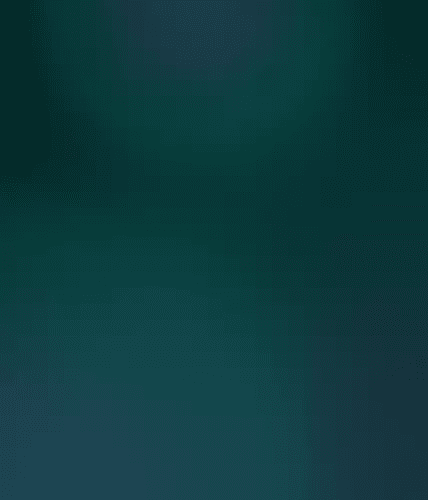](https://www.sitepoint.com/wp-content/uploads/2011/11/7.png)

现在是我们的最后一步:创建一个新层，命名为*云*。确保该层位于所有以前的层(渐变)之上。将前景色设置为`#2a435a`，背景色设置为`#cbd1d6`(可以通过点击左下角的彩色方块并将十六进制代码插入给定的空格来设置颜色)。进入 ***滤镜- >渲染- >云彩*** 。通过这样做，云已经呈现在我们的新图层上。将图层不透明度设置为 10%，模式设置为 ***【生动光】*(模式可以在不透明度滑块的左边找到)。我们现在有了这样的东西，其中云提供了一些纹理:**

[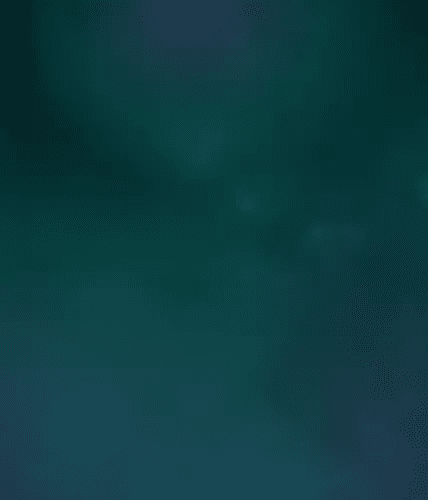](https://www.sitepoint.com/wp-content/uploads/2011/11/8.png)

我们的背景，对我们的演示非常重要，现在完成了！真正的设计。

### 基本形状

当我们查看最终的小部件时，我们看到一个白色和一个橙色的形状在图像中占主导地位。让我们从白色的形状开始，因为那是我们的基础。

在我们真正绘制它之前，这里有一个提示:试着按 CTRL+R 来调出 ***标尺*** ，这两个标尺位于编辑屏幕的左侧和顶部。然后右键单击其中一个标尺，弹出一个小菜单，您可以在其中选择测量单位。我选择了像素。这里有另一个提示:您可以单击并按住其中一个标尺，向右(从左边的标尺开始)和向下(从上面的标尺开始)拖动鼠标来创建参考线。您可以使用 ***视图- >新向导**、*来插入它们，或者您会发现这种方法更方便。

我们为什么要这本指南？嗯，这应该使事情更容易解释:通过启用这些标尺，我可以告诉您我的小部件有多大以及在哪里。我把我的基本形状从大约 85px 到 340px 宽到 70px 到 400px 高。所以如果你把这些参考线放在这些坐标上，你可以画出和我一样大的形状。如果它不在中间，请不要担心，因为我们稍后会修复它。

为了实际绘制形状，让我们选择 ***圆角矩形** **工具**。*设置绘制模式为 ***形状图层*** ，半径为 6px(见下图)。选择#f0f0f0 作为你的前景色，或者白色/灰色。我从不使用全白或全黑，色调和色彩更有趣，也更真实。

[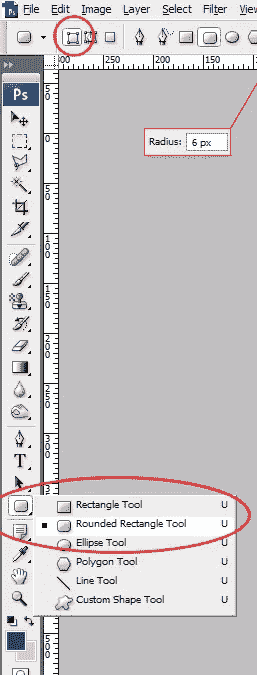](https://www.sitepoint.com/wp-content/uploads/2011/11/9.png)

我们现在可以画矩形了。如果您使用标尺和参考线，只需从左上角到右下角绘制形状。如果不是，试着做一个像文件大小的形状，只是小一点。这是我的结果:

[](https://www.sitepoint.com/wp-content/uploads/2011/11/10.png)

现在完成我们的基本形状，让我们在底部添加一个小三角形。为此，您可以选择 ***多边形工具*** :

[](https://www.sitepoint.com/wp-content/uploads/2011/11/11.png)

将 ***边*** 设为 3，这样我们就有了 3 条边，从而有了一个三角形。现在以你想要的任何大小/角度画三角形。当你完成后，按 CTRL+T 来自由变换它:试着让一边完全水平，这样你就有一个指向下的三角形。完成后，选择 ***移动工具*** (按 *V* )并将其移动到小工具的底部。为了完美地对齐它们，我们将使用 Photoshop 的 ***对齐***:CTRL+单击三角形和矩形层，这样您就选择了它们，确保您仍然选择了 ***移动工具*** 并单击此图标:

[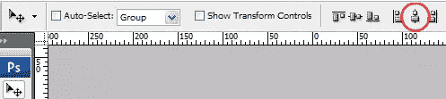](https://www.sitepoint.com/wp-content/uploads/2011/11/12.png)

那个图标的意思是 ***对齐水平中心*** ，这意味着它将对齐所选图层(我们的三角形和矩形)的中心。如果一切正常，您应该有这样的东西:

[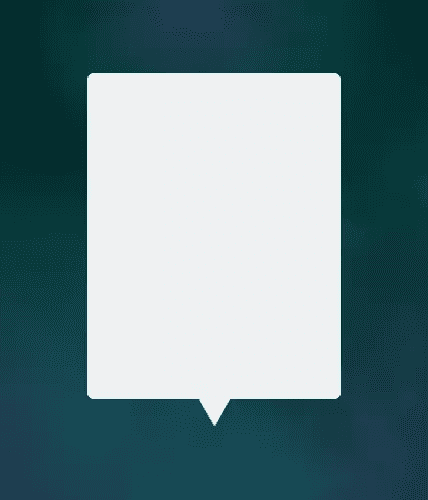](https://www.sitepoint.com/wp-content/uploads/2011/11/13.png)

现在，合并两层，这样你就有一个白色的形状。这样，我们的基本形状就完成了。

### 橙色形状

在我们的白色基本形状之上，有一个橙色的形状:边框。

代替复制白色层和删除中间部分，我想使用原始技术之一。为什么不复制？因为在这种情况下，我们会在橙色周围得到一个难看的白色边框。当然还有其他的方法，但是我会用我的方法来解释。所以，再次抓取 ***圆角矩形工具*** ，再次设置为 ***形状图层*** 选择我刚才说的 RSS 橙作为你的前景色:#f48229。现在放大白色形状的左上角，在上面画一个漂亮的圆角矩形，就像这样:

[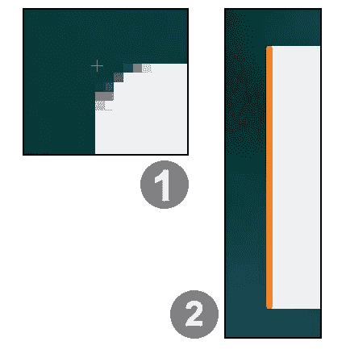](https://www.sitepoint.com/wp-content/uploads/2011/11/14.png)

现在复制橙色的形状，将新的放在白色形状的右边。其次，在白色形状的上面放一个更大的橙色形状，就像这样:

[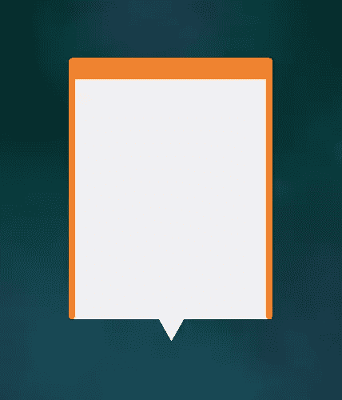](https://www.sitepoint.com/wp-content/uploads/2011/11/15.png)

复制上面的酒吧，并把它放在底部的白色形状。第三，尝试用橙色重建底部的三角形。最后，这也是我们没有复制它的原因，让我们稍微移动一下:上下移动两个大的橙色条，小边向左或向右，矩形向下，这样橙色形状完全覆盖白色形状。注意:这可能没有必要，因为你可能一开始就把所有事情都做对了。还要确保你不要过度移动橙色的形状:我们应该能够在之后看到下一步的影子。所以，如果你认为你的橙色边框已经看起来很棒了，那就忘了这种变化吧。

最后合并所有的橙色层，命名为*橙色*形状或类似的东西。我们最终的橙色看起来像这样:

[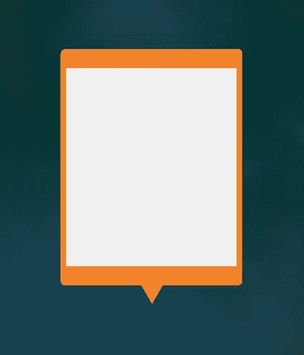](https://www.sitepoint.com/wp-content/uploads/2011/11/16.png)

### 第一个影子

现在我们给白色的形状添加一点*。*

 *[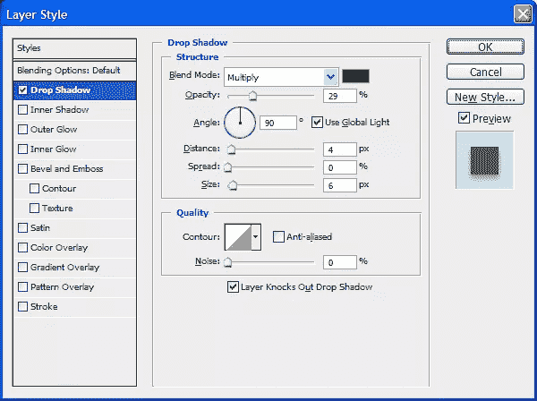](https://www.sitepoint.com/wp-content/uploads/2011/11/17.png)

结果:

[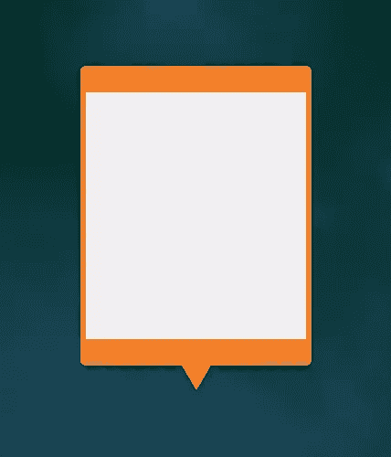](https://www.sitepoint.com/wp-content/uploads/2011/11/18.png)

### 第二个影子

现在让我们给橙色添加一个 ***内阴影***——这是一个应用现代网页设计技术的例子。我的意思是使用细节，添加 100%不透明度的阴影和其他一些技巧。通过添加阴影，你可以创造一点深度。颜色比形状本身更暗，以使其弹出。

[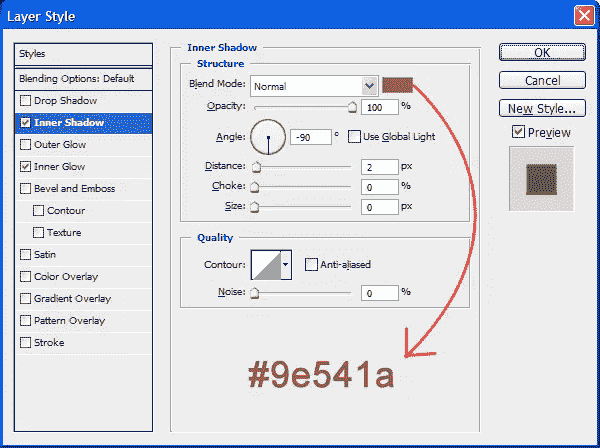](https://www.sitepoint.com/wp-content/uploads/2011/11/19.png)

投影的结果:

[](https://www.sitepoint.com/wp-content/uploads/2011/11/20.png)

### 添加内部阴影

通过使用另一种现代网页设计技术，我们可以得到更多的细节:橙色的内部阴影。我们将使用比原始形状更亮的橙色，代表闪亮的边缘。

[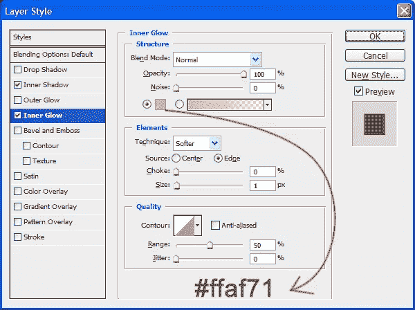](https://www.sitepoint.com/wp-content/uploads/2011/11/21.png)

结果是:

[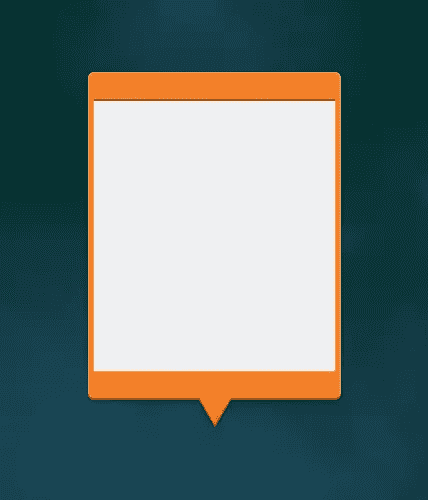](https://www.sitepoint.com/wp-content/uploads/2011/11/22.png)

### 噪音可以使事物变得美丽

有时候给设计中的某些元素添加纹理并不是很难。Photoshop 中有一个非常被低估的滤镜，叫做噪点。如果你不熟悉它，那就去了解它——它非常有用。

我们将添加噪声到橙色的形状，只是为了使整个更有趣，并添加一点纹理。于是选择橙色图层，选择 ***滤镜- >噪波- >添加噪波*** 。不过，只有一点点:

[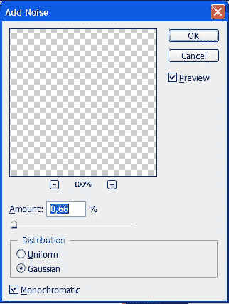](https://www.sitepoint.com/wp-content/uploads/2011/11/23.png)

现在我们有了这样的东西。好些了吗？

[](https://www.sitepoint.com/wp-content/uploads/2011/11/24.png)

### 添加最后的细节以获得更多的深度

为了使橙色的形状更加完整，我们将添加更多的线条和颜色。我将使用另一种“原始”技术:选择+填充。我将通过选择一行像素并用颜色填充来创建线条，而不是用形状或路径来创建线条。为什么？我不知道。我只做过一次，我喜欢它，所以我一直使用这个技术。有时候，就是更快。

我们的前两行将在白色矩形的两边。颜色会比形状的橙色深，所以类似#b97038。所以选择这种颜色作为你的前景色。放大设计，这样你就有了相当大的像素。然后使用 ***选择工具*** 选择 1px 宽的区域，从阴影周围开始(见下图)。确保在目前为止的所有图层上新建一个图层，按 Alt+Backspace 填充选区。

[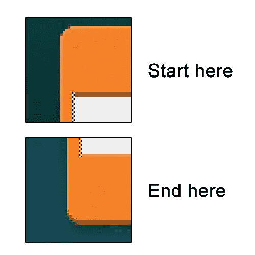](https://www.sitepoint.com/wp-content/uploads/2011/11/25.png)

虽然当缩小时，这条线可能看起来不太明显，但最终观众的眼睛会以我们记录几乎察觉不到的细节的方式记录它，这些细节告诉我们某事是真实的——或看起来是真实的。

现在，复制该层，并将其向右移动到该侧的相同位置，这样我们在两侧都有线:

[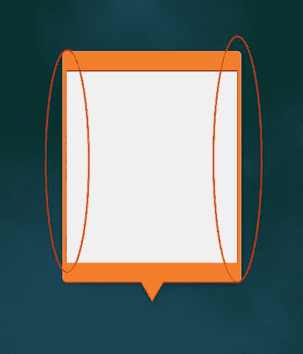](https://www.sitepoint.com/wp-content/uploads/2011/11/26.png)

然后，我们在白色矩形的底部添加一条更大的线，以增加更多的深度，使白色的盒子感觉像一个真正的盒子。设置你的前景色为浅橙色，比如#f8a25f，选择一个 3px 高的行，从我们刚刚创建的左边的行到我们刚刚创建的右边的行，就像这样:

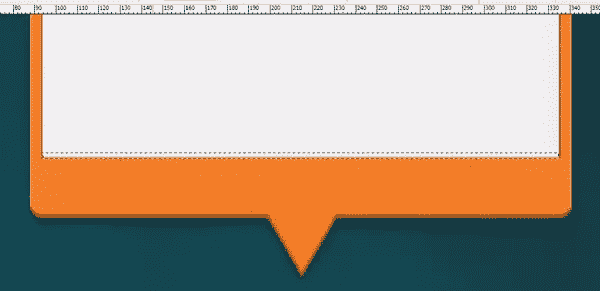

创建一个新层，然后再次用 Alt+Backspace 填充选区。

我们现在有这样的东西:

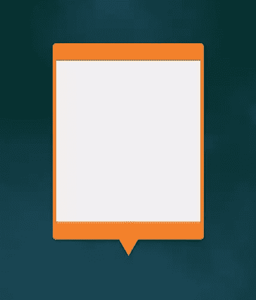

你现在可能注意到的是底部三角形缺乏深度。让我们解决这个问题。

放大三角形并选择**线条工具**。将线条设置为 1px，将前景色设置回#b97038。现在只需沿着三角形的边缘画一条线，然后移动它们一点点，直到它们看起来像这样:

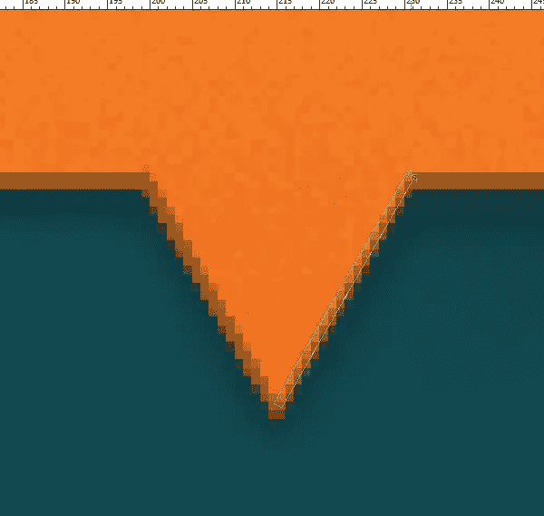

合并两条线(如果你有两个单独的层)，并通过图层样式给这些线添加一点阴影，获得与完整的橙色形状相同的闪亮效果:

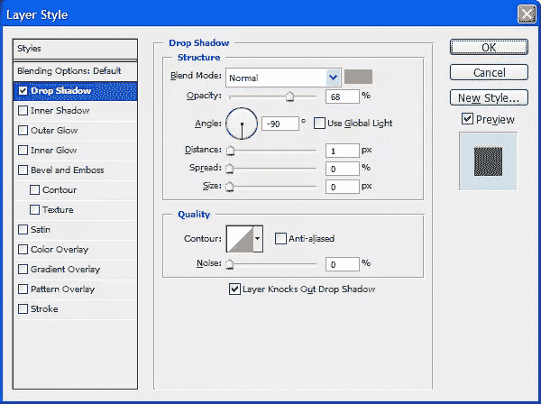

我们现在有了更多的细节，看起来像这样:

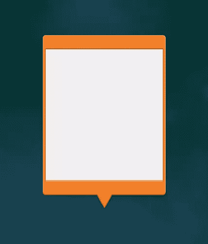

### 添加 RSS 图标

现在是非常重要的一步:添加图标，这样就很清楚我们在处理一个 RSS 小部件，而不是脸书或 Twitter 或其他小部件。

我们将使用最后一个“原始”技术:用钢笔工具覆盖一个现有的图标，而不是花几个小时寻找一个透明背景的 RSS 图标。

但是，首先，这当然不是我的设计。我们将要使用的是官方的 RSS 标志(尽管它有多种形式)。我发现了这张图片，您可以将其复制并粘贴到我们的 Photoshop 文档中:


学分归 [classicinternational.eu](http://classicinternational.eu) 所有。将图像缩小到合适的大小，然后将图像移动到小部件的顶部，如下所示:

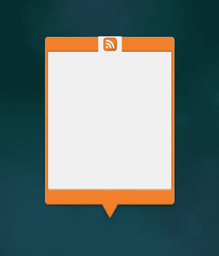

确保居中对齐:选择 RSS 图像和橙色形状或其中一个背景层，再次进入**移动工具**并按下我前面提到的 ***水平居中对齐*** 按钮。

现在让我们覆盖它。为此选择 ***钢笔工具*** 。如果你真的不知道如何操作 ***钢笔工具*** ，我建议你去看看一些教程，因为它是一个相当先进的工具。但这个任务并不太难，不妨试一试。再次选择#f0f0f0 作为前景色，并确保再次将 ***钢笔工具*** 的模式设置为**形状图层**。然后沿着 RSS 标志中的白条轮廓——就像这样:

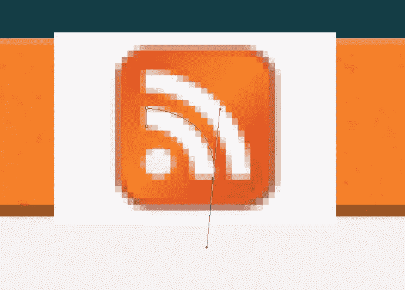

两个注释:在四个独立的路径中创建两个条和球更容易。所以当你关闭了一个路径，点击 ***Esc*** 删除路径，然后前进到下一个栏。你将得到三个新图层，每个图层都包含一个标志的白色部分。

其次，建议在开始绘制路径后降低图层的不透明度，因为这样你就可以对你要描摹的形状有一个全面的了解。如果这样做，记得把不透明度放回去。

如果您跟踪了所有三个部分，您可以从图层中删除原始的 RSS 徽标图像，您应该会看到如下内容:

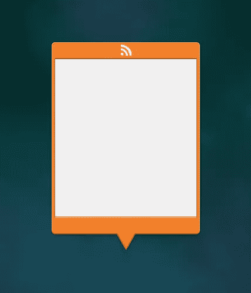

现在合并图层，这样你就有一个图层包含了小部件中间的白色 RSS 图标。

### 给图标添加一些阴影

为了让它看起来像是图标实际上是中的*橙色，让我们使用一种现代的设计技术，类似于我们之前使用的阴影技术。通过在图标上制作一个 1px 大小的阴影，完全不透明，看起来就像是“印”进了背景。所以把这个图层样式添加到图标上:*

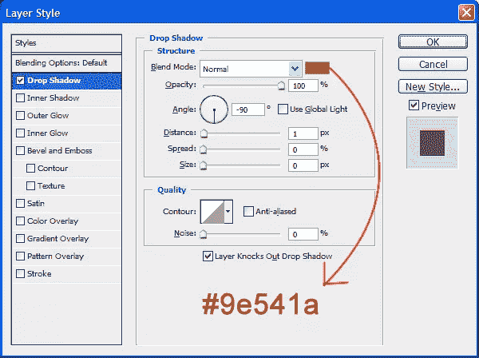

这种技术在按钮、网站和用户界面中被多次使用。

1.  **12。** **添加文字**

本教程中最简单的部分之一是添加文本——当进行这样的设计时，最好有一些文本来显示实际开发时的样子。所以让我们从选择 ***文本工具*** 开始。

我使用了三个实际 RSS 更新的例子，让它看起来像一个实际的 RSS 提要。为了有效地处理文本，我决定将它分成三部分，而不是创建一个文本框。

第一条短信:

 `健康丑闻下的双酚 a。档案往往是无情的。对于那些一头扎进科学期刊的人来说，双酚 A (BPA)事件具有全球健康丑闻的所有特征，可能是过去十年中最严重的事件之一。巴黎世界报 2011 年 10 月 30 日 09:00-05:00

 `第二段文字:

 `中国煤矿爆炸造成 29 人死亡。据官方媒体报道，中国中部一座煤矿发生瓦斯爆炸，造成 29 名矿工死亡，这是中国采矿业一系列致命事故中的最新一起。法国新闻社 2011 年 10 月 30 日 09:00-05:00

 `第三段文字:

 `钻争论转个人。关于水力压裂法的争论使邻居对立起来，经常使住在郊区或村庄的人与住在郊区或村庄外的农民和地主对立起来。纽约时报 2011-10-30 09:00-05:00`

 `现在，第三个可能看起来被删减了，但那是因为:我将为你节省稍后删除不必要的文本的努力。所以用 ***文本工具*** 创建三个文本框:一个下面有文本 1，一个上面有文本 2，第三个上面有文本 3——它们都是 **Arial，10pt** 。接下来，确保这些文字层在橙色图层的下面。此外，为了使内容更加清晰美观，请确保在文本框和橙色形状之间留有一定的空白空间。

我们有这样的东西:

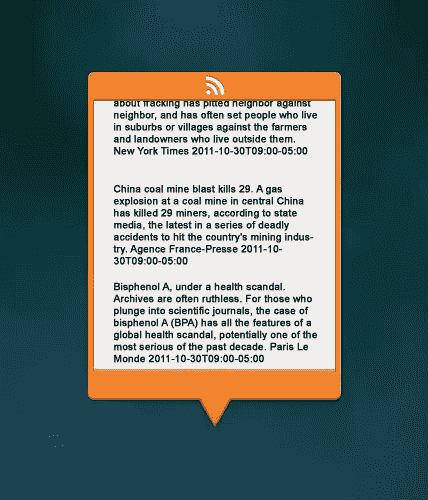

1.  13。 **造型正文**

给文本添加一些颜色会更好，这也很有用:它可以帮助读者区分文本中不同的元素。

首先，让我们的例子的标题样式:选择“中国煤矿爆炸死亡 29。”和“健康丑闻下的双酚 a”并使它们**加粗**(你可以在字体选择旁边这样做)。给他们#212121 作为颜色，让他们脱颖而出。

然后来源和时间:选择“纽约时报 2011-10-30T09:00-05:00”和“法新社 2011-10-30T09:00-05:00”和“巴黎世界报 2011-10-30T09:00-05:00”(一次一个)并使其*，颜色为#9e541a。*

 *最后，选择文本的剩余部分，并使其成为常规文本，#767676。我们现在有了这个:

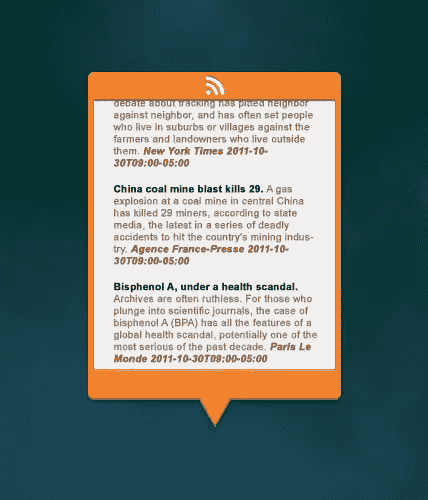

确保没有文本与橙色形状重叠，并且文本层在橙色形状层的下面。还要确保没有文本从橙色形状的顶部出来。

快好了！

### 线条和阴影

为了帮助读者区分不同的新闻条目，让我们添加两行。我们只需添加一个并复制它；再次选择 ***线条工具*** ，设置为 1px，#4b4b4b。画线的时候按住 shift，得到一条完美的直线，画在新闻项之间。

复制图层，将新线条放在另一个空白区域。使用 ***移动工具** (V)* 稍微移动它们，直到你非常确定它们正好在新闻条目之间。如果看起来像这样，你做得很好:


现在，为了增加一定的深度，让我们在所有层的顶部添加一个阴影:在所有层的顶部创建一个新层(称之为*阴影*或类似的东西),并选择顶部橙色形状下面的一个区域:

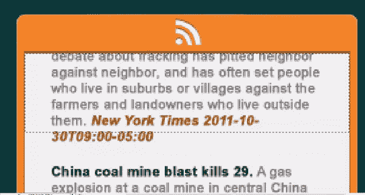

现在选择深黑色作为你的前景色，打开 ***渐变编辑器**。*在那里，应该有一个梯度，看起来像这样(见下图)。如果没有，按下渐变右上角的小箭头，选择 ***重置渐变*** 。如果你做了新的渐变，一定要保存它！

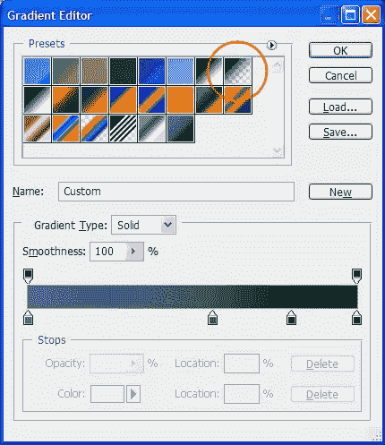

确保选择了*，而不是 ***径向渐变*** ，在我们刚刚选择的图层上绘制一个渐变:*

 *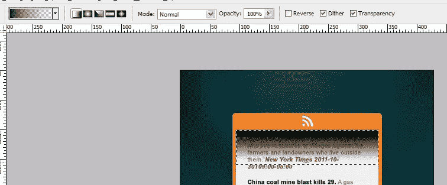

现在通过降低新建图层的不透明度到 50%来降低它的色调。我们现在有了这个结果，只剩下一样东西:一个滚动条。

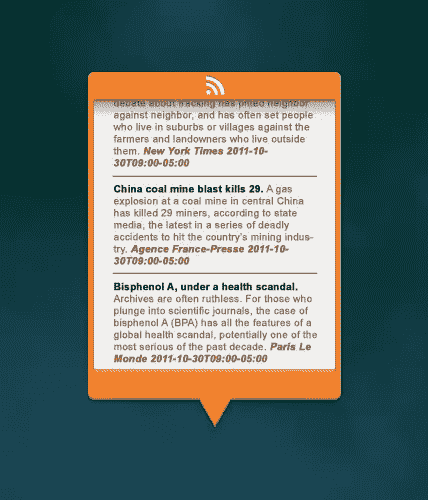

### 滚动条

当然，读者需要能够上下滚动他的新闻提要，所以这就是为什么我们要添加一个滚动条。让我们把它变得简单明了。

放大小部件的右下角，以便您可以向滚动条添加更多细节:

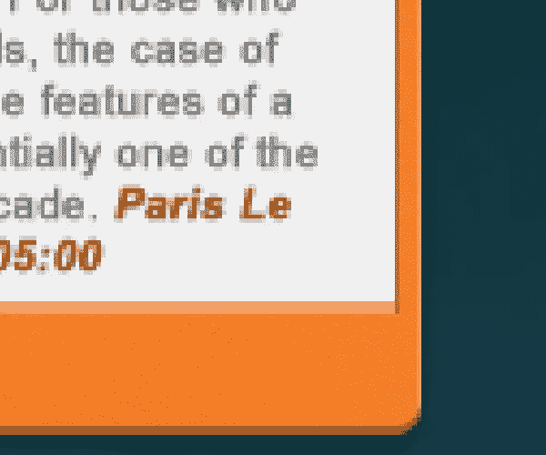

定位时遵从设计师的直觉:确保左边有空间，文本和滚动条之间也有空间。也试着将滚动条与文本对齐一点，这样滚动条的底部就能与文本的底部相匹配。

再次使用 ***圆角矩形工具*** ，这次半径为 2px，颜色为#776e67，绘制滚动条(不要太长):

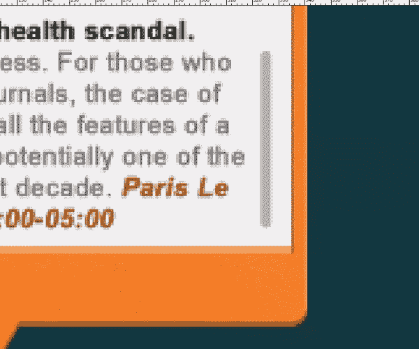

为了给它添加一些细节，选择 ***线条工具*** ，大小为 1px，颜色为# cbc5be，在条上创建两条小水平线。它看起来会像这样:

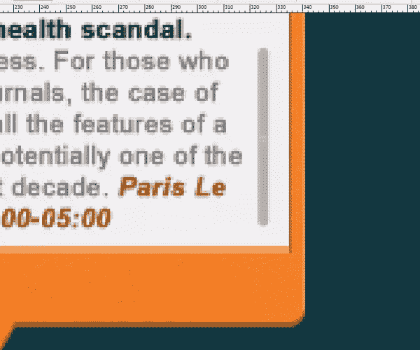

改变滚动条的不透明度到 50%左右……我们完成了！

我们刚刚使用简单、现代和有效的 Photoshop 技术创建了一个漂亮而令人印象深刻的 RSS Feed 小部件模型。

### 结果

这是我创造的:我希望你取得同样的结果！

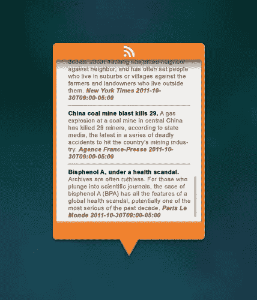

如果你有任何问题，请在下面的评论区提问。

感谢阅读！**`````* 

## `````**分享这篇文章**`````