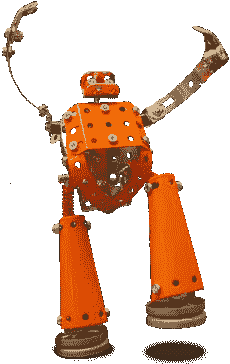

# 我们正在分发免费书籍！

> 原文：<https://www.sitepoint.com/were-giving-away-free-books/>

是的，你没看错。这不仅仅是一本免费的书——我们正在向现实世界赠送我们最新的书籍之一[html 5&CSS3](https://www.sitepoint.com/books/htmlcss1/ "HTML5 & CSS3 For The Real World")。

我有 50 本免费的电子版可以赠送，有两种简单的方法可以让你得到一本。

在 Twitter 上关注@designfestival。我会在一天中随机投放链接，第一个点击的人获胜。

通过在 Twitter 上关注@sitepointdotcom 并转发公告来增加你的机会(看起来像这样:*免费电子书-关注@designfestival 4 机会 2 认领 ow.ly/7r9dn 5 下载链接每天发推-随机副本给 RTers #CSS3* )。我们随机挑选 RTs 作为奖品。

你还在等什么？现在就关注@designfestival 吧。

对于那些不在 Twitter 上的人，不要担心。我们将在未来几天发布公告，这意味着您也有机会获奖。

## 分享这篇文章