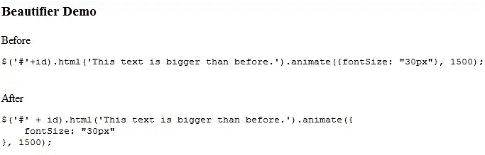
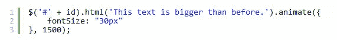

# 使用美化. js 美化您的 jQuery 代码

> 原文：<https://www.sitepoint.com/beautify-jquery-code-js-beautify/>

让您的 jQuery 代码变得整洁非常耗时。幸运的是，有在线工具和大量插件可以为我们自动完成这项任务。我最近需要动态地生成 JavaScript/jQuery 代码，因此它看起来很乱，不可读。所以我决定**用美化. js 来整理 jQuery 代码**，这样就统一、整洁，人们也能读懂。我在博客的函数演示部分广泛地使用它来整理 jQuery 代码。只需点击“查看代码”就可以在任何功能示例页面上看到它的运行。



应用语法荧光笔。

[现场试玩](http://www.jquery4u.com/function-demos/animate/)
[下载试玩包](http://www.jquery4u.com/files/js-beautify-test.zip)

## 说明

1.  从 GitHub 下载[美颜包](https://github.com/einars/js-beautify)。
2.  修改代码以适应您的设置(例如，我不需要模糊解包器，所以我删除了它们以减少未使用的代码，然后我在美化函数中添加了一个参数，以便它可以将美化器应用于特定的元素，然后循环包含 jQuery 代码的 class="raw "的元素)。
3.  在 DOM ready 中包含 beautifier 调用，然后如果您愿意，可以应用语法高亮。你可以使用这些 [10 个语法高亮](http://www.jquery4u.com/plugins/10-jquery-syntax-highlighters/)中的一个。

## 代码

包括脚本。

```
<script src="js/beautify.js"></script>
<script src="js/beautify-html.js"></script>
<script src="js/mybeautifier.js"></script>
/* beutify all code with class="raw" */
$(document).ready(function() {
    $('.raw').each(function()
    {
        beautify(this);
    });
});
```

使用 class="raw "在 pre 标记内指定代码元素。

```
我修改了美化()函数的版本，删除了代码解包函数，并将它们放入一个名为“mybeautifier.js”的新文件中。该文件的内容:
 var the = { 
美化进行中:false
}；

//这个虚拟函数通过可能将损坏错误铲到其他区域
 if (/chrome/)来减轻 Chrome 大型字符串损坏。test(navigator . user agent . tolowercase()){
string . prototype . old _ charAt = string . prototype . charAt；
string . prototype . charAt = function(n){ return this . old _ charAt(n)；} 
 }

function un packer _ filter(source){
var trailing _ comments = "；
var comment = "；
var found = false；

do {
found = false；
如果(/^s*/*/.测试(来源)){ 
发现=真实；
 comment = source.substr(0，source . index of(' */')+2)；
source = source . substr(comment . length)。replace(/^s+/，“)；
trailing _ comments+= comment+“n”；
 } else if (/^s*///.测试(源)){ 
发现=真；
评论= source.match(/^s*//.*/)[0];
source = source . substr(comment . length)。replace(/^s+/，“)；
trailing _ comments+= comment+“n”；
 } 
 } while(发现)；

返回 trailing _ comments+source；
 }

函数美化(elem) { 
 if (the .美化 _ 进行中)返回；

the .美化进度= true
 var source = $(elem)。html()；

var indent_size = $('#tabsize ')。val()；
var indent _ char = indent _ size = = 1？t“:”；
var preserve _ newlines = $(' # preserve-newlines ')。attr(' checked ')；
var keep _ array _ indentation = $(' # keep-array-indentation ')。attr(' checked ')；
var brace _ style = $(' # brace-style ')。val()；

if ($('#detect-packers ')。attr(' checked '){
source = un packer _ filter(source)；
 }

var comment_mark = ' 
```

## `分享这篇文章`