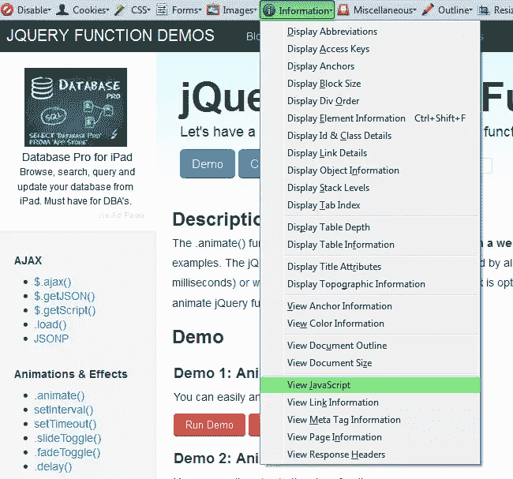
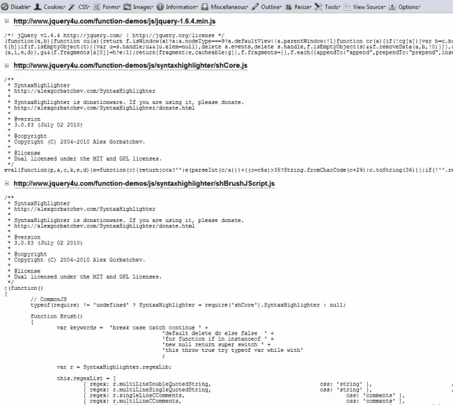

# 在页面上显示所有 JavaScript 的两个选项

> 原文：<https://www.sitepoint.com/bookmarklet-show-javascripts-page/>

这里有两个选项可以快速查看网页上使用的所有 JavaScript。当试图在不搜索单个文件的情况下查找事件处理程序或特定代码时，可能会派上用场。

1.  **选项 1:Bookmarklet**–Ichiro Hiroshi 的一个 Bookmarklet(把它拖到你的书签上)可以查看网页上使用的所有 JavaScript，只包括脚本链接和内联代码。
2.  **选项 2:Web Developer Toolbar**——一个 Firefox 插件，允许你查看页面上加载的所有 JavaScript，它包括 include 脚本和内联代码的所有内容。

## 书签

只需拖动这个按钮到你的书签，然后在任何页面上运行，以查看脚本。

## 代码

```
 javascript: (function () {
    s = document.getElementsByTagName('SCRIPT');
    tx = '';
    sr = [];
    for (i = 0; i ' (sr.join("n"))"nn-----nn"
        tx '');
        document.close();
    }
})(); 
```

## Firefox 开发者工具栏

安装 Firefox 附加组件。


访问任何网页，选择工具栏>信息>查看 JavaScript。



它显示了页面上使用的所有 JavaScript，包括包含的内容。js 文件也是。



## 分享这篇文章