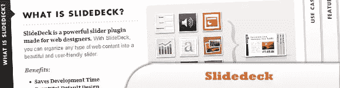
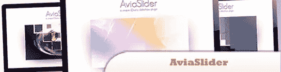
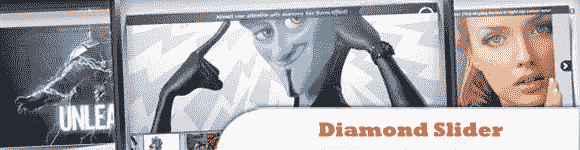
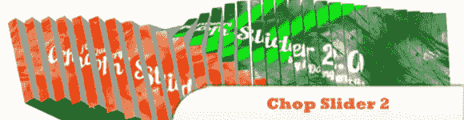

# 10 个需要花钱的 jQuery 插件

> 原文：<https://www.sitepoint.com/10-jquery-plugins-cost-money/>

jQuery 滑块在吸引注意力、显示图片和节省网站空间方面可以发挥非常重要的作用。它提供了一种便捷的方式来显示图像/视频/媒体和重要信息，用户可以滑动浏览，从而增强了网站的用户界面。今天，我们分享给你我们收集的 10 个 jQuery“Slider”插件，你肯定会发现它们很有用，但可能会让你损失一些钱。一定要看看 10 号真的很棒！尽情享受吧！

## 1.滑梯甲板

SlideDeck 是一个为网页设计师设计的强大的滑块插件。使用 SlideDeck，您可以将任何类型的 web 内容组织到一个漂亮且用户友好的滑块中。

好处:
>节省开发时间
>美观默认设计
>强大功能& API
>勤奋支持

  
[源+演示](http://www.slidedeck.com/)

## 2.用于 HTML 的 jQuery 滑块横幅图像旋转器

李 jQuery 图像滑块/横幅图像旋转器是精心制作的滑块/图像旋转器，功能齐全，非常容易安装和定制。每当你需要一个功能齐全的滑块图像旋转器或你需要一个简单的广告横幅，李 jQuery 图像滑块将做这项工作与轻松！

  
[源+演示](http://www.spotnil.com/envato/codecanyon/li-slider/)

## 3.高级滑块 v2.5

您可以将标题的位置设置为左、右、上或下，但您也可以给它一个自定义的位置和大小。此外，你可以选择两种字幕效果:滑动和淡化。

  
[源+演示](http://bqworks.com/products/advanced-slider/v2.5/example_basic.html)

## 4.avia slider–jQuery 幻灯片

是一个非常灵活和易于使用的 jQuery 图像幻灯片插件，具有一组以前没有的真正独特的过渡，以及一些基本的过渡，因此滑块将适合每个项目。

  
[来源](http://codecanyon.net/item/aviaslider-jquery-slideshow/105090)
[演示](http://codecanyon.net/item/aviaslider-jquery-slideshow/full_screen_preview/105090)

## 5.DD slider–10 个过渡–内嵌内容支持

DDSlider 推出了一个新的易于使用的滑块，具有 9 种不同的独特过渡(+渐变和随机-总共 11 种)，支持内嵌内容。在同一个页面中也可以有多个滑块。

  
[来源](http://codecanyon.net/item/ddslider-10-transitions-inline-content-support/104797)
[演示](http://codecanyon.net/item/ddslider-10-transitions-inline-content-support/full_screen_preview/104797)

## 6.jQuery 简单滑块插件

是一个 jQuery 插件，可以用来显示你的图片和视频。CSS3 动画由 Animate.css 驱动。它是移动友好的，支持在您的触摸设备上向左/向右擦除。

  
[来源](http://codecanyon.net/item/jquery-simple-slider-plugin/747688?WT.ac=category_item&WT.seg_1=category_item&WT.z_author=sike)
[演示](http://codecanyon.net/item/jquery-simple-slider-plugin/full_screen_preview/747688)

## 7.Nivo Slider Pro

最棒的 jQuery 图片滑块

  
[来源](http://nivo.dev7studios.com/pro/)
[演示](http://nivo.dev7studios.com/demos/)

## 8.菱形滑块–本·伯恩斯图像幻灯片

这个滑块带有两个漂亮的主题，组织良好的 PSD 源和清晰的 CSS 规则，允许快速简单的皮肤定制，以融入任何网站。这个 jQuery 插件提供了丰富的接口，可以改变任何默认设置，比如动画时间，输入方向等等。

  
[来源](http://codecanyon.net/item/diamond-slider-ken-burns-image-slideshow/686708?WT.ac=category_item&WT.seg_1=category_item&WT.z_author=BillyKid)
[演示](http://codecanyon.net/item/diamond-slider-ken-burns-image-slideshow/full_screen_preview/686708)

## 9.uno Slider–响应触摸启用滑块

是一个 jQuery 内容滑块插件，具有无限的过渡动画(真的，无限！)和各种各样的功能，如支持触摸、移动优化界面、动画层、响应能力和许多其他功能。

  
[来源](http://codecanyon.net/item/unoslider-responsive-touch-enabled-slider/657866?WT.ac=category_item&WT.seg_1=category_item&WT.z_author=Unodor)
[演示](http://codecanyon.net/item/unoslider-responsive-touch-enabled-slider/full_screen_preview/657866)

## 10.Chop Slider 2 jQuery 插件

是最伟大和最引人注目的动画 jQuery 图像滑块之一，拥有超过 150 种预定义的效果，包括 3D 效果！

  
[来源](http://codecanyon.net/item/chop-slider-2-jquery-plugin/591516?WT.ac=category_item&WT.seg_1=category_item&WT.z_author=iDangerous)
[演示](http://codecanyon.net/item/chop-slider-2-jquery-plugin/full_screen_preview/591516)

## 分享这篇文章