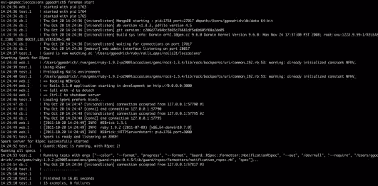
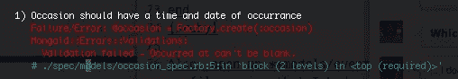

# 场合:雇佣工头、继承资源和场合

> 原文：<https://www.sitepoint.com/loccasions-hiring-a-foreman-occasions/>

在这篇文章中，我想最终完成 MVC 序列。这是[系列](https://www.sitepoint.com/loccasions-retrospective/)的第七篇文章，我想我们现在应该走得更远了。那些对我们低于预期的进展负有责任的人已经被解雇了。然而，首先，让我们使启动开发环境变得更容易一些。也许这将启动我们的生产力…

## 雇用工头

每次我想入侵 Loccasions，我都必须启动 guard，一个 web 服务器(`rails s`，目前)，以及 mongodb 和我的 vim 会话。毫无疑问，我忘了启动 mongodb，所以守卫被炸得到处都是。这是一种令人讨厌的浪费时间的行为，也让我在开始我的黑客课程时有一种不好的心态。我想稍微清理一下，所以我请来了[领班](http://rubydoc.info/gems/foreman/0.24.0/frames)。Foreman 是一个“基于 Procfile 的应用程序的管理者”，Google 会告诉你，这意味着你可以创建一个 **Procfile** (我们会把我们的放在应用程序的根目录中)，并列出我们希望 Foreman 启动的进程。

这听起来对我来说太棒了，所以我将`gem foreman, "~> 0.24.0"`添加到我的 Gemfile 中的`:development`和`:test`组，quick `bundle install`和 foreman 正式成为 payrole。

我有三个想要在开发中运行的流程:`mongod`、`guard`和`rails s`，所以我的 **Procfile** 看起来像这样:

```
web: rails s
test: guard
db: mongod --dbpath=/Users/ggoodrich/db/data
```

现在，我可以在我的应用程序目录中键入`foreman start`，Forman 将启动这三个进程。



这里没有安全帽

我喜欢想象一个衣衫褴褛、戴着安全帽的家伙对着流程尖叫(“好吧，数据库！离开你的懒惰碎片，准备数据！”)不过，老实说，我认为 Formean 更好的名字应该是 Procadile。我已经可以看到标志了…也许我需要得到一个非编程的爱好…


好吧，也许这个标志会比这个更好...

## 场合

我们终于可以设计如何添加活动了。你可能记得，场合属于一个事件。一个事件是该事件的个别发生。因此，如果您的事件是“销售女童军饼干”，那么该事件的事件可能是“2010 年 2 月 2 日”，纬度/经度为 35.223/-85.443(我邻居的房子)，注释为“2 盒 Samoas”。那么，该事件的另一个事件的日期可以是 2010 年 2 月 10 日，用 lat/long(我孩子的学校的 lat/long)表示，并且有一个说明说“Whatsherface 夫人买了一盒薄薄荷糖。”

让我们围绕这个想法写一些单元测试。将此放入**规格/型号/时机 _ 规格. rb**

```
require 'spec_helper'

describe 'Occasion' do
  before do
    @event = Factory.build(:event)
    @occasion = @event.occasions.build
  end

  it "should belong to an event" do
    @occasion.event.should_not be_nil
  end
  it "should have a time and date of occurrence" do
    dt = Time.now

    @occasion.occurred_at = dt
    @occasion.occurred_at.to_s.should == dt.to_s
  end

  it "should have a latitude and longitude" do
    @occasion.latitude = -85.000
    @occasion.longitude = 35.3232

    @occasion.latitude.should == -85.000
    @occasion.longitude.should == 35.3232
  end

  it "should have a note" do
    @occasion.note = "This thang went down"
    @occasion.note.should == "This thang went down"
  end

end
```

这些测试失败了，因为我们没有创建一个事件模型，并且 Event 没有一个`occasions`方法。一个快速的`rails g model Occasion occurred_at:datetime latitude:float longitude:float note:text -s`将会解决这个问题。(注意:s 跳过现有文件，这是我们已经创建的 spec 文件)。我们必须修改生成的模型文件，告诉它它存在于事件中。我们的**应用程序/模型/场合. rb** 文件看起来像这样:(我已经添加了验证和访问器)

```
class Occasion
  include Mongoid::Document
  field :occurred_at, :type => Time
  field :latitude, :type => Float
  field :longitude, :type => Float
  field :note, :type => String
  embedded_in :event, :inverse_of => :occasions
  validates :occurred_at, :latitude, :longitude, :presence => true

  attr_accessible :occurred_at, :latitude, :longitude, :note
end
```

另外，打开 **models/event.rb** ，在`embedded_in :user`行下面添加`embeds_many :occasions`。再次查看这个文件时，我意识到我忽略了定义事件的哪些属性应该是可访问的。这是一个坏习惯，所以我在事件模型中添加了`attr_accessible :name, :description`。

### 改变我们的 Spork 配置

在编写场合模型规范的过程中，我在 **spec/factories.rb** 中添加了一个新工厂来创建一个场合

```
factory :occasion do
    latitude 35.1234
    longitude -80.1234
    occurred_at DateTime.now
    note "Test Occasion"
    event
  end
```

在我的新工厂中，我改变了场合规格中的`before`块来使用它。这导致我的规格到处都是错误，比如:



我的工厂在哪？

所以，我的新 Spork/Guard 超级神奇的环境没有重新加载工厂。我疯狂地转向谷歌，问“现在怎么办？？！?"谷歌平静地回答:“把这个放到你的 **spec/spec_helper.rb** 文件的 Spork.each_run 块里，我的伙计。”

```
# Reload our factories
  FactoryGirl.factories.clear
  Dir[Rails.root.join("spec/factories.rb")].each{|f| load f}
```

当你弄乱 spec_helper.rb 时，Guard 知道重新加载 RSpec 环境，所以我的测试再次令人满意。当我们在那里时，让我们添加一些东西来重新加载路线:

```
# Reload routes
  Loccasions::Application.reload_routes!
```

现在我们有了一个模型，我们需要一种方法来创建它们。

### 你说土豆“快点”，我说土豆“场合控制者”

在这一点上，我们都应该是为资源创建 vanilla Rails 控制器的奥林匹克金牌获得者。在这种情况下，我们的资源就是机会。继续尝试获得一个工作(和规格)的控制器，用于启动和运行的场合。你可以看看我对这个要点做了什么，看看结果如何。

## 继承的资源

哇哦。要点是什么？这看起来不像我们为事件控制器所做的。你说得对，看起来不是那样。我骗了你。Plataformatec(和[制作 Rails 应用](http://pragprog.com/book/jvrails/crafting-rails-applications))的 Jose Valim 创造了 [inherited_resources](https://github.com/josevalim/inherited_resources) gem 来解决 Rails 中 95%的 RESTful 控制器做同样事情的事实。使用 Jose 的 gem，我们可以让我们的偶发事件控制器从`InheritedResources::Base`继承，并且我们可以免费获得 7 个~ ~致命~ ~公共控制器动作。我*心*这个社区。(顺便说一句，现在是我们把`gem "inherited_resources", "~> 1.3.0"` 添加到你的 Gemfile 和`bundle install`宝宝的好时机。)

在这种情况下，它不是完全自由的，因为我们必须做一些配置来处理我们的“特殊”情况。
这些情况主要与我们使用 MongoDB 有关，事实上场合是嵌入在文档层次结构中的(用户== >事件== >场合)。如果你试图做一些类似`Occasion.where(:event_id => @event.id)`或其他的事情，你会得到下面的错误，当你第一次看到它的时候，你会吓得魂不附体:

```
Mongoid::Errors::InvalidCollection: Access to the collection for Occasion is not allowed since it is an embedded document, please access a collection from the root document.
```

一旦你冷静下来，你就会意识到这完全有道理。因为我们使用的是文档数据库，所以事件被**嵌入到**事件中，事件被**嵌入到**用户中。因此，与其使用常规的 ActiveModel 类方法来访问集合，不如沿着文档层次结构向下走。我们需要一个用户(`current_user`，我们已经在使用它来确定事件的范围)和一个事件。我们在哪里得到事件？

route 参数有一个`:event_id`条目，因此，如果我们自己做这件事，我们将获取它并查询`current_user.events`集合。这是一个非常常见的场景，继承的*资源 gem 对常见场景非常聪明。让我们来看看**app/控制器/场合*** 控制器. rb 中的这个配置

文件:

```
belongs_to :event
actions :all, :except => [:show, :index]

def begin_of_association_chain
  current_user
end
```

但是等等！还有呢！！你看到上面那个`action`方法调用了吗？它告诉 inherited_resources 我们希望(或者在本例中不希望)控制器执行哪些操作。时机只能通过事件来观察，所以现在创建`show`和`index`动作是没有意义的(当我们到达 Loccasions API 时，我们会改变主意)。你们中真正有洞察力的人现在会问“但是，重定向呢？”，这是一个很棒的问题。Rails RESTful 控制器的一个常见习语是在资源创建后重定向到索引或显示页面。同样，我们不打算在这里这样做，我们想去的是`events#show`行动。inherited_resources gem 有一个叫做“智能重定向”的特性(来自他们的 [github 页面](http://github.com/josevalim/inherited_resources):)

> 创建和更新操作中的重定向按以下顺序计算资源 *url、集合* url、父 *url(我们稍后将看到)、根* url。在销毁操作中重定向按以下顺序计算集合 *url，父* url，root_url。

换句话说，它指出了我们想要什么。当我发现这个特征时，我像个小女孩一样尖叫起来。(不过，公平地说，我经常尖叫。)

非常简单，我们减少了需要编写的代码量。事件可以添加时机。我写了**spec/acceptance/add _ occasions _ spec . Rb 和 delete_occasions_spec.rb** 。我目前不担心更新，因为我在查看用例时遇到了问题。我确信我们稍后会回来更新，但是现在我想看地图。

**更新:**警觉的读者尼古拉斯·亨利在下面的评论中指出，你需要:

*   用事件表单 [github](https://github.com/ruprict/loccasions/blob/master/app/views/events/show.html.haml) 修改 events/show.html.haml
*   添加 occasions/_ occasion . html . haml[github](https://github.com/ruprict/loccasions/blob/master/app/views/occasions/_occasion.html.haml)
*   为场合 [github](https://github.com/ruprict/loccasions/blob/master/config/routes.rb) 添加路线

## loccasions . map do { | its | about . time()}

嗯，差不多…地图会是下一个帖子。

## 分享这篇文章