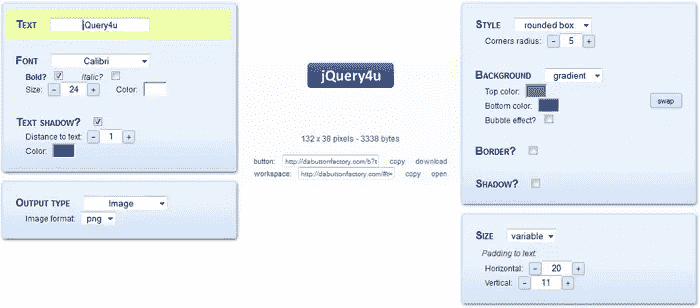
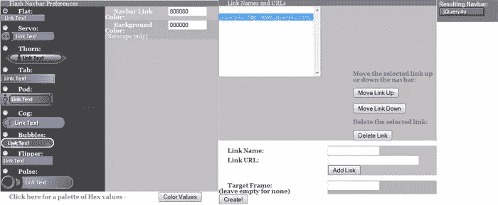
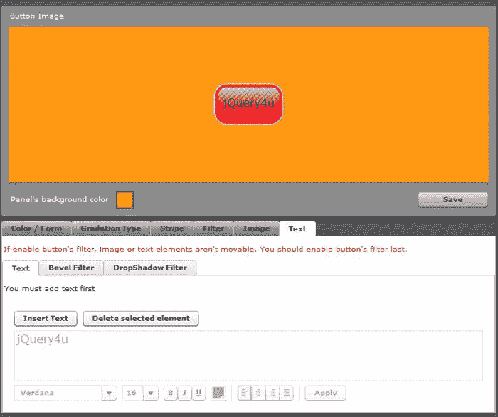
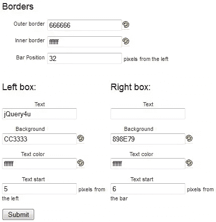
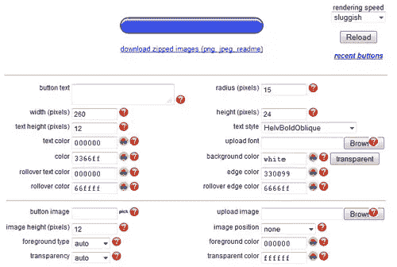
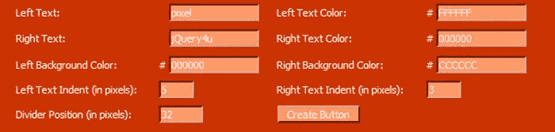
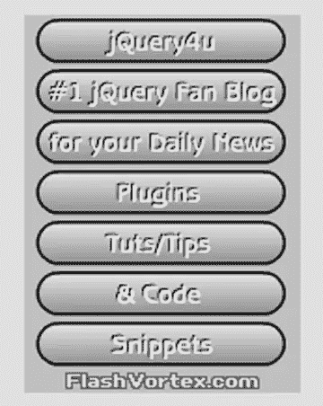
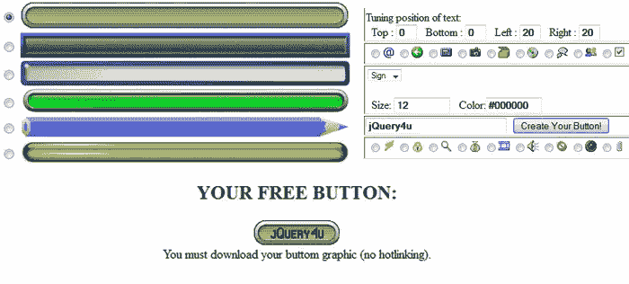
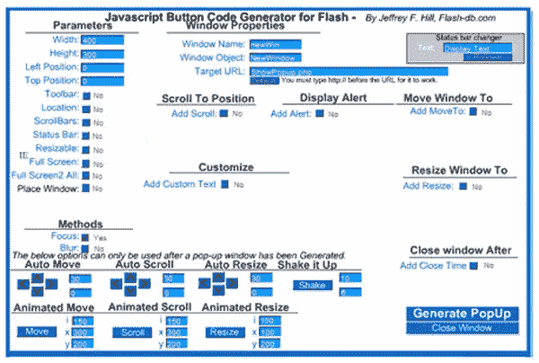

# 10 个在线网站按钮生成器

> 原文：<https://www.sitepoint.com/10-online-button-generators/>

我们收集了 10 个免费在线按钮创建者的名单，你可能会觉得非常有用！每个设计师&开发者都知道按钮对一个人的网站的重要性，这些工具将帮助你立刻创造出精彩的按钮！尽情享受吧！

相关帖子:

*   [**5 在线加载 AJAX 旋转器生成器工具**](http://www.jquery4u.com/tools/online-loading-ajax-spinner-generators/)
*   [**10 jQuery 增强 CSS 按钮**](http://www.jquery4u.com/plugins/10-jquery-enhanced-css-buttons/)

## 1.纽扣制造商

这是一个很棒的免费工具，可以为你的按钮生成 CSS 代码。按钮的不同部分有不同的颜色。颜色选择器顶部的滑块允许您修改左侧按钮的大小和形状。

  
[来源](http://css-tricks.com/6478-css3-button-maker/)
[演示](http://css-tricks.com/examples/ButtonMaker/)

## 2.达钮扣厂

这为你提供了很好的按钮创建工具。您可以改变按钮的大小、文本阴影、样式、颜色和输出类型(PNG / JPEG / GIF / ICO)。您对按钮所做的更改会随着您的工作而更新。

  
[源+演示](http://dabuttonfactory.com/)

## 3.自由闪光按钮发生器

如果你正在寻找一个创建 Flash 按钮的资源，那么免费的 Flash 按钮生成器将会出色地完成这项工作。首先选择一种按钮样式。可以通过十六进制值改变颜色。底部窗格允许您向按钮添加链接以及链接的名称。单击最后一个按钮会生成您的按钮及其相应的 HTML 代码。

  
[源+演示](http://swishit.com/FreeFlashButtons.html)

## 4.作为按钮生成器

您可以通过选项卡式界面编辑来创建按钮。定制选项覆盖了很多领域，可以满足你所有的按钮创建需求。结果可以作为 PNG 图像文件下载。

  
[源+演示](http://jirox.net/AsButtonGen/)

## 5.亚当·卡尔西的纽扣制造商

Adam Kalsey 的这个按钮创建工具有一个简单的界面。您可以选择按条分割图标，并选择条和按钮边缘之间的像素距离。

  
[源+演示](http://kalsey.com/tools/buttonmaker/)

## 6.玻璃状按钮

为你网站的菜单系统创造一些闪亮的玻璃按钮。

  
[源+演示](http://www.glassybuttons.com/glassy.php)

## 7.在线纽扣制造商

这个免费的在线按钮制作工具可以用来制作 88 x 31 像素的按钮，在你的网站上使用。如果你喜欢按钮制造商，请链接到这个页面。

  
[源+演示](http://www.yugatech.com/make.php)

## 8.闪光涡流

免费的在线工具来创建 Flash 横幅，菜单，按钮和更多。

  
[源+演示](http://www.flashvortex.com/download.php?generatorId=151)

## 9.Web 2.0 按钮制造商

基于网络的在线按钮生成器——在这个页面上，你可以为按钮创建数百种样式来装扮任何网页。

  
[源+演示](http://www.web2.0button.com/)

## 10.Flash DB JavaScript 按钮代码生成器

这是一个 JavaScript 按钮代码生成器工具，生成的 JavaScript 代码可以在你的网站上使用。

  
[源+演示](http://www.flash-db.com/PopUp/)

## 分享这篇文章