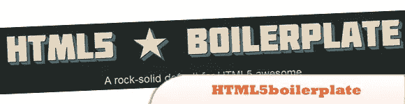
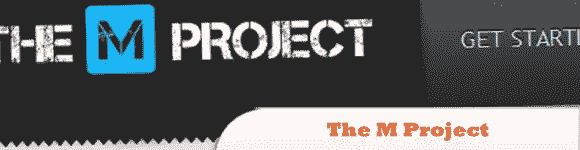
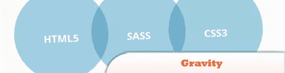
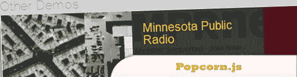
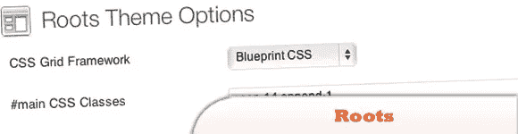
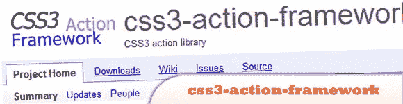

# 10 个方便的 HTML5 / CSS3 框架

> 原文：<https://www.sitepoint.com/10-handy-html5-css3-frameworks/>

呼唤所有 web 开发者！你当然应该浏览一下这些简单的 HTML5/CSS3 框架。我们在最近的帖子中发布了一些框架，但你可能想看看这个集合，因为你以前可能没有使用过其中的大部分。与最新的便捷 HTML5 & CSS3 技术保持同步！尽情享受吧！

相关帖子:

*   [**10 个轻量级和极简 CSS 框架**](http://www.jquery4u.com/dynamic-css-2/10-lightweight-minimal-css-frameworks/)
*   **移动 Web 应用开发者的 10 个新框架**

 **## 1.html 5 样板文件

H5BP 为您带来了美味的文档、站点优化构建脚本和定制样板生成器。除此之外，我们现在通过优化的服务器配置支持 lighttpd、Google App Engine 和 NodeJS(以及 Apache、Nginx 和 IIS ),并且我们已经将发布的样板文件的总体大小减少了 50%。

来源

## 2.M 项目

跨平台移动应用的 HTML5 JavaScript 框架。一些特性:MVC HTML5，JavaScript- all 开发周期，离线支持(自动缓存清单生成)，丰富的用户界面，用于本地和远程存储持久性的 DataProvider，国际化(i18n)，开源(MIT License)，基于 NodeJS 的构建工具(称为 Espresso)。

[演示](https://github.com/mwaylabs/The-M-Project)

## 3.重力

一个基于 SASS 的框架，用于制作功能强大、易于维护的 HTML5 网站。它可以帮助你快速地原型化你的想法，并且通常会让你的生活变得更加容易。

[来源](http://gravityframework.com/)
[演示](http://gravityframework.com/examples/)

## 4.爆米花. js

是 HTML5 视频的事件框架，提供了一个简单的 API 来同步交互式和沉浸式内容。Popcorn.js 利用原生的 HTMLMediaElement 属性、方法和事件，将其规范化为一个易于学习的 API，并为社区贡献的交互提供一个插件系统。

[来源](http://popcornjs.org/)
[演示](http://popcornjs.org/demos)

## 5.根

是一个为开发者设计的 WordPress 主题，它基于 HTML5 样板、Blueprint CSS(或 960.gs)和 Starkers，可以帮助你快速创建小册子网站和博客。

[来源](http://www.rootstheme.com/)
[演示](http://www.rootstheme.com/)

## 7.css3-行动-框架

CSS3 动作库旨在将所有最好的 CSS3 效果聚集在一个地方。今天支持 CSS3 的浏览器数量正在增长；在许多情况下，CSS3 可以像 Java Script 替换一样使用，并有助于更好的浏览体验。

[来源](http://code.google.com/p/css3-action-framework/)
[演示](http://www.allapis.com/css3-action-framework/hover.html)

## 分享这篇文章**