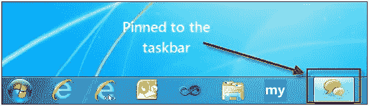
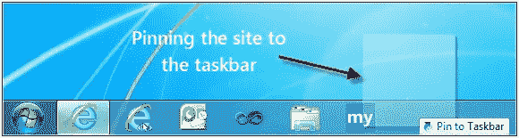
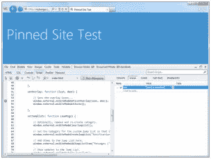

# 使用站点锁定和覆盖图标来提高用户参与度

> 原文：<https://www.sitepoint.com/using-site-pinning-and-overlay-icons-for-enhanced-user-engagement/>

我最近在测试 IE9 的站点锁定 API，发现了一个很酷的功能，可以增强用户通知。如果你不熟悉站点锁定，这是一个很好的方法，允许用户通过 Windows 任务栏方便快捷地访问他们喜欢的站点。在 BuildMyPinnedSite.com 的上有一个很好的概述，解释了它是如何工作的，Sitepoint 以前也发表过一些很好的报道[这里](https://www.sitepoint.com/pinned-sites-with-internet-explorer-9-and-windows-7/)，这里[这里](https://www.sitepoint.com/using-pinned-sites-to-build-customer-relationships/)和[这里](https://www.sitepoint.com/huffpost-pinned-sites-reinventing-the-big-news-experience/)。

### 让用户保持最新状态

API 提供的特性之一是通知，它允许开发人员向最终用户提供警告。该功能允许您动态插入自定义的覆盖图标，以便在重要信息可用时提醒用户。这些覆盖图标呈现在固定在任务栏上的 favicon 上。如果你看下面的图片，你可以看到它的作用:


*钉住没有覆盖图标的站点*


*用覆盖图标钉住站点*

因此，如果你考虑一下可能性，任何为用户提供收件箱、特价商品或发送时间敏感警报的网站都可以使用这种通知功能来让他们的用户了解最新情况，并更多地参与到网站中。像《赫芬顿邮报》这样的网站已经发现，注册了《赫芬顿邮报》[的用户在网站](http://windowsteamblog.com/ie/b/ie/archive/2011/02/17/economics-of-the-web-ie9-users-that-pin-huffington-post-spend-49-more-time-on-site.aspx)上花费的时间增加了 49%。

最棒的是，添加这一功能非常简单。

### 设置它

在这篇文章中，我们不打算深入介绍如何锁定一个网站的基础知识。如果你想了解更多，这里有一个让你快速上手的好资源:[BuildMyPinnedSite.com](http://buildmypinnedsite.com/)。事实上，我用那个网站来帮助我掌握基础知识，它非常值得一去。

要添加通知，您需要几样东西:

*   一个很酷的网站图标。如果你没有，你可以使用方便的基于网络的 X 图标编辑器来创建一个。
*   要使用的一组覆盖图标。建议尺寸为 16×16。

API 是基于 JavaScript 的，我们将使用以下方法:

[`window.external.msSiteModeClearIconOverlay()`](http://msdn.microsoft.com/en-us/library/ff976301%28v=VS.85%29.aspx)
[`window.external.msSiteModeSetIconOverlay()`](http://msdn.microsoft.com/en-us/library/ff976304%28v=VS.85%29.aspx)
[`window.external.msSiteModeActivate()`](http://msdn.microsoft.com/en-us/library/ff976297%28v=VS.85%29.aspx)
[`window.external.msIsSiteMode()`](http://msdn.microsoft.com/en-us/library/ff976296%28v=VS.85%29.aspx)

`window.external.msSiteModeClearIconOverlay`方法用于清除任何先前设置的覆盖图标。`window.external.msSiteModeSetIconOverlay`允许您指定通知图标的名称以及可访问的描述。我们将使用`window.external.msSiteModeActivate`来闪烁图标以通知用户更新。最后，`window.external.msIsSiteMode`会让我们知道页面是否是作为固定站点启动的，从而让我们更好地确定何时运行代码。

对于覆盖图标，我使用了五个图像，分别显示数字 1 到 5，来表示用户收件箱中的邮件数量。

### 代码

我需要添加的第一件事是对我的 favicon 的引用。请注意，如果您没有添加，默认情况下将使用 Internet Explorer 的图标。

```
<link rel="shortcut icon" type="image/ico" href="favicon.ico" />
```

接下来，我想创建一些样本数据来使用。在我的演示中，我想让叠加图标每 5 秒钟动态变化一次，以模拟更真实的场景。数据是一个简单的数组，每个元素中都包含 JSON 数据。

```
myPin.init([{ "num": 1, "label": "Label 1" },

            { "num": 2, "label": "Label 2" },

            { "num": 3, "label": "Label 3" },

            { "num": 4, "label": "Label 4" },

            { "num": 5, "label": "Label 5" }

            ]);
```

通过设置计时器，我将能够每 5 秒钟获取一组新数据。

```
setInterval(function () { myPin.getData(); }, 5000);
```

要记住的主要事情是，我正在“模拟”从某个远程主机获取数据。实际上，`myPin.getData()`方法所做的就是使用一个运行计数器来获取一组新的数据，并呈现一个新的覆盖图标:

```
getData: function () {

        // A function that just simulates returning a result set...

        var idx = 0;

        // Determines whether the current page was launched as a pinned site.

        if (window.external.msIsSiteMode()) {

            idx = this.currIndex++;

            this.currIndex = (this.currIndex < 5) ? this.currIndex : 0;

            this.dispOverlay(this.dataBin[idx]);

        }

}
```

如您所见，它使用运行计数器 var `currIndex`来确定要获取哪个数组元素，然后将数据传递给`dispOverlay()`。这就是我们使用`window.external.msSiteModeClearIconOverlay()`清除任何先前显示的覆盖图标并为实际图标名生成一个字符串的地方。你可以看到`oImg` `var`是基于我们正在使用的数据动态创建的。

```
dispOverlay: function (theData) {

        var oImg = "";

        // Is there any data?

        if (theData) {

            // Clear any preexisting overlay icon

            window.external.msSiteModeClearIconOverlay();

            // Create the image string...

            oImg = "images/num_" + theData.num + ".ico";

            // Go ahead and create the overlay image and it's label...

            this.setOverlay(oImg, theData.label);

        }

}
```

该图标名称以及图标的可访问标签文本被传递给`setOverlay()`，它通过`window.external.msSiteModeSetIconOverlay`设置覆盖图标，并使用`window.external.msSiteModeActivate`闪烁任务栏图标。

```
setOverlay: function (icon, desc) {

            // Sets the overlay icons...

            window.external.msSiteModeSetIconOverlay(icon, desc);

            window.external.msSiteModeActivate();

}
```

### 测试一下

要测试这一点，只需在 Internet Explorer 9 中运行新锁定的页面，抓住选项卡并将其拖到任务栏即可:


*标签被拖动到任务栏*


*钉住没有覆盖图标的站点*

页面被锁定五秒钟后，代码将触发第一个通知，并继续每隔五秒钟在其他图标之间循环。


*用覆盖图标钉住站点*

要记住的一件重要的事情是，IE F12 开发工具可供你在调试你的固定站点时使用。因此，如果你遇到了怪癖，只需按下 F12 键，工具就会出现。



### 演示和最终代码

你可以在 IE9:

[http://reybango.com/demos/sitepinning/index.html](http://reybango.com/demos/sitepinning/index.html)

当页面呈现时，将选项卡向下拖动到任务栏并固定它。您应该会看到一个新的窗口，其中显示了您新固定的站点。五秒钟后，你会看到第一个重叠图标出现在任务栏中。

这是完整的源代码。你也可以[在这里](http://reybango.com/demos/sitepinning/src/pinned-sites-overlay-icons.zip)下载一切。真正了不起的是，实现这一点的代码并不多。事实上，使用 API 只需要 4 次方法调用。大部分代码是为了模拟拉入数据。对用户参与度的影响当然值得添加到功能中。

```
<!DOCTYPE html>

<html>

<head>

<title>Pinned Site Test</title>

<link rel="shortcut icon" type="image/ico" href="favicon.ico" />

<meta name="application-name" content="Pinned Site Test" />

<meta name="msapplication-starturl" content="http://reybango.com/demos/sitepinning/index.html" />

<meta name="msapplication-navbutton-color" content="#3480C0" />

<meta name="msapplication-window" content="width=1024;height=768" />

<meta name="msapplication-tooltip" content="Testing the Pinned Site API" />

<style>

body {

    background: none repeat scroll 0 0 #4492CE;

    color: #EDEFF4;

}

h1 {

    float: left;

    font: 440%/1.4em 'Segoe Light',Segoe,'Segoe UI','Meiryo Regular','Meiryo',sans-serif;

    margin-left: 10px;

    position: relative;

}

</style>

</head>

<body>

<h1>Pinned Site Test</h1>

<div></div>

<script>

    var myPin = {

        currIndex: 0,

        dataBin: [],

        getData: function () {

            // A function that just simulates returning a result set...

            var idx = 0;

            // Determines whether the current page was launched as a pinned site.

            if (window.external.msIsSiteMode()) {

                idx = this.currIndex++;

                this.currIndex = (this.currIndex < 5) ? this.currIndex : 0;

                this.dispOverlay(this.dataBin[idx]);

            }

        },

        setOverlay: function (icon, desc) {

            // Sets the overlay icons...

            window.external.msSiteModeSetIconOverlay(icon, desc);

            window.external.msSiteModeActivate();

        },

        dispOverlay: function (theData) {

            var oImg = "";

            // Is there any data?

            if (theData) {

                // Clear any preexisting overlay icon

                window.external.msSiteModeClearIconOverlay();

                // Create the image string...

                oImg = "images/num_" + theData.num + ".ico";

                // Go ahead and create the overlay image and its label...

                this.setOverlay(oImg, theData.label);

            }

        },

        init: function (myData) {

            this.dataBin = myData;

        }

    };

    // This clears out any previously set overlay icons...

    window.external.msSiteModeClearIconOverlay();

    // Run it once to kick everything off...

    myPin.init([{ "num": 1, "label": "Label 1" },

            { "num": 2, "label": "Label 2" },

            { "num": 3, "label": "Label 3" },

            { "num": 4, "label": "Label 4" },

            { "num": 5, "label": "Label 5" }

            ]);

    // This is only here because I want to simulate pulling data on a regular interval...

    setInterval(function () { myPin.getData(); }, 5000);

</script>

</body>

</html>
```

*本文原载[由作者](http://blog.reybango.com/2011/10/10/using-site-pinning-and-overlay-icons-for-enhanced-user-notifications-and-engagement/)发布。它是再版，稍加修改，经允许。*

## 分享这篇文章