# 自动化 Amazon EC2 实例备份和恢复，第二部分

> 原文：<https://www.sitepoint.com/automating-amazon-ec2-instance-backup-and-recovery-part-two-2/>

# 第二部分:从快照中恢复 EC2 实例。

**技能等级:**中级。
**操作系统:** Linux。

## 第一部分最后一次…

我们在第一部分结束时停下来，从`cron`开始每天运行一次计划快照。在第二部分中，我们将学习如何使用几个命令从快照中恢复失败的 AWS EBS 支持的 EC2 实例。

## 灾难场景

哪些情况会迫使我们执行完整实例恢复？以下是几个例子:

*   文件系统损坏
*   恶意入侵
*   硬件故障
*   影响您的实例但不影响其他实例的延长的 Amazon 一般中断
*   人为误差

## 恢复场景

### 您有另一个 EC2 实例

这是我的首选方法。因为我维护了多个实例，所以它们都运行着`cron`备份，因此都有能力执行恢复任务。如果您有另一个实例，但是它还没有安装 EC2 API 工具，请查看第一部分，了解如何安装它。

### 您没有其他实例

以下是一些可以考虑的选项:

*   创建一个新的 T1.micro“仅限管理员”实例。按月计算，它们相当便宜，但仍能为您提供完整的功能。它们足够便宜，可以全天运行，所以你不必在危机期间大惊小怪。
*   使用这些说明来克隆现有的单个实例。如果您正在运行一个大型实例并制作其精确的运行副本，这可能会带来很高的成本。一种成本更低的方法是克隆实例，并在需要时关闭它。
*   使用您的家庭系统来提供功能。[请参见约翰·德格纳的优秀教程进行说明。](https://www.sitepoint.com/from-zero-to-cloud-setting-up-an-ec2-sandbox-part-2/ "From Zero to Cloud: Setting up an EC2 Sandbox, Part 2")本解决方案的详细说明超出了本教程的范围，但是这些示例可以很容易地用于这种情况。

## 选择一种方法–AWS 控制台或命令行

本教程包括 GUI 和 CLI 两种方法。每个都有优点，我让你选择你喜欢的那个…

## 先决条件:

*   成功完成[第一部分](https://www.sitepoint.com/automating-amazon-ec2-instance-backup-and-recovery-part-one/ "Automating Amazon EC2 Instance Backup and Recovery, Part One")，特别是`/opt/bin/instanceid`和`/opt/bin/ec2do`。
*   GUI 方法:访问 [AWS 管理控制台 Web GUI](https://console.aws.amazon.com/ec2)
*   CLI 方法:对正在运行的 AWS EC2 EBS 支持的 Linux 实例的超级用户访问——例如:

    ```
    ssh -i AWSKeyPair.pem ec2-user@{yourInstance_FQDN_or_IP}
    % sudo su
    root@yourInstance#
    ```

## AWS 管理控制台 GUI 计划

1.  收集有关实例的信息。
2.  收集有关可用快照的信息。
3.  从选择的快照创建 Amazon 机器映像(AMI)。
4.  从刚刚创建的 AMI 启动一个新实例。

### GUI 方法:关于实例的信息

很容易在实例视图中自定义列以显示您需要的内容:

*   Click on Instances in the left navigation menu

    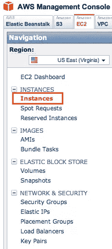

*   Click the Show/Hide button to the right

    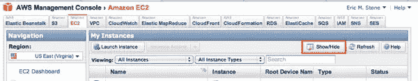

*   Select the needed columns and click Apply

    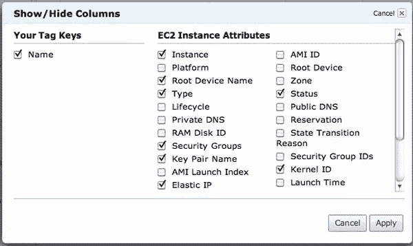

*   Locate and record the following information:
    AMI ID, Root Device Name, Type, Security Groups, Key Pair Name, and Kernel ID

    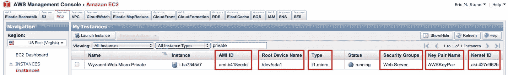

*   Click on AMIs in the left navigation menu, then enter the AMI ID from the previous step into the indicated box. That AMI will appear below. Click the Show/Hide button so that the Architecture and Root device are checked, then click Apply. Verify that the root device is EBS, and record the Architecture:

    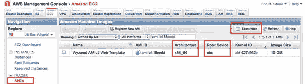

### GUI 方法:从快照创建 AMI

*   Click on Snapshots in the left navigation menu, then click on the “Started” column title until the latest snapshots are at the top. Read through the descriptions until you find one that is a snapshot of a ROOT (/), BOOTABLE filesystem. Once located, click on it once and make sure the checkbox in the first column is checked. Also record the Capacity. Finally, click on the “Create Image” button.

    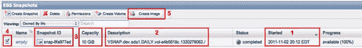

*   Fill out the form with the information you have recorded along the way and click “Yes, Create”.

    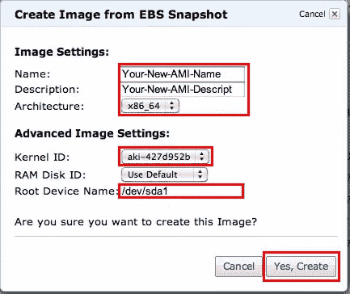

### GUI 方法:从 AMI 启动实例

*   Click on AMIs in the left navigation menu, then type in the name of your new AMI in the search box. Click once on the line and verify that the checkbox is checked at the beginning of the line.

    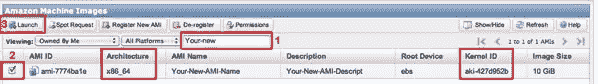

*   At this point, the Launch button should be come enabled. Click it and the Request Instances Wizard appears. Select the instance type you desire, then click Continue:

    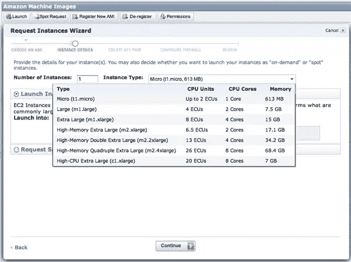

*   Next, specify the kernel ID and check the Accidental Termination Prevention box, then click Continue:

    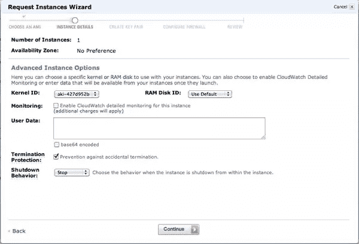

*   Type in the name for your new AMI, then click Continue:

    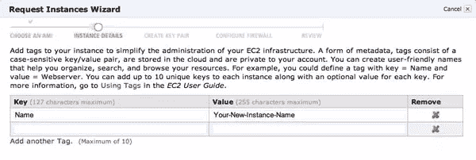

*   Choose a key pair, then click Continue:

    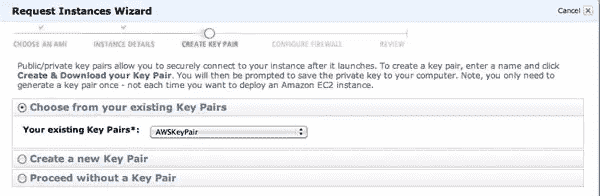

*   Choose or create a security group, then click Continue:

    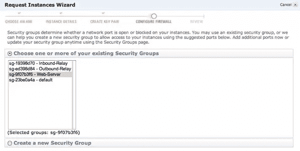

*   Finally, verify all information, then click Launch:

    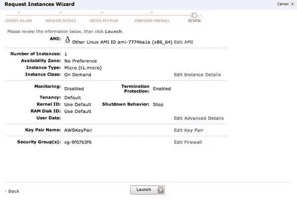

> 如果您已经做到了这一步，那么您已经使用 GUI 控制台方法成功地克隆了一个实例。恭喜你！

## 命令行计划

1.  安装下面的示例脚本。
2.  收集有关实例的信息。
3.  收集有关可用快照的信息。
4.  创建实例克隆并启动它。

### CLI 方法:脚本安装

本教程底部的脚本有助于自动化该过程的每个步骤，提供了工作流的关键部分，使我们能够快速完成工作。

**重要提示:请在`/opt/bin`目录中创建这些脚本，确保在看到花括号{}的地方插入您的具体值。**

**另外，请确保在所有新脚本上正确设置执行权限:**

```
root@yourInstance# chmod 750 /opt/bin/*
```

### CLI 方法:关于实例的信息

在我们继续之前，我们需要收集一些数据。最佳实践是保留一份打印出来的实例配置记录，以便于访问。'-l' (ell)选项告诉脚本在本地模式下运行，它只输出当前实例的信息，还告诉您 OS 架构。此脚本的非本地调用不提供 OS arch。

```
# /opt/bin/instanceinfo -l
ami=ami-31509058
arch=i686
device=/dev/sda1
group=Web-Server
instanceid=i-29765a07
kernel=aki-407d9529
keypair=AWSKeyPair
privatedns=ip-10-100-100-100.ec2.internal
privateip=10.100.100.100
publicdns=ec2-100-200-200-200.compute-1.amazonaws.com
publicip=100.200.200.200
region=us-east-1a
type=c1.medium
volume=vol-723ebc42
```

### CLI 方法:关于可用快照的信息

查找所需卷的可用快照:

```
# /opt/bin/ec2do describe-snapshots | grep {VOLUME_FROM_LAST_STEP}
```

选择您希望用作克隆源的快照，并继续执行创建克隆步骤！

### CLI 方法:创建并启动克隆

```
# /opt/bin/clone -a x86_64 -n "MY-AMI-FROM-SNAPSHOT" -d "AMI-FROM-SNAP-20110818" -r "/dev/sda1" -s "snap-248adc04" -kern aki-427d952b -z 10 -g "My-Security-Group" -t "t1.micro" -k "KeyPairNameHere"
```

#### /opt/bin/clone 的选项

-a OS 架构(/bin/arch)
-n 新 AMI 名称
-d 新 AMI 描述
-r 根设备
-s 快照 ID
-kern 内核 ID
-z 新卷的大小
-g 用于新实例的安全组
-t 类型实例启动
-k 密钥对用于新实例

> 如果您已经做到了这一步，那么您已经使用命令行方法成功地克隆了一个实例。恭喜你！

### CLI 方法:脚本

**重要提示:请在`/opt/bin`目录中创建每个脚本，确保在看到花括号{}的地方插入您的具体值。**
**另外，请务必在所有新脚本上正确设置执行权限:**

```
root@yourInstance# chmod 750 /opt/bin/*
```

#### /opt/bin/instanceinfo

下面是一个简单的 Perl 脚本，用于输出要为每个实例查找的项目列表:

```
#!/usr/bin/perl
#
## instanceinfo
#
use strict;
$|  = 1;

my $args		= {};
$args->{'local'}	= 0;
$args->{'instanceid'}	= '';
while ($ARGV[0] =~ /^-/) {
	$_ = shift;
	$args->{'local'}	= 1,	next if /^-l$/;
}

if ($args->{'local'}) {
	$_	= `/opt/aws/bin/ec2-metadata -i`;
	$args->{'instanceid'}	= (split)[1];
}

open(IN,"/opt/bin/ec2do describe-instances $args->{instanceid} |") or die;

my $settings			= {};
chomp($settings->{1}->{'arch'}	= `/bin/arch`) if $args->{'local'};

my $counter	= 0;
while (<IN>) {
	if (/^RESERVATION/) {
		$counter ++;
		$settings->{$counter}->{'group'} = (split)[3];
	}
	if (/^INSTANCE/) {
		next unless /running/;
		my @line	= split;
		$settings->{$counter}->{'ami'} = $line[2];
		$settings->{$counter}->{'publicdns'} = $line[3];
		$settings->{$counter}->{'privatedns'} = $line[4];
		$settings->{$counter}->{'keypair'} = $line[6];
		$settings->{$counter}->{'type'} = $line[8];
		$settings->{$counter}->{'region'} = $line[10];
		$settings->{$counter}->{'kernel'} = $line[11];
		$settings->{$counter}->{'publicip'} = $line[13];
		$settings->{$counter}->{'privateip'} = $line[14];
	}
	if (/^BLOCKDEVICE/) {
		my @line	= split;
		$settings->{$counter}->{'device'} = $line[1];
		$settings->{$counter}->{'volume'} = $line[2];
	}
	if (/^TAG/ and /name/i) {
		$settings->{$counter}->{'name'} = (split)[4];
	}
}

foreach my $counter (sort keys %$settings) {
	print '='x60,"n$settings->{$counter}->{name}n",'='x60,"n";
	foreach my $key (sort keys %{$settings->{$counter}}) {
		print "$key=$settings->{$counter}->{$key}n";
	}
}
```

### /opt/bin/ec2run

这个脚本包装器只允许我们在需要的时候启动一个新的实例，并且始终有一个合适的环境。

请务必修改以下示例，以包含您的具体信息。

```
#!/bin/bash
#
## ec2run Wrapper
#
export EC2_HOME='/opt/aws/apitools/ec2'  # Make sure you use the API tools, not the AMI tools
export EC2_BIN=$EC2_HOME/bin
export EC2_PRIVATE_KEY=/root/.ec2/pk-{your_32_char_rand}.pem
export EC2_CERT=/root/.ec2/cert-{your_32_char_rand}.pem
export PATH=$PATH:$EC2_BIN
export JAVA_HOME=/usr/java/latest
/opt/aws/bin/ec2run $*
```

#### /opt/bin/clone

本教程的主要 shell 脚本是`clone`，它允许我们创建快照的精确副本作为运行实例。

请务必修改以下示例，以包含您的具体信息。

```
#!/usr/bin/perl
#
## clone
#
use strict;
$|	= 1; # unbuffered output

#######################################################################################################
## some defaults - change these to match your environment, or override from the command line

my $settings	= {};
$settings->{'snap'}	= '';
$settings->{'name'}	= '';
$settings->{'desc'}	= '';
$settings->{'key'}	= 'AWSKeyPair';
$settings->{'type'}	= 't1.micro';
$settings->{'kern'}	= 'aki-427d952b';
$settings->{'arch'}	= 'x86_64';
$settings->{'size'}	= 10;
$settings->{'group'}	= 'Production';
$settings->{'root'}	= '/dev/sda1';

#######################################################################################################
## Process the command line
while ($ARGV[0] =~ /^-/) {
	$_ = shift;
	$settings->{'arch'}	= shift,	next if /^-a$/;
	$settings->{'desc'}	= shift,	next if /^-d$/;
	$settings->{'key'}	= shift,	next if /^-k$/;
	$settings->{'kern'}	= shift,	next if /^-kern$/;
	$settings->{'name'}	= shift,	next if /^-n$/;
	$settings->{'snap'}	= shift,	next if /^-s$/;
	$settings->{'type'}	= shift,	next if /^-t$/;
	$settings->{'size'}	= shift,	next if /^-z$/;
	$settings->{'group'}	= shift,	next if /^-g$/;
	$settings->{'root'}	= shift,	next if /^-r$/;
}

#######################################################################################################
## more defaults...
chomp($settings->{'desc'}	= 'AMI-FROM-SNAPSHOT-' . `/bin/date '+%Y%m%d'`) unless $settings->{'desc'};

#######################################################################################################
## CREATE AN AMI LINKED TO THE SNAPSHOT
my $cmd	= qq|/opt/bin/ec2do register -n $settings->{name} -d $settings->{desc} --root-device-name $settings->{root} -b "$settings->{root}=$settings->{snap}" -a $settings->{arch} --kernel $settings->{kern}|;
print "Executing: $cmdn";
chomp($_ = `$cmd`);
my $ami	= (split)[1];
print "New AMI ID: $amin";

#######################################################################################################
## LAUNCH THE NEW AMI
$cmd	= qq|/opt/bin/ec2run $ami -b "$settings->{root}=snap-$settings->{snap}:$settings->{size}:true" -g $settings->{group} -t $settings->{type} -k $settings->{key}|;
print "Executing: $cmdn";
system($cmd);

print "Done.n";
```

## 摘要

恭喜你！干得好–您已经实现了自动恢复。

## 资源链接

[http://aws.amazon.com/ec2/faqs/](http://aws.amazon.com/ec2/faqs/)
[http://docs . Amazon web services . com/AWS EC2/latest/command line reference/](http://docs.amazonwebservices.com/AWSEC2/latest/CommandLineReference/)
[从零到云:设置 EC2 沙箱，第 2 部分](https://www.sitepoint.com/from-zero-to-cloud-setting-up-an-ec2-sandbox-part-2/ "From Zero to Cloud: Setting up an EC2 Sandbox, Part 2")

Shutterstock 上的 AlexGul 图片

## 分享这篇文章