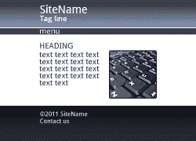

# 如何使用 CSS 将包装元素扩展到整个浏览器宽度

> 原文：<https://www.sitepoint.com/css-extend-full-width-bars/>

很抱歉标题太长，但这是 CSS 布局中面临的一个常见问题。通常，我们需要一个元素超出(居中的)页面宽度来填充浏览器窗口。考虑一个典型的页面设计:



```
 <!DOCTYPE html>
<html lang="en">
<head>
<meta charset="UTF-8" />
<title>SiteName</title>
</head>
<body>
<article>
	<header></header>
	<nav></nav>
	…content…
	<footer></footer>
</article>
</body>
</html> 
```

最外面的页面元素使用 CSS 代码居中，例如:

```
 article
{
	width: 70%;
	margin: 0 auto;
} 
```

那么我们如何应用重复的水平背景来填充窗口呢？页面顶部的元素很简单，因为我们可以在`body`标签上定义一个图像，例如

```
 body
{
	background: url(header.png) 0 0 repeat-x;
} 
```

但是我们不能对页脚这样做，因为它在`article`里面，位置由内容的数量决定。最明显的解决方案是包装元素，即我们将`footer`移出`article`并添加一个内部标签:

```
 …content…
</article>

<footer>
	<div class="content">
		<p>Footer content.</p>
	</div>
</footer> 
```

然后我们可以相应地修改 CSS:

```
 footer
{
	width: 100%;
	background: url(footer.png) 0 0 repeat-x;
}

div.content
{
	width: 70%;
	margin: 0 auto;
} 
```

这是一个我们都在使用的解决方案，尽管它冒犯了语义 HTML 之神。内部的`div`不是必需的——我们添加它是为了 CSS 样式的目的。

幸运的是，有一些跨浏览器的解决方案不需要额外的标签。最简单的方法是添加大量填充，然后用负边距将元素移回其原始位置。这是一种常用于创建等高列的技术，但在本例中，我们将其应用于宽度:

```
 body
{
	overflow-x: hidden;
}

.extendfull, .extendleft
{
	padding-left: 3000px;
	margin-left: -3000px;
}

.extendfull, .extendright
{
	padding-right: 3000px;
	margin-right: -3000px;
} 
```

当“extendleft”类应用于一个元素时，它将扩展到浏览器的左边。类似地，“extendright”将其扩展到右边,“extendfull”两者都做。为了防止水平滚动，我们将`overflow-x: hidden`应用于`body`。

[**查看演示页面……**](https://blogs.sitepointstatic.com/examples/tech/full-width-bars/index.html)

这项技术适用于 IE8、IE9、Firefox、Chrome、Safari 和 Opera。它不是包装标签的替代品，但它确实为一些布局问题提供了一个替代解决方案。

## 但是我绝对要支持 IE6 和 IE7！

真的吗？你确定吗？这种技术不会破坏你的设计，但是 IE6 拒绝显示超出外部元素限制的背景。IE7 尽了最大努力，但是，尽管“extendleft”通常是有效的，但“extendright”却不是这样。

就个人而言，我会让传统浏览器保持原样… *但我不是你的老板*。幸运的是，您可以用一点 CSS 技巧来解决这个问题:

```
 /* IE6/7 fix */
.extendfull, .extendleft, .extendright
{
	position: relative;
	display: inline;
	float: left;
	width: 100%;
} 
```

如果你幸运的话，这不会对你在现代浏览器中的布局产生不利影响。如果是这样，您需要相应地调整样式，使用条件样式表，或者添加一些糟糕的 IE6/7 代码。祝你好运！

## 分享这篇文章