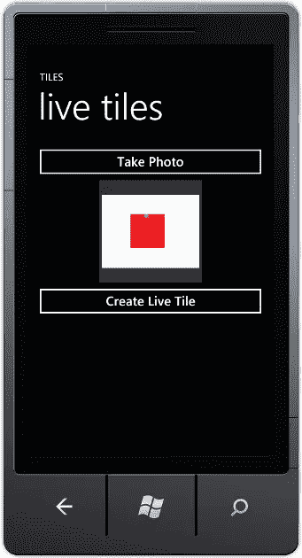
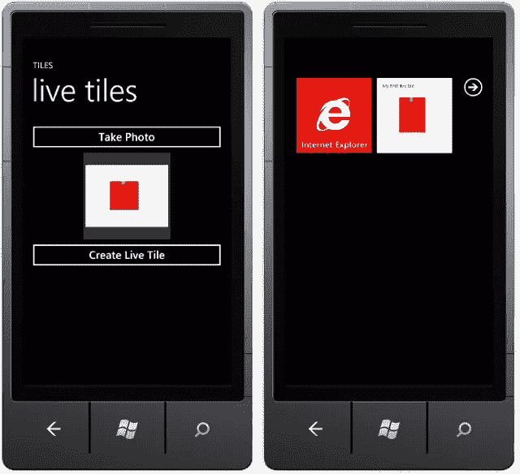

# 如何创建动态实时磁贴

> 原文：<https://www.sitepoint.com/how-to-create-dynamic-live-tiles/>

Windows Phone 最具创新性的功能之一是带有动态磁贴的开始屏幕。在最初的版本中，应用程序被限制为用户可以从应用程序列表中锁定到开始屏幕的单个磁贴。Mango 版本改变了这一点，用户可以选择在开始屏幕上显示多个磁贴，代表应用程序的不同部分。在这篇文章中，我们将看看如何创建动态图片，特别是如何动态创建图片的背景图像。

我们将从包含两个按钮控件和一个图像的简单页面布局开始。第一个按钮将用于启动 CameraCaptureTask，以便从相机中捕捉照片。照片将显示在图像控件中。最后，第二个按钮将大头钉的照片，并使用它作为一个新的生活瓷砖的背景。

```
<StackPanel x:Name="ContentPanel" Grid.Row="1" 
                       Margin="{StaticResource PhoneHorizontalMargin}">
    <Button Content="Take Photo" Click="CaptureClick" />
    <Border Height="200" Width="200" Padding="5"
                    Background="{StaticResource PhoneInactiveBrush}" >
        <Image x:Name="PhotoImage" />
    </Border>
    <Button Content="Create Live Tile" Click="CreateClick" />
</StackPanel> 
```

为了捕捉照片，我们需要创建一个 CameraCaptureTask 的实例，连接完成的事件，并在按下“拍照”按钮时调用 Show 方法。捕获的照片被复制到独立存储中，加载到位图图像中，并显示在图像控件 PhotoImage 中。

```
private string filename;
private CameraCaptureTask camera = new CameraCaptureTask();
public MainPage() {
    InitializeComponent();

    camera.Completed += camera_Completed;
}

void camera_Completed(object sender, PhotoResult e) {
    filename = Guid.NewGuid() + ".jpg";
    using (var file = new IsolatedStorageFileStream(filename, FileMode.Create, 
                FileAccess.Write, IsolatedStorageFile.GetUserStoreForApplication())) {
        e.ChosenPhoto.CopyTo(file);
    }

    DisplayImage(filename);
}

private void CaptureClick(object sender, RoutedEventArgs e) {
    camera.Show();
}

private void DisplayImage(string filename) {
    using (var file = new IsolatedStorageFileStream(filename, FileMode.Open, FileAccess.Read, IsolatedStorageFile.GetUserStoreForApplication())) {
        var image = new BitmapImage();
        image.CreateOptions = BitmapCreateOptions.None;
        image.SetSource(file);

        this.PhotoImage.Source = image;
    }
} 
```

此时运行代码将允许用户启动相机，捕捉图像并在应用程序中显示，如图 1 所示。

[](https://www.sitepoint.com/wp-content/uploads/2011/10/sp0017_01.png)

图 1

下一步是为实时图块创建背景图像。我们可以通过简单地创建一个 WriteableBitmap 并单独呈现各种元素来做到这一点。然而，这使得很难设计和调整平铺的布局。另一种方法是创建一个 UserControl 并使用 Expression Blend 来布局元素。下面的 UserControl 代码创建一个简单的布局，其中 TextBlock 覆盖在 Image 控件上。

```
<UserControl

    xmlns:x="http://schemas.microsoft.com/winfx/2006/xaml"
    xmlns:d="http://schemas.microsoft.com/expression/blend/2008"
    xmlns:mc="http://schemas.openxmlformats.org/markup-compatibility/2006"
    mc:Ignorable="d"
    x:Class="LiveTileSample.FrontTile"
    Width="173" Height="173"
    d:DesignWidth="173" d:DesignHeight="173">
    <Grid>
        <Image Stretch="Fill" Source="{Binding Image}"/>
        <TextBlock TextWrapping="Wrap" Text="{Binding Title}" VerticalAlignment="Top"
                                                  Margin="{StaticResource PhoneMargin}"/>
    </Grid>
</UserControl> 
```

您还会注意到 TextBlock 的 Text 属性和 Image 的 Source 属性都使用数据绑定来确定它们的值。这使得无需调整 UserControl 本身就可以轻松调整磁贴的内容，只需在 UserControl 的实例上设置 DataContext 即可。下面的 TileData 类将表示 UserControl 的内容。

```
public class TileData {
    public string ImageFilename { get; set; }
    public string Title { get; set; }
    public BitmapImage Image {
        get {
            using (var file = new IsolatedStorageFileStream(ImageFilename, FileMode.Open, 
                        FileAccess.Read, IsolatedStorageFile.GetUserStoreForApplication())) {
                var image = new BitmapImage();
                image.CreateOptions = BitmapCreateOptions.None;
                image.SetSource(file);
                return image;
            }
        }
    }
} 
```

当用户点击“Create Live Tile”按钮时，将会创建一个 TileData 类的新实例，其中包含之前捕获的照片的文件名和要覆盖的文本。这将被设置为 FrontTile UserControl 实例上的 DataContext。由于该控件不会被添加到页面上的 VisualTree 中，因此您需要调用 UserControl 上的 Arrange 和 Measure 方法，以使其正确呈现。

接下来，将 FrontTile 呈现为新的 WriteableBitmap。同样，您需要调用 Invalidate，以确保在将 WriteableBitmap 保存到 IsolatedStorage 时，其内容能够正确呈现。您会注意到我们使用了 EditableImage 来帮助将 WriteableBitmap 保存为 png。可编辑图像的代码和相应的 PngEncoder 可以从 Joe Stegman 的博客下载。注意，这段代码使用了我们添加到 EditableImage 类中的一个额外的 FromBitmapImage 方法。请参阅本文末尾的代码。

```
private void CreateClick(object sender, RoutedEventArgs e) {
    var td = new TileData() {
                        ImageFilename = filename,
                        Title = "My first live tile" };
    var ft = new FrontTile();
    ft.DataContext = td;
    ft.Arrange(new Rect(0, 0, 173, 173));
    ft.Measure(new Size(173, 173));

    var wbmp = new WriteableBitmap(ft, null);
    wbmp.Invalidate();

    var ei = EditableImage.FromBitmapImage(wbmp);
    var tileImage = "/Shared/ShellContent/" + filename.Replace(".jpg", ".png");
    using (var file = new IsolatedStorageFileStream(tileImage, FileMode.Create, FileAccess.Write,
                IsolatedStorageFile.GetUserStoreForApplication()))
    using (var strm = ei.GetStream()) {
        strm.CopyToStream(file);
    }

    var shellData = new StandardTileData() {
                            BackgroundImage = new Uri("isostore:" + tileImage, UriKind.Absolute)
                        };
    ShellTile.Create(new Uri("/MainPage.xaml?image=" + filename, UriKind.Relative), shellData);
} 
```

为了将图像用作实时互动程序的背景图像，它的尺寸必须为 173 像素见方，并且必须位于独立存储的`/Shared/ShellContent`文件夹中。在将 WriteableImage 保存到独立存储中之后，可以将新创建的文件设置为新 ShellTile 的 BackgroundImage。Create 方法需要 StandardTileData 类的一个实例，以及用户点击磁贴时将启动的唯一 Uri。在这种情况下，Uri 包含要启动的页面 MainPage.xaml 和一个查询字符串参数 image，它将用于确定要显示的图像。这个过程的最后一部分是处理查询字符串参数并显示相应的图像。

```
protected override void OnNavigatedTo(System.Windows.Navigation.NavigationEventArgs e) {
    base.OnNavigatedTo(e);

    string filename;
    if (NavigationContext.QueryString.TryGetValue("image", out filename)) {
        DisplayImage(filename);
    }
} 
```

图 2 展示了应用程序运行时捕获的一幅图像，然后第二幅图像显示了用户单击“Create Live Tile”按钮时创建的 Live Tile。

[](https://www.sitepoint.com/wp-content/uploads/2011/10/sp0017_02.png)

图 2

最后，下面是添加到 EditableImage 类的代码，用于从 WriteableBitmap 生成 EditableImage。

```
public static EditableImage FromBitmapImage(WriteableBitmap source) {
    var ei = new EditableImage(source.PixelWidth, source.PixelHeight);
    for (int idx = 0; idx < source.PixelHeight; idx++)  {
        for (int jdx = 0; jdx < source.PixelWidth; jdx++) {
            var px = source.Pixels[idx * source.PixelWidth + jdx];
            var a = (byte)((px >> 24));
            var r = (byte)((px >> 16) & 0xff);
            var g = (byte)((px >> 8) & 0xff);
            var b = (byte)((px >> 0) & 0xff);

            ei.SetPixel(jdx, idx, r, g, b, a);
        }
    }
    return ei;
} 
```

## 分享这篇文章