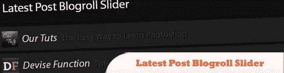
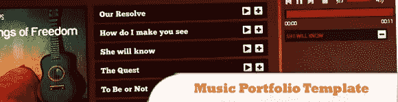
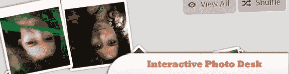
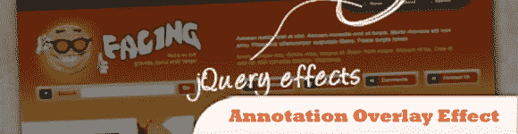
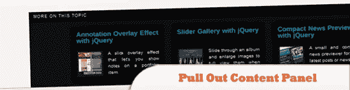
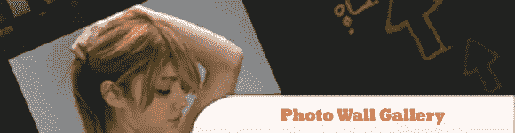
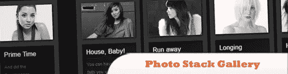

# 10 个 Web 组合 jQuery 插件

> 原文：<https://www.sitepoint.com/10-web-combi-jquery-plugins/>

用 jQuery、CSS 和 HTML 的 **web 组合，给你的 web 设计一个更好的优势，通常的怀疑**。在你的屏幕上看到魔法！它们是一个很好的组合，可以提供小部件、图库、导航等等。尽情享受吧！

相关帖子:

*   [**15 大 jQuery 滚动插件**](http://www.jquery4u.com/jquery-scrolling/top-15-jquery-scrolling/)
*   [**10 个牛逼的 CSS/JS 插件和编码技巧**](http://www.jquery4u.com/javascript/10-awesome-cssjavascript-plugins-coding-techniques/)

## 1.最新帖子 Blogroll 滑块

使用 jQuery、PHP 和 XSL 创建一个 blogroll 滑块，显示你最喜欢的博客的最新帖子。目的是获得博客的给定 RSS 提要，并在 PHP 的帮助下解析 XML 数据。

[来源](http://tympanus.net/codrops/2010/06/17/latest-post-blogroll-slider/)
[演示](http://tympanus.net/Tutorials/LatestPostSlider/)

## 2.剖析 jQuery 过滤器

了解 PHP、CSS3 和 HTML 如何与 jQuery 融合在一起，创建那些吸引人的 jQuery 插件。通过一次取一个 jQuery 源代码块来剖析 jQuery 过滤器，分解它，并了解进程中发生了什么。

[来源&截屏](http://net.tutsplus.com/tutorials/javascript-ajax/quick-tip-dissecting-jquery-filters/)

## 3.带有 HTML5 和 jQuery 的音乐文件夹模板

使用 jQuery 和 HTML5 设计的令人惊叹的音乐作品集模板。这个模板给出了一个关于如何将 HTML5 和 jQuery 融合来创建令人惊叹的插件和设计的想法。

[来源](http://tympanus.net/codrops/2010/07/26/music-portfolio-template/)
[演示](http://tympanus.net/Development/MusicPortfolioTemplate/)

## 4.动画 404 页

迟早有人会输入错误的网址，或者通过一个断开的链接进入你的网站。这就是臭名昭著的 404 页面显示的时间。学习如何设计一个友好的错误页面来鼓励你的用户停留在你的网站上。

[来源](http://tutorialzine.com/2010/08/animated-404-not-found-page-css-jquery/)
[演示](http://demo.tutorialzine.com/2010/08/animated-404-not-found-page-css-jquery/404.html)

## 5.带有 jQuery 和 CSS3 的交互式照片台

基于 jQuery 和 CSS3 的交互式 photoDesk 插件有助于创建交互式文件夹和图库。用这个插件让观众享受在你的网站上玩图片的乐趣。

[来源](http://tympanus.net/codrops/2010/07/01/interactive-photo-desk/)
[演示](http://tympanus.net/Development/PhotoDesk/)

## 6.注释覆盖效果

本教程是关于如何创建一个简单的叠加效果来显示注释，例如网页设计者作品集的作品集项目。

[来源](http://tympanus.net/codrops/2010/10/12/annotation-overlay-effect/)
[演示](http://tympanus.net/Tutorials/AnnotationOverlayEffect/)

## 7.用 jQuery 拉出内容面板

在本教程中，我们将创建一个在预定义的滚动位置滑出的内容面板。它会显示一个与相关内容的预告，它可以扩展到整个页面大小，以显示更多。

[来源](http://tympanus.net/codrops/2010/11/01/pull-out-content-panel/)
[演示](http://tympanus.net/Tutorials/PullOutContentPanel/)

## 8.滑动面板照片墙画廊

本教程有助于创建一个令人惊叹的整页照片墙画廊。这个想法是有一个完整的页面充满了拇指，当我们悬停时有一个很好的灯光效果。当一张图片被点击时，一个面板从底部向上滑动，显示完整的图片。

[来源](http://tympanus.net/codrops/2010/05/14/sliding-panel-photo-wall-gallery-with-jquery/)
[演示](http://tympanus.net/Tutorials/SlidingPanelPhotowallGallery/)

## 9.美丽的照片堆栈库

本教程解释了如何创建一个漂亮清新的图片库。这个想法是将相册显示为一个滑块，当一个相册被选中时，我们将该相册的图像显示为一个漂亮的照片堆栈。

[来源](http://tympanus.net/codrops/2010/06/27/beautiful-photo-stack-gallery-with-jquery-and-css3/)
[演示](http://tympanus.net/Tutorials/PhotoStack/)

## 10.带有 jQuery 的缩略图导航库

用可滚动的缩略图创建一个非凡的图库，缩略图可从导航中滑出。我们将为该样式使用 jQuery 和一些 CSS3 属性。主要想法是有一个相册菜单，其中每个项目将显示一个水平栏缩略图时，点击。

[来源](http://tympanus.net/codrops/2010/07/29/thumbnails-navigation-gallery/)
[演示](http://tympanus.net/Tutorials/ThumbnailsNavigationGallery/)

## 分享这篇文章