# 如何使用 Photoshop & Illustrator 制作一顶 Fedora 帽子

> 原文：<https://www.sitepoint.com/how-to-use-photoshop-illustrator-to-create-a-fedora-hat/>

在本教程中，我将教你如何在 Photoshop 中创建一个 fedora 帽子的插图。如果你是一个初学者到中级用户，帽子是一个相当复杂的说明，而我们在它的时候，你也将了解液化功能的好处，提供一些形状的帽子。

如果你已经熟悉 Photoshop 的界面，这个教程大概需要一个小时。

### 试映

以下是您今天将整理的最终结果:

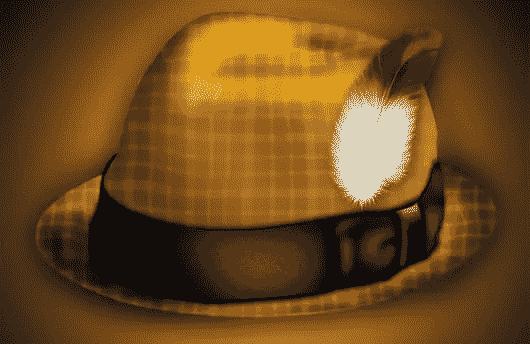

### 资源

对于本教程，您需要一些额外的资源。您可以通过以下链接获得它们:

*   [羽毛](http://officialpsds.com/Feather-PSD23346.html)——官方 PSDs
*   [格子图案](http://graphicssoft.about.com/od/photoshoppatterns/ss/sksplaidpat.htm)–图形软件

### 步骤 1:新建文档

在 Photoshop 中创建新文档。我的画布的尺寸是 600 像素乘以 700 像素，分辨率为 72 dpi。

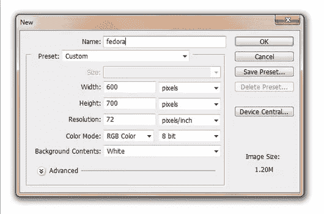

### 第二步:背景

使用图层样式将渐变应用到背景中。双击背景层，调出图层样式，使用截图作为渐变设置的指导。

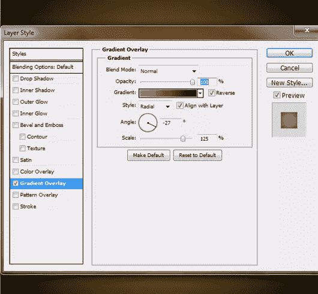

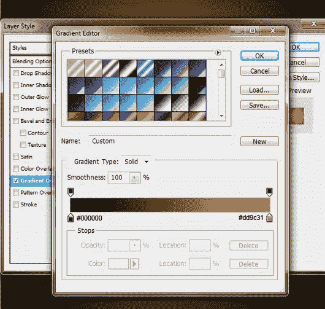

### 步骤 3:在 Illustrator 中绘制帽子

现在打开 Adobe Illustrator。我将使用 Illustrator 中的钢笔工具来创建我帽子的形状。我觉得我能比在 Photoshop 中更容易地控制它。创建与 Photoshop 中相同大小的画布。我的帽子有三个不同的部分，所以我做了三种不同的形状。用任何颜色填充它们，因为一旦我们将它们导入 Photoshop，我们就会改变它们。

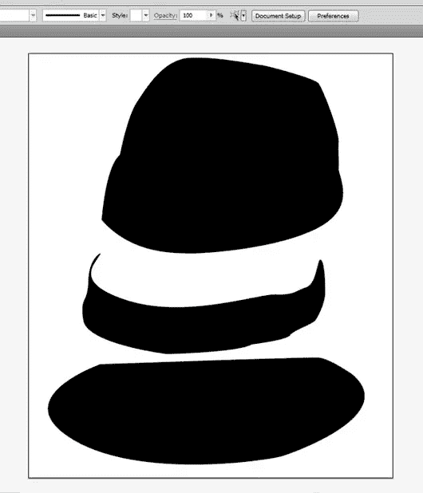

### 第四步

现在把这些形状转移到 Photoshop 中——我只是用了“拖放”的方法。确保你已经将帽子的所有三个部分“栅格化”了，一旦你将它们转移到 Photoshop 中，这是一个菜单选项，你可以通过右击每个层来访问。

将包含帽子边缘的图层名称改为“边缘”,并使用图层样式更改颜色叠加。现在你最好复制每一层，这样我们可以添加一点点的模式。

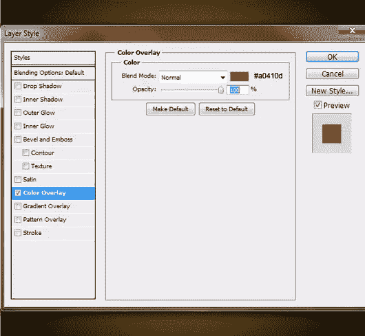

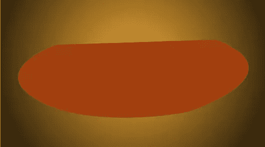

### 第五步

不需要改变帽子周围蝴蝶结的颜色(保持黑色#000000 ),但是你可以把这个图层的名字改为“蝴蝶结”。

### 第六步

现在为帽子的顶部(你可以命名为“顶部”)改变图层样式的颜色。

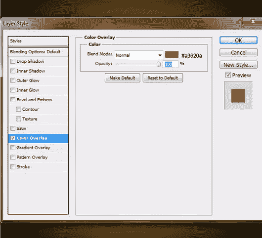

### 第七步

这就是你的软呢帽现在应该看起来的样子，因为你已经应用了颜色变化。通过单击备份层旁边的眼睛图标，使备份层不可见。

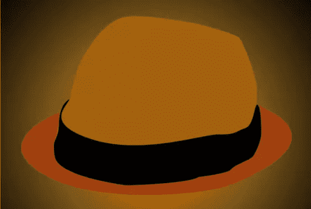

### 第八步:边缘

选择你的“边缘”层，然后使用菜单选项图层>图层样式>创建图层。现在确保边缘的“颜色填充”层被选中。让我们加深这个边缘的一些区域。拿起你的加深工具，用 52px 的软圆刷开始，使用设置*范围:中间色调*和*曝光:86%* 沿着边缘走。

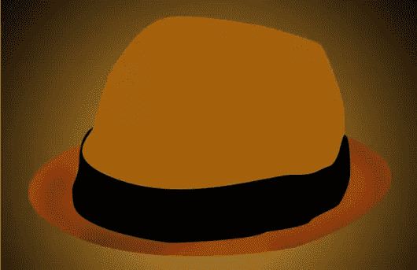

### 第九步

现在将范围改为阴影，用 75px 的软圆形笔刷再加深一点。

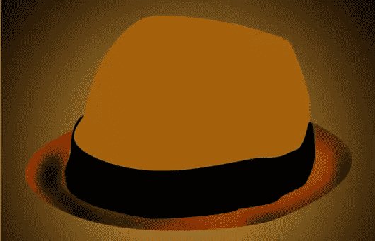

### 第十步

现在拿起你的减淡笔刷，刷一些高光。我用的是 72px 的软圆笔刷，设置*范围:高光*和*曝光:48%* 。

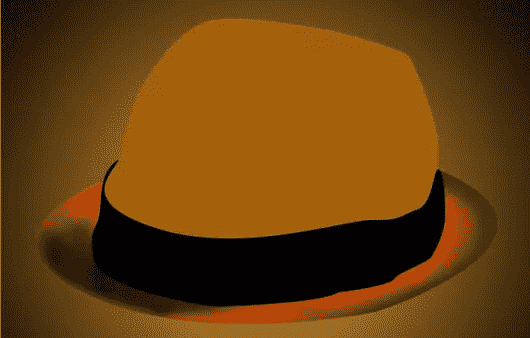

### 第十一步:图案

使你复制的“边缘”层可见。确保这一层是在边缘的“颜色填充”层，并重新命名为“边缘图案”。现在右击图层，点击'*转换为智能对象*，然后栅格化。确保这一层的填充设置为 0%，并添加这个图层样式:

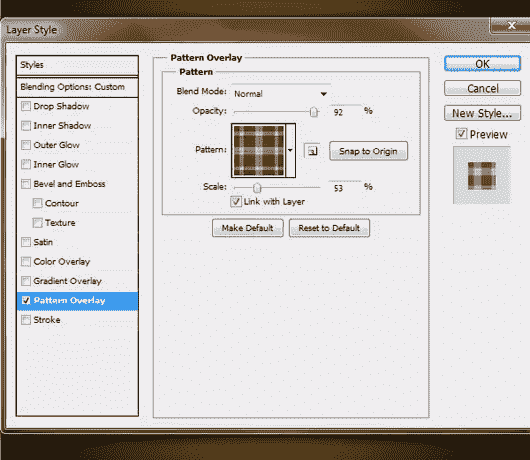

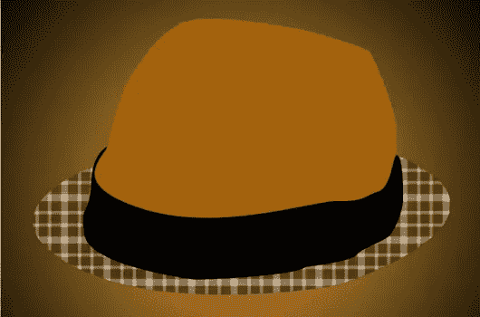

### 步骤 12

现在将这一层转换为智能对象，并将其栅格化。改变这一层的混合模式为“柔光”。

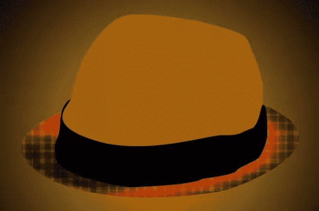

### 第十三步

现在这种模式看起来有点“扁平”——让我们改变一下。去*过滤器>液化*并尽你最大努力改变模式，给它一些形状。

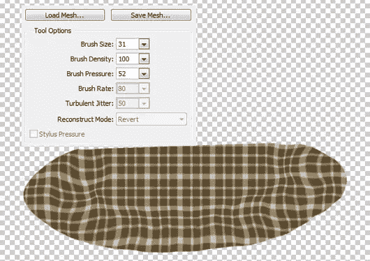

### 步骤 14

到目前为止，它应该是这样的:

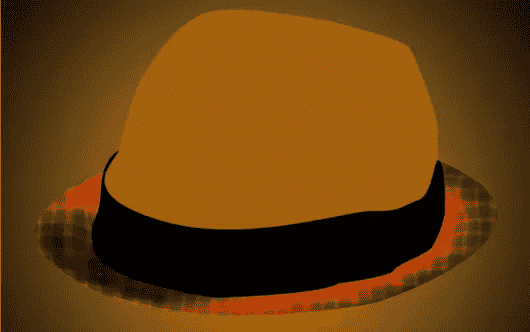

### 第十五步:顶层

现在在你的“顶部”图层上，进入*图层>图层样式>创建图层*。现在确保你已经选择了'顶部的颜色填充',并加深和减淡帽子的顶部。最好是混合使用不同的范围，并调整曝光。

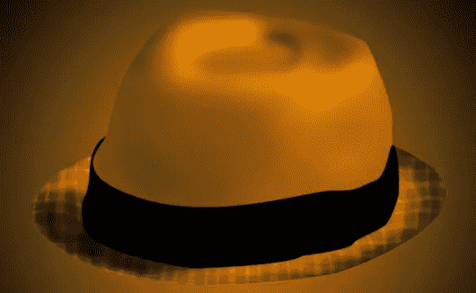

### 第十六步

现在抓住不可见的“顶部”层，使其可见。确保它是在'顶部的颜色填充'层，并添加模式。确保这一层的填充是 0%。

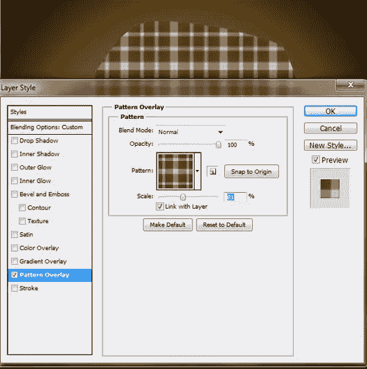

### 步骤 17

将这个“顶层图案”图层转换为智能对象，并将其栅格化。改变这一层为'柔光'，改变填充为 57%。

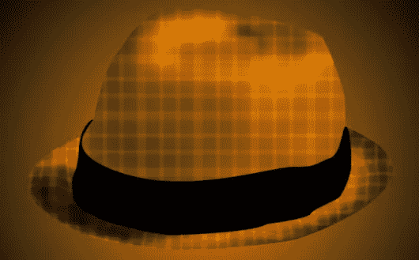

### 步骤 18

现在改变图案，给帽子一些形状。去过滤>液化，我用了一个 69 像素的笔刷绘制帽子的外部边缘，用一个小一点的笔刷绘制顶部。

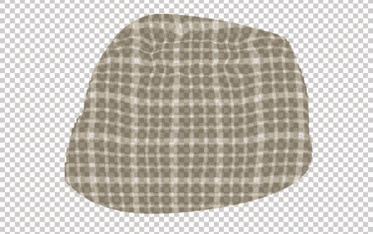

### 步骤 19

这是它液化后的样子:

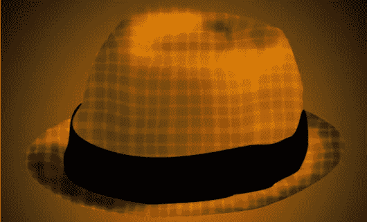

### 步骤 20

现在在图案上新建一层，使用画笔工具。用 135px 的软圆刷(#d0a054)在柔和高光处刷。我在帽子上画了一个 V 字形的斜线来突出我的帽子。

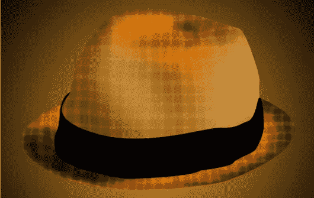

### 步骤 21

将此图层的不透明度更改为 60%:

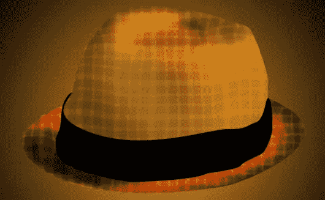

### 步骤 22

创建一个新层。现在我们将“顶部”加深一点。用同样的软圆形画笔(#2e1b01)在左侧边缘周围加深颜色。然后改变这一层为“柔光”:

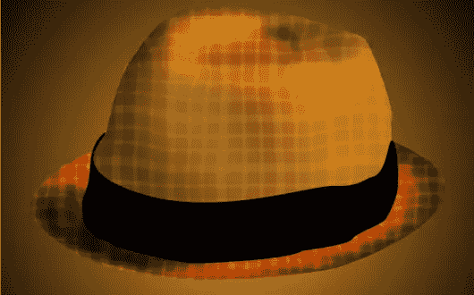

### 步骤 23

新建一个图层，用软笔刷(#ffffff)在顶部添加一些高光:

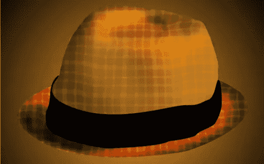

### 步骤 24

改变这一层为“覆盖”，不透明度为 55%:

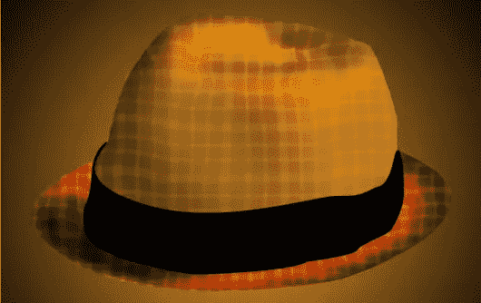

### 步骤 25

创建一个新的层，增加一些光泽。我还使用了涂抹工具来平滑它

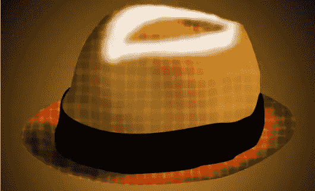

### 步骤 26

改变这一层为“柔光”，不透明度为 87%:

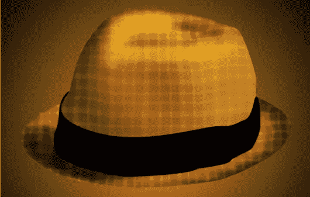

### 步骤 27

现在在你的“蝴蝶结”图层上新建一个图层，用 83px 的软圆刷(#ffffff)刷一些亮光。我通常喜欢选择“蝴蝶结”,这样我就不用担心擦掉了。要进行选择，只需将鼠标悬停在“Bow”层旁边的方块上，同时按下 Control 或 Option 并单击该方块。

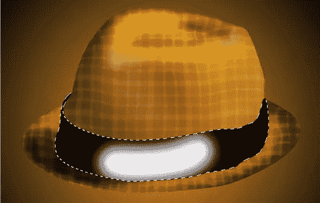

### 步骤 28

改变这个发光层的填充为 57%:

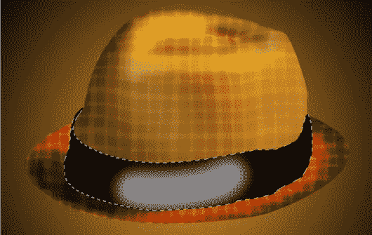

### 步骤 29

现在进入*滤镜>模糊>运动模糊*使用这些设置模糊这层:

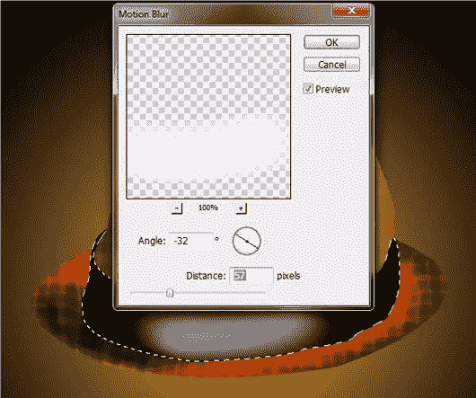

### 步骤 30

进入*滤镜>噪波>添加噪波*添加一些噪波，使用以下设置:

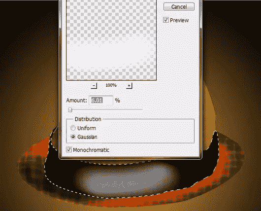

### 步骤 31

您可能需要擦除一些区域，使高光看起来更自然。

### 步骤 32

使用黑白画笔工具(软圆形画笔)添加阴影和高光。还记得每当你添加白色笔画添加一些噪音，如步骤 30。添加高光，直到它看起来像一个弓，如下图所示。

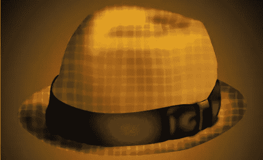

### 步骤 33

现在去你的“弓”层是不可见的，使其可见，并复制它。确保“弓副本”和“弓副本 2”在原始弓层之下。选择其中一个副本，使用*滤镜>模糊>高斯模糊*和以下设置进行模糊处理:

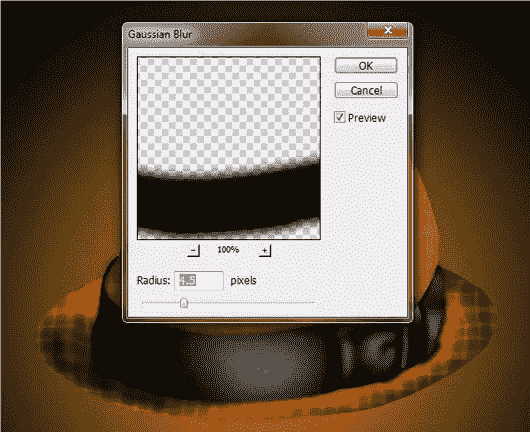

### 步骤 34

将该层向下移动几个像素:

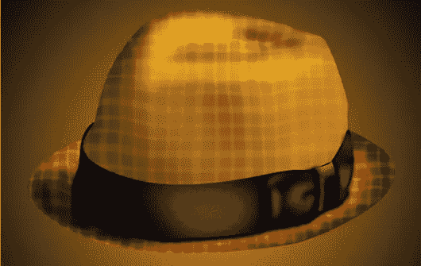

### 步骤 35

再次重复高斯模糊，但应用于其他复制层，然后向上移动。

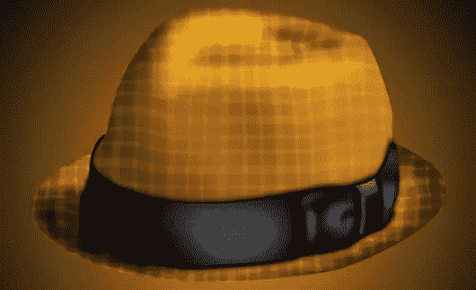

### 步骤 36

下载羽毛的 PSD 并拖放到你的画布上。如果需要，调整它的大小。

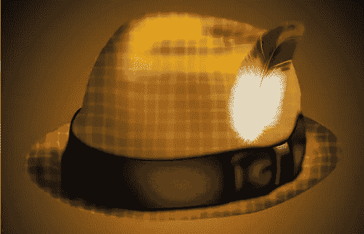

### 步骤 37

为羽毛添加阴影:

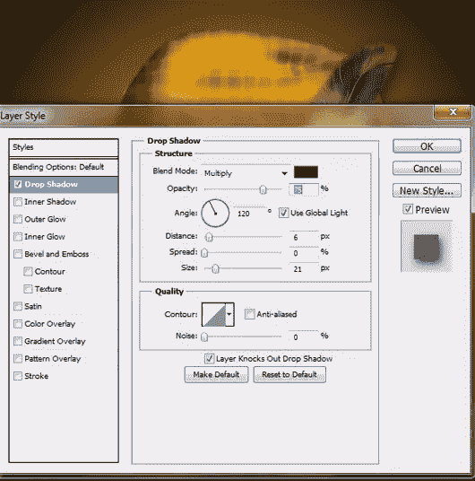

### 步骤 38

创建一个新层，用钢笔工具创建一条线，如下所示。请确保您的画笔工具设置为 3px 软圆刷#FFFFFF。右键单击钢笔工具线并选择描边路径。还要确保选中“模拟压力”框。

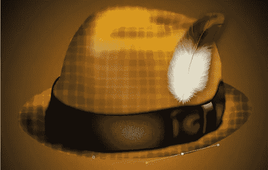

### 步骤 39

改变这一层为“柔光”:

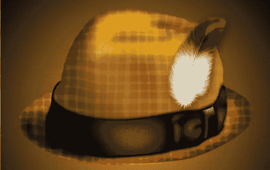

### 步骤 40

在你的背景层上新建一层。使用#FFFFFF 499px 软圆刷在这一层的帽子后面放置一个高光。

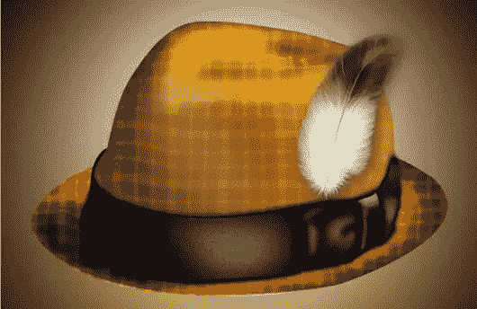

### 步骤 41

将该层更改为“叠加”:

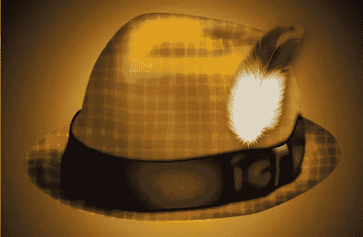

### 步骤 42

在“浅色”层上新建一层，用#FFFFFF 软圆刷沿着帽子的顶部边缘刷。

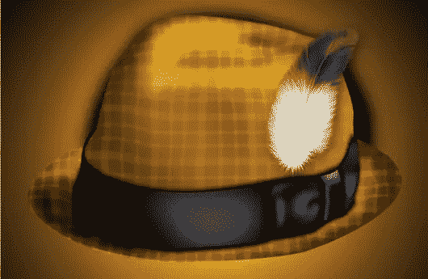

### 步骤 43

改变这一层的不透明度为 32%:

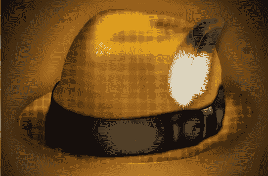

### 步骤 44

创建一个新层，并再次添加阴影到底部。改变这个图层的混合模式为叠加，不透明度为 71%:

### 步骤 45

现在把所有和你的软呢帽相关的东西放在一个组里(除了阴影层，灯光层和背景层)。通过选择所有图层并将其拖至文件夹图标，将其放入一个组中。复制这个文件夹，将其转换为智能对象，并应用高斯模糊。

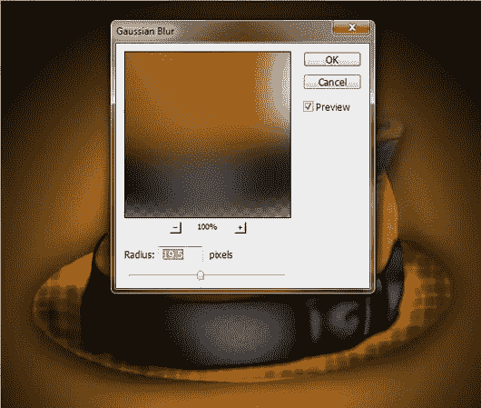

## 决赛成绩

以下是你的帽子应该或多或少的样子。恭喜你！

## 分享这篇文章