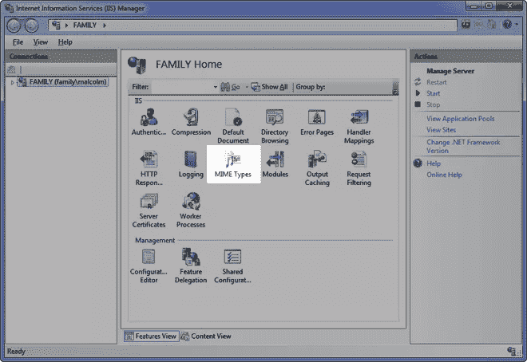

# 使用 ApplicationCache 在 HTML5 中离线浏览

> 原文：<https://www.sitepoint.com/offline-browsing-in-html5-with-applicationcache/>

离线浏览对于 web 开发者和设计者来说变得越来越重要。让用户能够离线使用你的网站一直是一个目标，但退一步说，这个目标很难实现。然而，随着我们进入 HTML5 时代，这种情况正在改变，现在您可以利用 [ApplicationCache](http://www.whatwg.org/specs/web-apps/current-work/#applicationcache) 接口。

使用应用程序缓存，您可以指定当用户脱机时浏览器可以缓存和使用哪些文件。你的网站会像用户在线一样工作，最好的是，他们不会注意到任何不同！

那么，如何指定浏览器应该缓存哪些文件呢？这是在缓存清单文件中定义的。

### 缓存清单

缓存清单文件位于您的网站中，它定义了浏览器可以缓存哪些文件。缓存清单有一个`appcache`扩展名，要使用它，你需要在网页的 *html* 标签中引用它。

```
<!DOCTYPE HTML>

<html manifest="offline.appcache">
```

关键是这个**必须包含在每一页**中。如果不存在，浏览器不会缓存该页面。还有那个的*是什么意思？好吧，即使你没有在清单文件中包含当前的 HTML 页面，浏览器也会显式地缓存它。*

### 缓存清单捕获

这里还有一些需要注意的地方。为了让 web 服务器正确地提供缓存清单，必须添加一个新的 mime 类型的 *text/cache-manifest* ，否则事情不会如您所料。要在 IIS 7 中这样做，选择你的网站并点击 **MIME 类型**。



选择**添加**并输入新的 MIME 类型。


这需要在浏览器缓存任何文件之前完成。

### 缓存清单结构

缓存清单分为三个部分:

*   缓存–定义浏览器可以缓存哪些资源
*   网络–定义哪些资源需要用户在线
*   回退–为无法缓存的资源定义回退

该文件的最低要求是打开行缓存清单。这是唯一需要的部分。目前缓存的大小被限制在 5MB，这对于一个网站来说是相当大的。这是一个完整的缓存清单文件。

```
CACHE MANIFEST

# Created on 8 October 2011

CACHE:

site.css

site.js

NETWORK:

login.aspx

currency.aspx

# offline.jpg will replace all images in the images folder

# offline.html will replace all html pages if they cannot be found

FALLBACK:

site/images images/offline.jpg

*.html offline.html
```

清单文件不难理解。以#开头的行是注释，将被浏览器忽略。每个部分都告诉浏览器什么可以缓存，什么不能缓存，以及找不到资源时该怎么做。这些部分可以按任何顺序列出。

在继续之前，有一条信息需要记住，而且非常重要。如果一个资源下载失败， ***整个*缓存进程失败**。要么全有，要么全无。如果发生这种情况，浏览器将回退到旧的缓存文件。

记住这一点。

### 更新应用程序缓存

缓存资源可以提高性能，但这也意味着资源不是最新的。例如，如果在网站上更新了资源，但应用程序缓存保持缓存状态，直到出现以下情况之一，就会发生这种情况:

*   缓存清单文件已更改
*   用户清除他们的临时互联网文件
*   应用程序缓存以编程方式更新

在清单文件中有一个版本号是一个好主意，这样当您将更改部署到网站时，旧的缓存资源将被删除，新的资源将被下载和缓存。

### 应用缓存和 JavaScript

应用程序缓存有许多在缓存过程中触发的事件。除了手动强制刷新缓存或为演示文稿编写演示之外，我实在想不出有多少时候您会想与这些事件挂钩。然而，他们在这里:

*   `onchecking`–用户代理正在检查更新，或首次尝试下载清单。
*   `onnoupdate`–不更新清单文件。
*   `ondownloading`–用户代理发现更新，或首次尝试下载清单。
*   `onprogress`–用户代理正在下载清单中列出的资源。
*   `oncached`–下载完成，资源被缓存。
*   `onupdateready`——资源已经下载，可以通过调用 [swapCache](http://msdn.microsoft.com/en-us/library/windows/apps/hh465709%28v=vs.85%29.aspx) 进行刷新
*   `onobsolete`–清单是 404 或 410 页面，因此应用程序缓存被删除。
*   `onerror`–由多项原因造成。清单是 404 或 410 页。运行更新时，清单可能已更改。

创建事件处理程序是小菜一碟。

```
var appCache = window.applicationCache;

function logEvent(e) {

console.log(e);

}

function logError(e) {

console.log("error " + e);

};

appCache.addEventListener('cached', logEvent, false);

appCache.addEventListener('checking', logEvent, false);

appCache.addEventListener('downloading', logEvent, false);

appCache.addEventListener('error', logError, false);

appCache.addEventListener('noupdate', logEvent, false);

appCache.addEventListener('obsolete', logEvent, false);

appCache.addEventListener('progress', logEvent, false);

appCache.addEventListener('updateready', logEvent, false);
```

如果希望在缓存被清除时为用户刷新页面，可以向 updateready 事件添加一些额外的代码来处理这一点。

```
appCache.addEventListener('updateready', function (e) {

appCache.swapCache();

window.location.reload();

}, false);
```

像往常一样，你可以在这里查看完整的 API 参考资料。

对我来说，这是 HTML5 改变游戏规则的一个方面。我推荐你去了解它，热爱它，使用它。

## 分享这篇文章