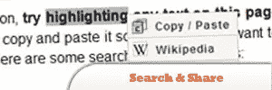

# 增强用户界面的 10 个 jQuery 插件

> 原文：<https://www.sitepoint.com/10-jquery-ui-plugins/>

Today, we have a collection of 10 **jQuery Plugins to Enhance your User Intefaces**. Most of them can be done in just a few minutes and may be all you need to give your projects that little extra something. Enjoy!

相关帖子:

*   [**jQuery 桌面 UI–ext js Web 界面门户**](http://www.jquery4u.com/tutorials/jquery-desktop-ui-ext-js/)
*   [10 个 jQuery 用户界面插件](http://www.jquery4u.com/user-interface/10-jquery-user-interface/)
*   [10 个 JavaScript Web UI 库](http://www.jquery4u.com/javascript-libraries/10-javascript-web-ui-libraries/)

## 1.特征表

简单方便地创建交互式“特色项目”小部件。

## 2.舞池

当你点击一个产品时，产品图片会缩小以看到特写镜头和描述。

## 3.搜索和共享

使突出显示文本成为一种功能性更强的操作。更具体地说，它试图理解用户文本选择的意图，并相应地呈现各种选项。

[来源](http://www.latentmotion.com/search-and-share/)

## 4.侧面导航工具提示/弹出气泡

使用 jQuery 的工具提示/弹出气泡。

## 5.脸书风格警报确认框

这向你展示了如何实现一个脸书风格的警告框。

[来源](http://www.9lessons.info/2009/08/facebook-style-alert-confirm-box-with.html)

## 6.创建一个交互式、可过滤的投资组合

如何在 jQuery 中创建一个看起来像是用 Flash 制作的交互式文件夹。

[来源](http://www.gethifi.com/blog/a-jquery-plugin-to-create-an-interactive-filterable-portfolio-like-ours)

## 7.脸书喜欢自我暗示

脸书喜欢用 jQuery、Ajax 和 PHP 自动建议用户搜索。

[来源](http://www.9lessons.info/2009/06/autosuggestion-with-jquery-ajax-and-php.html)

## 8.喜爱的评级

本教程将向你展示如何像 amypink.com 一样实施一个“表达爱意”的评级系统。

[来源](http://www.9lessons.info/2009/09/favourite-rating-with-jquery-and-ajax.html)

## 9.魔法卷轴

一个实用的&易于实现的插件，这个垂直滚动条使用切片效果以优雅的风格显示元素，创造了一个不同的视角。

[来源](http://plugins.jquery.com/project/magicScroller)

## 10.Google Wave 历史滑块

使用谷歌波浪式历史滑动条，让访问者能够及时返回查看评论线程上发生的变化。

[来源](http://tutorialzine.com/2009/10/google-wave-history-slider-jquery/)

## 分享这篇文章