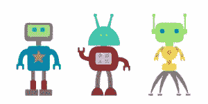

# 机器人工厂——第一部分

> 原文：<https://www.sitepoint.com/the-robot-factory-part-one/>



## 在 Sinatra 中添加和删除资源

在本教程中，我将介绍如何使用 Sinatra 在数据库中添加和删除资源。

为了演示这一点，我将构建一个名为“机器人工厂”的微型网络应用程序，允许用户“构建”一条机器人生产线。每个机器人将被保存到一个数据库中，随机选择头部、身体和腿，也可以在制造完成后删除。你可以在这里看到运行的最终版本——[http://robotfactory.heroku.com/](http://robotfactory.heroku.com/)。你也可以在这里看到所有完成的代码——https://gist.github.com/1110005。

要遵循本教程，您需要安装以下 gem:

```
$ gem install sinatra data_mapper sqlite3 dm-sqlite-adapter slim sass
```

在我开始之前，我用出色的 [Inkscape](http://inkscape.org/) 画了一些看起来很酷的机器人零件，然后保存为 top1.png、top2.png、middle1.png…等等。你可以在这里找到所有的文件，但是你也可以使用相同的命名规则创建你自己的图像。

## 构建应用程序

这个应用程序中的所有内容都将在同一个文件中，所以打开你最喜欢的文本编辑器，并将文件保存为“main.rb”。首先，我们需要一些 gem，并在 DataMapper 中设置数据库。

```
%w[sinatra dm-core dm-migrations slim sass].each{ |lib| require lib } 
DataMapper.setup(:default, ENV['DATABASE_URL'] || File.join("sqlite3://",settings.root, "development.db"))
```

接下来是机器人类。如您所见，robot 类有 4 个属性:一个自动递增的 id 和 3 个整数，分别对应于顶部、中部和底部的图像。这些整数是通过使用 Proc 将默认值设置为一个随机数来生成的，该随机数对应于有多少个顶部、中间和底部图像:

```
class Robot 
  include DataMapper::Resource 
  property :id, Serial 
  property :top, Integer, :default => proc { |m,p| 1+rand(6) } 
  property :middle, Integer, :default => proc { |m,p| 1+rand(4) } 
  property :bottom, Integer, :default => proc { |m,p| 1+rand(5) } 
end 

DataMapper.finalize
```

既然已经建立了机器人模型，就需要将其迁移到数据库中。打开终端，导航到保存 main.rb 文件的文件夹，然后键入以下内容:

```
$> irb
ruby-1.9.2-p180 :002 > require './main'
=> true
ruby-1.9.2-p180 :003 > Robot.auto_migrate!
=> true
```

## 路线处理程序

下一项工作是创建路由处理程序。第一种允许 CSS 在同一个文档中被写成内嵌视图。

```
get('/styles.css'){ scss :styles }
```

接下来，我们将创建三个主要的处理程序。首先是索引页，实际上是机器人工厂中唯一的页面。它获取数据库中的所有机器人对象，并将它们作为数组存储在实例变量@robots 中，可以在视图中访问该变量。第二个处理 post 请求，当“构建机器人”按钮被按下时被执行。这将创建一个新的机器人，然后重定向回索引页面，新的机器人将成为@robots 数组的一部分。最后一个处理程序负责删除机器人。它使用 url 的`:id`部分找到被删除的机器人，然后使用 DataMapper 的 destroy 方法将其从数据库中删除。然后，它重定向回索引页面，该机器人将不再是@robots 数组的一部分。

```
get '/' do 
  @robots = Robot.all 
  slim :index 
end 

post '/build/robot' do 
  robot=Robot.create 
  redirect to('/')
end

delete '/delete/robot/:id' do 
  Robot.get(params[:id]).destroy 
  redirect to('/')
end 

__END__
```

## 视图

现在，是时候发表一些看法了。在这个例子中，我选择使用内嵌视图，这样它们可以包含在同一个文件中。我还使用了非常棒的 Slim 模板语言来编写它们。

首先是相当标准的 HTML 5 布局。我还包含了一个链接，链接到一些来自 [Google Web 字体目录](http://www.google.com/webfonts)的字体，我稍后将在 CSS 中使用它们。

```
@@layout 
doctype html 
html 
  head 
    meta charset="utf-8" 
    title Robot Factory 
    link rel="shortcut icon" href="/fav.ico" 
    link href="http://fonts.googleapis.com/css?family=Megrim|Ubuntu&amp;v2" rel='stylesheet' 
    link rel="stylesheet" media="screen, projection" href="/styles.css" 
    /[if lt IE 9] 
      script src="http://html5shiv.googlecode.com/svn/trunk/html5.js" 
  body == yield 
    footer role="contentinfo" 
      p Building Quality Robots since 2011
```

下一个视图是索引页面，这是应用程序中唯一的页面。它基本上包括一个表单中的按钮，按下该按钮可以构建一个机器人，以及一个机器人列表(如果有的话)。如果还没有机器人存在，会出现一条消息告诉你去制造一些。我已经将机器人的代码分离到一个单独的视图中，并将其作为一个部分(`==slim :robot, :locals => { :robot => robot }`)，这通常是一个好主意，但在处理 Ajax 时有额外的好处，我们将在后面看到。

```
@@index 
h1 Robot Factory 
form.build action="/build/robot" method="POST" 
  input.button type="submit" value="Build A Robot!" 
-if @robots.any? 
  ul#robots - @robots.each do |robot| 
    ==slim :robot, :locals =>; { :robot =>; robot } 
- else 
  h2 You Need To Build Some Robots!
```

机器人的代码将构成其身体的三幅图像放在一个列表项中。最后还有一个用于删除按钮的表单。这必须是表单的一部分，这样才能使用正确的 HTTP 动词 DELETE(注意隐藏的表单字段，它用来告诉 Sinatra 这实际上是一个删除请求)。

```
@@robot 
li.robot 
  img src="https://s3.amazonaws.com/daz4126/top#{robot.top}.png"
  img src="https://s3.amazonaws.com/daz4126/middle#{robot.middle}.png" 
  img src="https://s3.amazonaws.com/daz4126/bottom#{robot.bottom}.png" 
  form.destroy action="/delete/robot/#{robot.id}" method="POST"   
    input type="hidden" name="_method" value="DELETE" 
    input type="submit" value="×"
```

该应用程序现在已经完全完成，将运行得很好，尽管它看起来不是很好。主要问题是组成机器人的图像是并排显示的，而不是像预期的那样垂直叠放。

## 添加一些风格

这都是通过应用一些样式整理出来的。前面，我们添加了一个处理程序，允许我们将 CSS 放入视图中，因为我们使用的是内联视图，它就放在同一个文件中其他视图的下面:

```
@@styles
html,body,div,span,object,iframe,h1,h2,h3,h4,h5,h6,p,blockquote, pre,abbr,address,cite,code,del,dfn,em,img,ins,kbd,q,samp,small,strong,sub,sup,var,b,i,dl,dt, dd,ol,ul,li,fieldset,form,label,legend,table,caption,tbody,tfoot,thead,tr,th,td,article, aside, canvas, details,figcaption,figure,footer,header,hgroup,menu,nav,section, summary,time,mark,audio,video {
  margin:0;
  padding:0;
  border:0;
  outline:0;
  font-size:100%;
  vertical-align:
  baseline;
  background:transparent;
  line-height:1;
} 

body{font-family:ubuntu,sans;} 

footer {
  display:block;
  margin-top:20px;
  border-top:3px solid #4b947d;
  padding:10px;
} 

h1 {
  color:#95524C;
  margin:5px 40px;
  font-size:72px;
  font-weight:bold;
  font-family:Megrim,sans;
} 

.button { 
  background:#4b7194;
  color:#fff; 
  text-transform:uppercase; 
  border-radius:12px;
  border:none; 
  font-weight:bold;
  font-size:16px; 
  padding: 6px 12px;
  margin-left:40px; 
  cursor:pointer; 
  &:hover{background:#54A0E7;} 
} 

#robots {
  list-style:none;
  overflow:hidden;
  margin:20px;
} 
.robot { 
  float:left; 
  width:100px;
  padding:10px 0; 
  position:relative; 
  form {
    display:none;
    position:absolute;
    top:0;
    right:0;
  } 
  &:hover form {
    display:block;
  } 
  form input {
    background:rgba(#000,0.7);
    padding:0 4px; 
    color:white;
    cursor:pointer; 
    font-size:32px;
    font-weight:bold;
    text-decoration:none;
    border-radius:16px;
    line-height:0.8;
    border:none; 
  } 
  img {
    display:block;
    padding:0 10px;
  } 
}
```

这都是非常标准的东西。它从一个基本的重置开始，然后为正文、页脚和标题设置所有的字体和颜色。“建立一个机器人”按钮被设计得非常漂亮、明亮和圆润(就像所有优秀的 web 2.0 按钮一样)。机器人向左浮动，因此它们将并排出现，图像设置为 display:block，这迫使它们坐在彼此的上面。包含“删除”按钮的表单被设置为隐藏，除非机器人悬停在其上。它也被设计成看起来像一个标准的“删除”按钮。

该应用程序现在可以工作了，看起来也应该如此，但每次你试图建造或摧毁一个机器人时，都会有一些页面重新加载，这会减慢整个过程。这听起来像是 XMLHttpRequest 的工作……但是那要等到本教程的第 2 部分！

同时，[制造一些机器人](http://robotfactory.heroku.com/)来陪伴你…

## 分享这篇文章