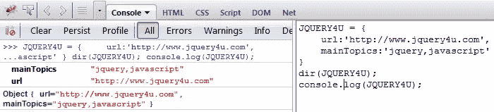
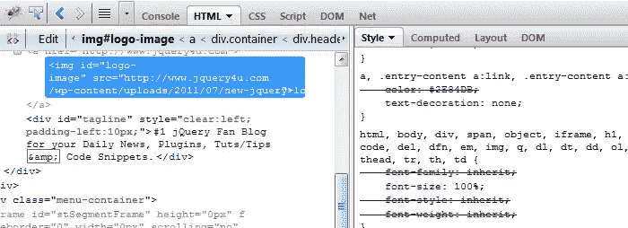

# 掌握 Firebug 控制台的 10 个技巧

> 原文：<https://www.sitepoint.com/firebug-console-tips/>

## 这里有一些提示，让你可以开始拥有那个 Firebug 控制台！

如果你不知道什么是 Firebug 控制台，那么从这里开始:[什么是 Firebug 以及如何设置](http://www.jquery4u.com/utilities/live-jquery-debugging-firebug/)**。**

 **### 技巧 1——如何隐藏恼人的错误

Firebug 有选项**隐藏那些恼人的网络错误！**(如果您的代理设置不可用，如果您在工作中与管理员核实您的使用权限，您可能会看到这些。pac 文件)。该选项菜单也可用于隐藏其他错误类型。非常有用！
T3


### 提示 2–键盘快捷键

你可以**按 CTRL+ENTER 来运行 Firebug 控制台中的代码**,而不是用鼠标点击“运行”。参见[键盘快捷键](http://getfirebug.com/wiki/index.php/Keyboard_and_Mouse_Shortcuts)的完整列表。

### 技巧 3–Firebug 控制台

**创建一个 firebug 控制台表**——只需粘贴以下代码即可查看！

```
var table1 = new Array(5);
for (var i=0; i <table1 .length="" i="" table1="" console.table="" loading="lazy" src="https://uploads.sitepoint.com/wp-content/uploads/jquery4u/2011/10/firebug-table.jpg" alt="firebug-table" title="firebug-table" width="719" height="204" class="alignnone size-full wp-image-8262">### 提示 4 - Console.dir()

The benefit of using **Console.dir()** instead of console.log() is that on objects, arrays and other types it displays their properties straight up, which can save time. You can simply type dir(nameofobject) into the Firebug Console. I like dir.



Also to note that "Dir" works without "console." (but log doesn't!)
[js]
JQUERY4U = {
    url:'http://www.jquery4u.com',
    mainTopics:'jquery,javascript'
}
dir(JQUERY4U); //works without console.
log(JQUERY4U); //doesn't</table1>
```

### 技巧 5–console . debug()

使用 **Console.debug()** 而不是 console.log()的好处是，当您试图调试您的 JavaScript 代码时，它删除了所有令人讨厌的废话。对于经常使用它的人来说很有用，但不是很多人都这样做。爱调试？阅读更多关于[调试链](http://msdn.microsoft.com/en-us/scriptjunkie/ee819093)的信息

### 技巧 6——创建一个快速书签

您可以在 Firebug 控制台中**创建代码的快速书签。只需按下*复制>右键书签栏>点击粘贴*。任务完成。现在，您可以在需要时单击该书签来运行代码，甚至可以跨浏览器进行测试。**

一些可以尝试的书签:

*   jQuery 浮动书签地球仪——非常有趣！
*   [JavaScript 直接编辑网页](http://www.jquery4u.com/snippets/javascript-edit-web-page/)

### 技巧 7–使用 Firebug 网络面板


学习如何使用 Firebug NET Panel: [**如何使用 NET Panel 分析 HTTP 请求，HTTP Fox & Fiddler2**](http://www.jquery4u.com/testing/http-request-net-panel-httpfox-fiddler2/) 。

### 技巧 8–Firebug“附加组件”和扩展

有大量有用的“附加组件”来补充 Firebug 控制台。参见: [**10 个扩展插件扩展 Firebug 控制台**](http://www.jquery4u.com/extensions/10-extension-plugins-extend-firebug-console/)

### 技巧 9–Firebug 控制台 API


如果你还不知道有一个 [**Firebug 控制台 API**](http://getfirebug.com/wiki/index.php/Console_API) 有很多有用的信息。

### 技巧 10-检查 DOM CSS 样式

在 Firebug 中，你可以很容易地检查与页面上任何元素相关的样式。只需右键单击并检查该元素，然后切换到 CSS 选项卡。在 CSS 标签中，任何带删除线的**样式都意味着它前面有另一个样式。记住样式的优先级如下:1)内嵌，2)页面内，3)样式表。您可以**实时编辑样式，并在标签内双击为该 CSS 标签创建一个新的样式**。
**

希望这些快速提示能帮助你了解一些你不知道的关于令人敬畏的 Firebug 控制台的事情。** 

## **分享这篇文章**