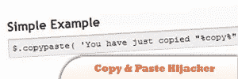
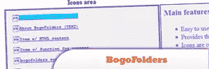

# 2011 年 9 月的 10 个新 jQuery 插件

> 原文：<https://www.sitepoint.com/jquery-september-2011/>

今天，我们为 2011 年 9 月这个令人惊叹的月份收集了另外 10 个 jQuery 插件。每个月初还会有更多，所以请继续关注！

 别忘了[订阅我们的 RSS 源](https://www.jquery4u.com/feed/)免费获取最新的 jQuery 内容！

 [## 1.平滑缩放平移–高级 jQuery 图像查看器](https://codecanyon.net/item/smooth-zoom-pan-jquery-image-viewer/511142) 

This is a jQuery image viewer prepared to display product photos, maps or any image within custom small area. Can be configured and implemented in web pages with simple copy / paste steps.

[Source](https://codecanyon.net/item/smooth-zoom-pan-jquery-image-viewer/511142)

## 2.jqZoomage

这是一个简单的缩放面板，允许你的用户将鼠标放在你的小图片上，以查看特写。它非常适合用于产品详情页面或类似页面。

[来源](https://codeblog.shawson.co.uk/jqzoomage-jquery-component/)

## 3.混排字母效果:一个 jQuery 插件

了解如何制作一个 jQuery 插件，它可以随机播放任何 DOM 元素的文本内容——这是一个有趣的效果，可以用在标题、徽标和幻灯片中。

[来源](https://tutorialzine.com/2011/09/shuffle-letters-effect-jquery/)

## 4.把你的东西放在中间

当你创建网页时，你需要把一些东西(如 div，span，img 等)放在浏览器的中心。

[来源](https://plugins.jquery.com/project/centeringstuff)

## 5.拖放文件上传任何文件输入-降级优雅！

这个插件允许你添加拖放功能到任何支持多文件的文件上传输入中。对于不支持此功能的浏览器，性能会正常下降。

[来源](https://github.com/abailiss/jQuery-drag-drop-file-upload)

## 6.复制粘贴劫持者

这个插件允许你在复制东西时完全定制用户的剪贴板文本/html。

[来源](https://plugins.jquery.com/project/copypaste)

## 8.默认输入文本

简单的插件:
>设置默认输入字段文本(来自标题)并添加“default input”类。
>当输入获得焦点时删除该文本和类
>如果没有输入任何内容恢复默认文本&当焦点丢失时恢复默认文本
>提交时删除输入中的默认文本如果它仍然存在

[源](https://github.com/c2h5oh/jQuery-Default-Input-Text)

## 9.自行车优步建兴

一个试图制作尽可能少占用空间的图像循环(rotator)插件。相当成功的一个。
>简单、裸机必备图片循环插件
>跨浏览器兼容
>又快又小

[源码](https://github.com/c2h5oh/jQuery-Cycle-Uber-Lite)

## 10.BogoFolders

通过“文件菜单”界面查看文本。

[来源](https://wanderinghorse.net/computing/javascript/jquery/bogofolders/demo-bogofolders.html)

## 分享这篇文章