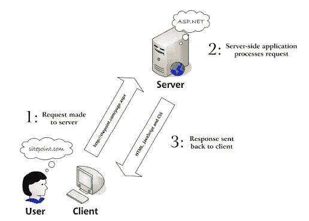
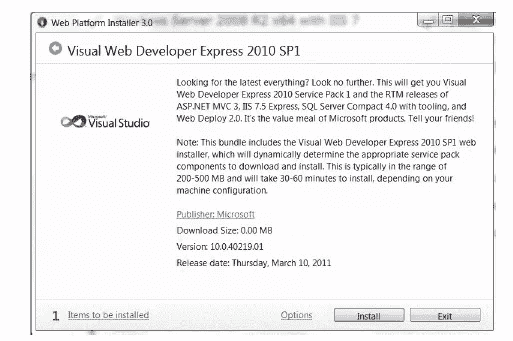
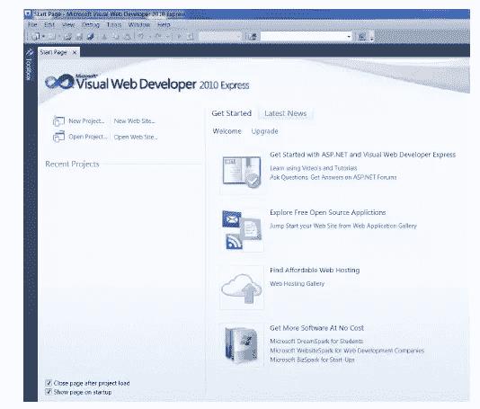
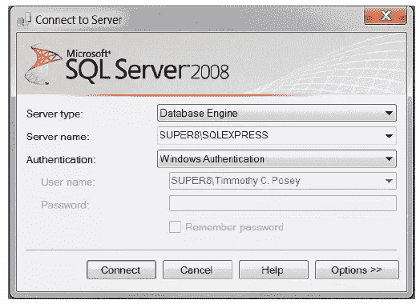
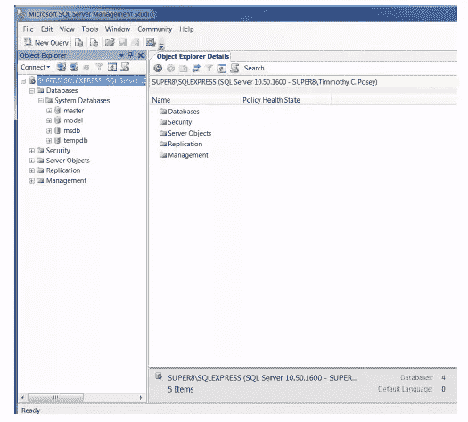
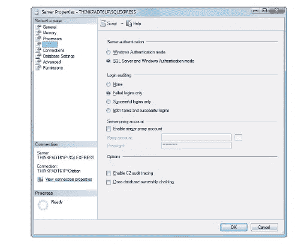

# 介绍 ASP.NET 和。网络平台

> 原文：<https://www.sitepoint.com/introducing-asp-net-and-the-net-platform/>

*这是摘自我们的新书《用 C# & VB 构建你自己的 ASP.NET 4 网站》，作者是克里斯蒂安·戴瑞，怀亚特·巴尼特&蒂姆·波西。*

到目前为止，ASP.NET 是这个星球上最流行的 web 开发技术之一。第一个版本于 2002 年发布，从那以后，微软延续了发布强大的 web 开发框架的传统，允许 web 开发人员用更少的资源做更多的事情。ASP.NET 在成熟的公司世界中经历了快速发展，也成为许多自由开发者的选择。ASP.NET 有许多优势，包括一个名为 Microsoft Visual Studio 的成熟的 IDE(集成开发环境)，以及在服务器端自动处理许多日常任务的高级安全和性能框架，使开发人员能够创建更成熟的 web 应用程序和网站。

ASP.NET 4 是最新的版本。NET framework 引入了许多新功能，这些新功能建立在它的前身的基础上，以提高性能、安全性和与最新浏览器的互操作性。最重要的是，它提供了新的开发工具，包括 Visual Web Developer 2010 速成版和 SQL Server 2008 R2 速成版，这两个版本都是免费的！这些工具支持 web 应用程序的快速应用程序开发(RAD)。

本书的目标是让你能够将所有这些技术结合起来使用，从而产生奇妙的结果。我们将带您一步一步地完成每项任务，向您展示如何充分利用每项技术和工具。我们开始吧！

### 什么是 ASP.NET？

ASP.NET 是一个复杂而强大的 web 开发框架。如果你以前从未使用过 ASP.NET，你可能需要一些时间和耐心来适应它。使用 ASP.NET 进行开发不仅需要理解 HTML 和 web 设计，还需要牢固掌握面向对象编程和开发的概念。幸运的是，我们相信你会发现这些好处充分回报了你的学习努力！

在接下来的几节中，我们将向您介绍 ASP.NET 的基本知识。我们将逐步完成在您的 web 服务器上安装它的过程，并查看一个演示 ASP.NET 页面是如何构建的简单示例。但是首先，让我们定义一下 ASP.NET 实际上是什么。

*ASP.NET 是一种基于微软开发 web 应用的服务器端技术。NET 框架*。

好吧，让我们打破这个充满术语的句子。

*ASP.NET 是一种服务器端技术*。也就是说，它运行在 web 服务器上。大多数网页设计者都是在学习客户端技术，比如 HTML、JavaScript 和层叠样式表(CSS)。当 web 浏览器请求仅使用客户端技术创建的网页时，web 服务器只需抓取浏览器(或客户端)请求的文件，然后将它们发送出去。客户端完全负责读取这些文件中的标记，并解释这些标记以在屏幕上显示页面。

然而，像 ASP.NET 这样的服务器端技术却是另一回事。服务器端代码(例如，ASP.NET 页面中的代码)不是由客户端解释，而是由 web 服务器解释。在 ASP.NET 的例子中，页面中的代码被服务器读取并用于生成 HTML、JavaScript 和 CSS，然后被发送到浏览器。因为 ASP.NET 代码的处理发生在服务器上，所以它被称为服务器端技术。如图 1.1 所示，客户端只能看到 HTML、JavaScript 和 CSS。服务器完全负责处理服务器端代码。

图 1.1。与 web 应用程序交互的用户

| **用户** | 交易开始和结束于用户。用户操作 web 客户端软件并解释结果。 |
|   |   |
| **网络客户端** | 这是人们用来与 web 应用程序交互的软件程序。客户端通常是网络浏览器，如 Internet Explorer 或 Firefox。 |
|   |   |
| **网络服务器** | 这是位于服务器上的软件程序。它处理 web 客户端发出的请求。 |
|   |   |

ASP.NET 是一种开发网络应用的技术。web 应用程序只是一个动态网站的别称。一个“网站”可以被认为是一个静态页面，其中的内容很少改变或者仅仅是信息性的。你当地的牙医或高中可能有一个“网站”。web 应用程序本质上是动态的，通常被认为是标准桌面软件的 web 版本。Google Mail 是 web 应用程序的一个很好的例子。Web 应用程序通常(但不总是)将信息存储在数据库中，并允许网站的访问者访问和更改这些信息。

已经开发了许多不同的编程技术和支持的语言来创建 web 应用程序；PHP、JSP、Ruby on Rails、CGI 和 ColdFusion 只是其中比较流行的几种。然而，ASP.NET 并没有把你束缚在特定的技术和语言上，而是让你用各种熟悉的编程来编写 web 应用程序。我们将只关注两个最受欢迎的。NET 语言、Visual Basic.NET(通常简称为 VB.NET 或 VB)和 C#(发音为“See-Sharp”)。

ASP.NET 使用微软。NET 框架。这个。NET Framework 将构建 Windows 桌面应用程序、web 应用程序、web 服务等所需的所有技术收集到一个包中，并使它们可用于许多编程语言。说 ASP.NET 使用了。NET 框架真的是一个巨大的轻描淡写。ASP.NET 本质上是网络版的。NET 框架是 Windows 桌面应用程序的世界。例如，如果你的朋友用。对于 Windows 桌面应用程序来说，这些代码可以很容易地在 ASP.NET 的 web 应用程序中使用，几乎不需要修改。

即使解释了所有的行话，你可能仍然想知道是什么让 ASP.NET 这么好。事实是，现在有很多服务器端技术，每种技术都有自己的优点和缺点。然而，ASP.NET 有几个独特的特征:

■ASP.NET 允许你使用你最喜欢的编程语言编写服务器端代码——或者至少是你从一长串支持的语言中选择的一种。的。NET 框架目前支持超过 40 种语言，其中许多可以用来建立 ASP.NET 网站。

■ASP.NET 页面由*编译*，而非解释。在 ASP。NET 的前身 ASP(“经典 ASP”)对页面进行了解释:每当用户请求一个页面时，服务器会将该页面的代码读入内存，找出如何执行代码，然后执行它。在 ASP.NET，服务器只需要知道如何执行代码一次。代码被编译成高效的二进制文件，可以非常快速地反复运行，而不需要每次都重新读取页面。与过去的 ASP 相比，这使得性能有了很大的提高。

■ASP.NET 可以完全使用的功能。NET 框架。内置了对 XML、web 服务、数据库交互、电子邮件、正则表达式和许多其他技术的支持。NET，这样你就不用重新发明轮子了。

■ASP.NET 允许您将页面中的服务器端代码与 HTML 布局分开。当你与一个由程序员和设计专家组成的团队一起工作时，这种分离是一个很大的帮助，因为它允许程序员修改服务器端代码，而不需要踩在设计师精心制作的 HTML 上——反之亦然。

■ASP.NET 使在许多 web 表单中重用公共用户界面元素变得容易，因为它允许我们将这些组件保存为独立的 web 用户控件。在这本书的过程中，你将学习如何给你的网站添加强大的功能，并在许多地方用最少的努力重用它们。

■您可以获得帮助开发 ASP.NET 网络应用程序的优秀工具。Visual Studio 2010 Express 是一个强大的免费可视化编辑器，包括可视化 HTML 编辑器、代码自动完成、代码格式化、数据库集成功能、调试等功能。在本书的过程中，你将学习如何使用这个工具来构建我们讨论的例子。

■安全机制，如成员角色和登录，以及 SQL 注入攻击预防，通过 ASP.NET web 应用程序自动启用。

还和我们在一起吗？太好了！是时候收拾工具开始建造了。

### **安装所需软件**

如果你打算学习 ASP.NET，你首先需要确保你已经安装了所有必要的软件组件，并且可以在你的系统上运行。在我们继续前进之前让我们处理这个。

**Visual Web Developer 2010 速成版**

这是 ASP.NET 4.0 的一个强大的免费网络开发环境。它包括功能强大的代码、HTML 和 CSS 编辑器、项目调试、IntelliSense(微软的代码自动完成技术)、能够可视化设计数据库和数据结构的数据库集成等等。在本书的学习过程中，你会发现很多可视化 Web 开发人员的乐趣。

**。NET Framework 4 和。NET 框架软件开发工具包(SDK)**

正如我们已经讨论过的。NET 框架驱动 ASP.NET。你很可能会。因为它是通过 Windows Update 服务自动安装的。否则，它将与 Visual Studio 一起安装。

**微软 SQL Server 2008 R2 速成版**

这是 SQL Server 2008 的免费但功能齐全的版本。该软件是一个关系数据库管理系统，其目的是尽可能快速可靠地存储、管理和检索数据。您将学习如何使用 SQL Server 来存储和操作您将在本书中构建的 DorkNozzle 应用程序的数据。

**SQL Server Management Studio Express**

因为 SQL Server Express 版没有附带任何可视化管理工具，所以您可以使用这个由微软开发的免费工具来访问您的 SQL Server 2008 数据库。

### **安装 Visual Web Developer 2010 速成版**

按照以下简单步骤安装 VisualWeb Developer 2010 速成版:

1.浏览到[http://www.microsoft.com/express/](http://www.microsoft.com/express/)并选择**微软 Visual Studio**

2.选择**Visual Web Developer 2010 Express**的链接，然后点击**立即安装**

3.在 Microsoft.com 的网页上；点击**立即安装**

4.。执行下载的文件，**vwd.exe**。这将开始 Web 平台安装程序的过程。

5.作为 Visual Web Developer 安装的一部分，您将安装 SQL Server 2008 R2 速成版，该版本被标识为依赖项并自动安装。整个下载大约 770MB。

图 1.2。正在安装 Visual Web Developer 2010 速成版

6.在下一个设置屏幕中，您将被要求选择 SQL Server 2008 R2 速成版的身份验证模式。这里，为了简单起见，我们选择使用 Windows 身份验证。高级用户可以选择使用混合模式来设置自己的 SQL Server 帐户管理，但是，本书将假设使用 Windows 身份验证模式。

7.安装程序可能会提示您重新启动计算机，并根据您的计算机配置下载更多更新。请按照屏幕上的说明操作，以确保您拥有最新版本。

8.启动 VisualWeb Developer 以确保它已为您正确安装。它的欢迎屏幕应该如图 1.3 所示

图 1.3。Visual Web Developer 2008 速成版的起始页

### **安装 SQL Server Management Studio Express**

您已经安装了 Visual Web Developer 和 SQL Server 2008 R2 速成版。在本书后面讨论关系数据库时，您才会用到 SQL Server，但是我们会在这里安装所有需要的软件，这样到时候，您就可以建立完整的环境了。

为了有效地使用 SQL Server 2008 实例，您需要一个管理工具来处理您的数据库。SQL Server Management Studio Express 是微软提供的免费工具，允许您管理您的 SQL Server 2008 实例。要安装它，请按照下列步骤操作:

1.导航到[http://www.microsoft.com/express](http://www.microsoft.com/express)(或者通过使用您最喜欢的网络搜索引擎)并点击**SQL Server Management Studio Express**部分下的**下载**链接。

2.下载文件。下载完成后，执行文件并按照步骤安装产品。一定要选择合适的版本，无论是 32 位还是 64 位，这取决于您的计算机和数据库工具。确保选择完全安装，并在**功能选择**下勾选所有复选框。

安装后，可以从**开始>所有程序>微软 SQL Server 2008>SQL Server Management Studio Express**访问 SQL Server Manager Express。执行时，它会首先要求您提供凭证，如图 1.4 所示。

图 1.4。正在连接到 SQL Server

默认情况下，安装后，SQL Server 2008 Express Edition 将只接受使用 Windows 身份验证的连接，这意味着您将使用 Windows 用户帐户登录到 SQL Server。因为您是安装 SQL Server 2008 的用户，所以您已经拥有 SQL Server 的完全权限。点击**连接**连接到您的 SQL Server 2008 实例。

通过身份验证后，您将看到图 1.5 中的界面，该界面为您提供了许多与 SQL Server 2008 实例进行交互和管理的方法。

SQL Server Management Studio 允许您浏览驻留在 SQL Server 上的对象，甚至修改它们的设置。例如，您可以通过右键单击 ***计算机* SQLEXPRESS** (其中*计算机*是您的计算机的名称)，选择**属性**，并从面板中选择**安全**来更改您的服务器的安全设置，如图 1.6 所示。
这里我们将**服务器认证模式**修改为`SQL Server`和`Windows Authentication mode`。我们将在本书的稍后部分需要这个设置，但是如果你愿意，你现在可以设置它，然后点击 **OK** 。

图 1.5。管理您的数据库服务器

图 1.6。使用 SQL Server Management Studio 更改服务器设置

就是这样。您的计算机现在已准备好构建 ASP.NET web 项目和 SQL Server 数据库。现在有趣的事情开始了——是时候创建你的第一个 ASP.NET 页面了！

*像这样？看看这本书:[用 C# & VB](https://www.sitepoint.com/books/aspnet4/) 搭建自己的 ASP.NET 4 网站。*

## 分享这篇文章