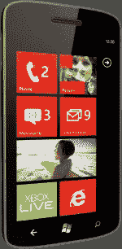
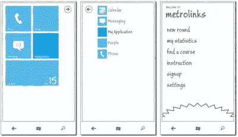
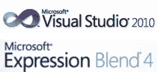
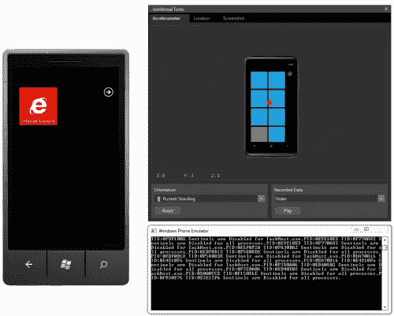
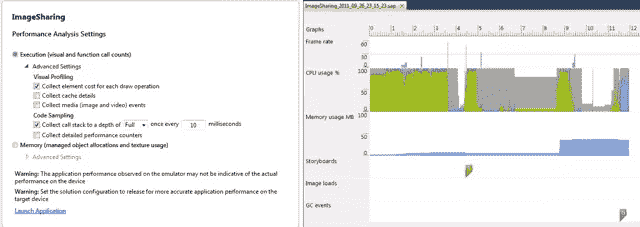
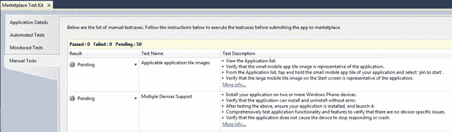
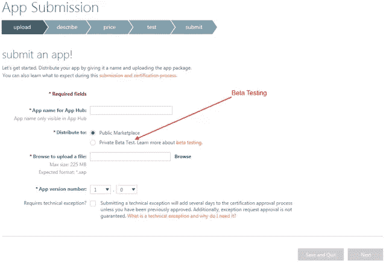
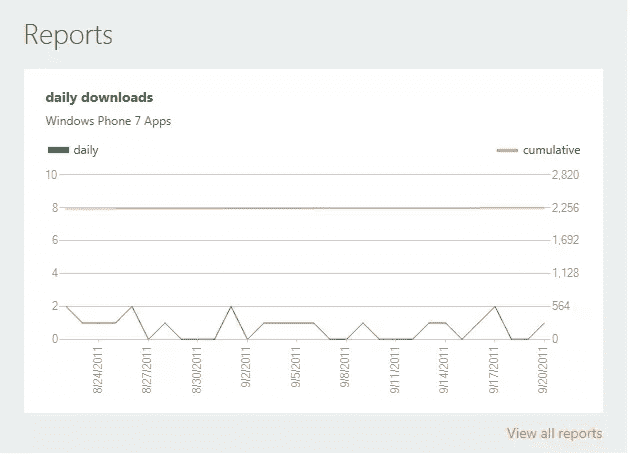

# Windows Phone 芒果有什么新功能

> 原文：<https://www.sitepoint.com/whats-new-in-windows-phone-7-5-aka-mango/>

自从大约一年前 Windows Phone 首次发布以来，关于下一个更新/版本将包括什么的讨论几乎无休止。今年早些时候的第一次重大更新引入了复制粘贴功能，这显然是第一个版本中应该有的东西，但没有在圣诞节前的最后期限前推出第一轮设备。从那时起，焦点就一直在 Windows Phone Mango 上，这不仅是对设备上消费者体验的更新，也是对所有开发工具、API 甚至市场的重大更新。在这篇文章中，我们将对现在可用的主要更新做一个快速的总结。

### Windows Phone (7.5)

[](https://www.sitepoint.com/wp-content/uploads/2011/09/sp0016_01.png)

图 1

从消费者的角度来看，以前被称为 Windows Phone 7 系列的平台，然后是 Windows Phone 7，现在应该被称为 Windows Phone。如果问，实际平台是 Windows Phone 7.5，如果你看看设置>关于下的软件属性就很明显了。一些新功能包括电子邮件的对话视图，跨文本的线程集成消息，即时消息和脸书聊天，应用程序多任务处理，当然还有更好的浏览体验的 IE9。

### Windows Phone 操作系统 7.1

啊，是的，房间里的大象:如果你一直在玩测试版或 RC 版的开发工具，你会注意到对 Windows Phone 7.1 的引用。此外，如果你在更新的设备上查看操作系统版本，你会看到数字从 7.1 开始。这类似于 Windows 7，实际上运行在 Windows OS 6.1 上(不信的话去命令提示符下输入“ver”)。Windows Phone 7.5 运行在 Windows Phone OS 7.1 上。如果你在工具中看到对 Windows Phone 7.1 的引用，它指的是同一个版本。

### 您的应用概念

为 Windows Phone 开发应用程序的第一步应该是与潜在客户、设计师和你能找到的任何其他创造性投入合作。当然，你需要记录这项工作，还有什么比使用整合到 Expression Blend 中的[草图流](http://www.microsoft.com/expression/products/sketchflow_overview.aspx)更好的方式呢？codeplex 上甚至有一些特定的 [Windows Phone 模板](http://wp7sketchflow.codeplex.com/)。



[](https://www.sitepoint.com/wp-content/uploads/2011/09/sp0016_02.png)

图 2

### 设计和开发您的应用程序

首先，请注意，我将应用程序的设计和开发放在了同一个步骤中。这是因为构建应用程序的过程应该是一个迭代的方法，包括设计用户界面和开发应用程序的逻辑。你可以自己完成，或者你可以在一个团队中工作，但是你绝对应该同时使用 [Visual Studio](http://www.microsoft.com/visualstudio/en-au) 和 [Expression Blend](http://www.microsoft.com/expression/products/Blend_Overview.aspx) 。在 Visual Studio 的当前版本中，如果你使用集成设计体验，我几乎可以保证你做错了——打开 Expression Blend，穿上你的黑色内衣，让设计师进来。



[](https://www.sitepoint.com/wp-content/uploads/2011/09/sp0016_03.png)

图 3

### 运行和测试您的应用程序

在应用程序的开发阶段，您可以使用 Windows Phone 模拟器，也可以直接使用真实设备。模拟器，虽然它最初看起来一样，有一些主要的补充。您会注意到，在图 4 中，模拟器已经更新为新的默认主题颜色红色(以前是蓝色)。右侧是附加工具窗口，您可以通过该窗口模拟摇动设备(加速度计选项卡)、更改设备位置(位置选项卡)和拍摄屏幕截图。



[](https://www.sitepoint.com/wp-content/uploads/2011/09/sp0016_04.png)

图 4

下面的窗口是模拟器的控制台输出窗口。这是模拟器的一个鲜为人知的功能，但对于调试损坏的数据绑定表达式，或者如果您碰巧使用 Console.Writeline，则特别有用。对于 x86 机器，您需要设置以下注册表项:

```
[HKEY_LOCAL_MACHINESOFTWAREMicrosoftXDE] 
"EnableConsole"=dword:00000001 
```

或者，如果您运行的是 64 位，请使用此键——并且不要忘记重启模拟器以显示控制台窗口。

```
[HKEY_LOCAL_MACHINESOFTWAREWow6432NodeMicrosoftXDE] 
"EnableConsole"=dword:00000001 
```

### 提高性能

构建移动应用程序最困难的事情之一是确保它们运行良好。归根结底，用户不希望坐在那里等待应用程序的响应。性能通常与应用程序使用的 CPU 周期数量及其内存占用量密切相关。Visual Studio 中新的性能分析工具允许您分析应用程序的执行和内存(图 5)，允许您逐步优化应用程序，使其更快更好。您可以通过按 Alt-F1 或从“调试”菜单中选择“启动 Windows Phone 性能分析”来启动该工具。请注意，您的 Windows Phone 应用程序需要面向 Windows Phone 7.1，并且是启动项目，以便此菜单项可用。

[](https://www.sitepoint.com/wp-content/uploads/2011/09/sp0016_05.png)

图 5

### 准备部署

当然，一旦您通过严格的测试运行了您的应用程序，并对其性能感到满意，您就需要将您的应用程序提交到 Windows Phone Marketplace。如果你没有提前花时间确保你已经具备了所有必要的先决条件并遵守了所有的认证要求，这可能会非常令人沮丧。为了帮助您做到这一点，您可以使用市场测试工具包(在解决方案资源管理器中右键单击您的 Windows Phone 7.1 项目，然后选择打开市场测试工具包)。测试套件由四个选项卡组成(图 6):应用程序细节、自动化测试、监控测试和手动测试。

[](https://www.sitepoint.com/wp-content/uploads/2011/09/sp0016_06.png)

图 6

通过这四个标签，你将把你的申请放在最有利的位置，让它第一次被市场接受。

### 通过 AppHub 部署

在完成测试套件之后，您终于准备好向市场提交您的应用程序了。这是通过 [AppHub](http://create.msdn.com) 完成的。当然，你必须注册，这需要一点费用。幸运的是，在很短的时间内，有一些令牌可供愿意注册本地社区计划的澳大利亚开发者使用。[在此注册](http://windowsphone.livews.net/register/community.aspx?event=buildmobile)，了解澳大利亚 Windows Phone 开发者社区的最新动态。

应用程序提交流程最近进行了更新，它允许您提交 7.0 和 7.1 应用程序。您可以提交两个不同版本的应用程序，Marketplace 会将它们分发到相应的手机上。但是请注意，一旦您提交了 7.1 版本的应用程序，您目前将无法更新您的 7.0 版本。微软已经证实，AppHub 的更新正在进行中，将在 10 月份的某个时候更新这两个版本。

[](https://www.sitepoint.com/wp-content/uploads/2011/09/sp0016_07.png)

图 7

最近的更新还带来了两个新特性，应该有助于应用程序的开发:

*   **Beta 测试**(图 7 中的箭头):这允许您指定愿意测试您的应用程序的用户的 Windows Live Ids 数量。此时，Marketplace 不会对您的应用程序进行测试，但是他们会管理您的应用程序向这些测试人员的分发。
*   **私人分发**:这允许你在 Marketplace 中使用你的应用程序，但是不能通过搜索看到。您可以将您的应用程序的深层链接转发给任何想要使用该应用程序的人。请注意，这不会阻止有权访问您的应用程序的深层链接的任何人授权下载您的应用程序。虽然它可以用于内部企业应用程序的部署，但是您仍然应该在授予用户访问公司数据的权限之前验证用户的身份。

### 报告和例外

一旦你的应用程序在 Marketplace 上可用，你当然会想知道你下载了多少，你支付了多少钱，是否有任何异常/崩溃。AppHub 刷新使所有这些信息更容易访问。例如，图 8 展示了一个应用程序的每日下载量——希望您的应用程序能比这个做得更好！

[](https://www.sitepoint.com/wp-content/uploads/2011/09/sp0016_08.png)

图 8

您还可以获得任何崩溃的报告，包括完整的堆栈跟踪。这对于确定您的应用程序在哪里运行是非常重要的。

希望这已经让你快速浏览了 Windows Phone 7.5 更新中的一些主要功能。这个版本的开发工具现在可以下载了。这里只是一些有用的链接。

*   [Windows Phone 7.5 开发者工具](http://go.microsoft.com/?linkid=9772716)
*   [地铁设计教程](http://www.microsoft.com/design/toolbox/school/tutorials.aspx)
*   [Windows Phone 芒果在线培训课程](http://msdn.microsoft.com/en-us/WP7MangoTrainingCourse)
*   [Windows Phone 芒果培训课程下线](http://download.microsoft.com/download/6/B/0/6B0DE7A5-75B3-419B-AFBB-1CCAE5DF17BA/MangoTrainingCourseBeta2.exe)
*   [Windows Phone 培训课程](http://msdn.microsoft.com/en-us/WP7TrainingCourse)

## 分享这篇文章