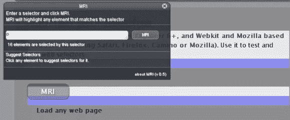
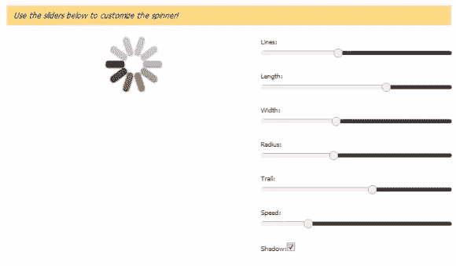
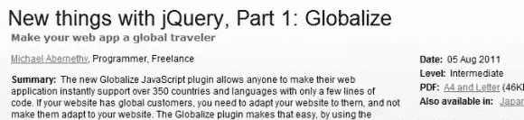
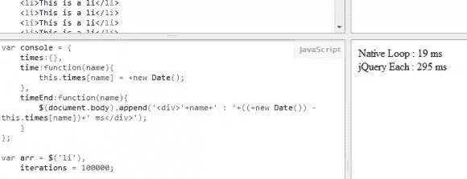
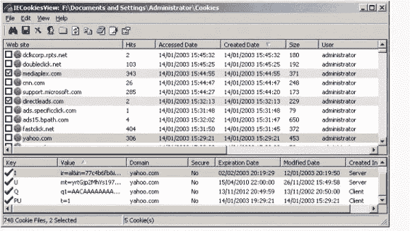
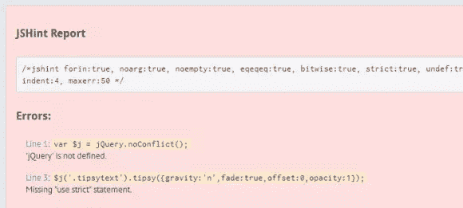
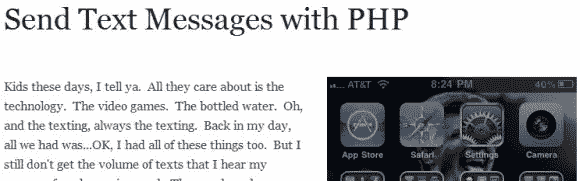
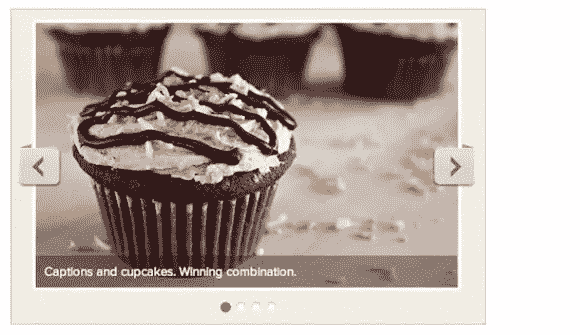

# 随机 jQuery、JavaScript 和网络开发——2011 年 9 月

> 原文：<https://www.sitepoint.com/september-2011/>

嗨！今天的帖子是我过去一个月左右(2011 年 8 月和 9 月)在互联网上发现的一些 jQuery、JavaScript 和 Web 开发的东西。有些有用，有些有趣，有些不太有用，但非常有趣！绝对值得分享到博客上。尽情享受吧！:)

相关帖子:

*   【2011 年 10 月版

## 网络浏览器 iPad

这太酷了。这是一种创造基于网络的 iPad 的尝试。并非所有的功能都已经实现，但它仍然是好的。
 
[网络浏览器 iPad](http://alexw.me/ipad2/)

## Transform.js 创新动画

2D 和 3D 变换作为常规 CSS 属性，可以使用。css()并使用。动画()。

[transform . js 创新动画](http://transformjs.strobeapp.com/)

## MRI DOM 选择器工具

可以帮助您找到 DOM 元素的选择器。
 
[MRI DOM 选择器工具](http://westciv.com/mri/)

## 用 jQuery 创建自己的加载微调器

大卫又玩他的老把戏了。不错的演示！
 
[用 jQuery 加载微调器](http://davidwalsh.name/dw-content/spin-js.php)

## jquery 全球化插件

可能对多语言支持有用。
 
[游戏化插件](http://www.ibm.com/developerworks/opensource/library/os-jquerynewpart1/index.html)

## 测试 jQuery.fn.each 与本机循环

这很酷，这是一个 jsFiddle 中测试 jQuery.fn.each vs Native 循环速度的脚本。

[jquery . fn . each vs 原生循环](https://jsfiddle.net/martinaglv/NcRsV/)

## IE Cookies 工具

说明了它的功能。

[IE cookie 工具](http://www.nirsoft.net/utils/iecookies.html)

## 在线 JavaScript 调试器–jsHint

我已经用这个有一段时间了，它非常好，所以我认为它值得分享！

[jsHint](http://jshint.com/)

## JavaScript reform.js

Reform 库试图为 web 应用程序中最常见的上下文目标(如 HTML、XML、JavaScript 等)提供一组可靠的编码输出函数。该库还根据历史漏洞和当前的注入技术，对允许的字符持保守观点。

JavaScript reform . js

## 使用 jQuery 发送文本消息

使用 PHP 发送文本消息。
 
[文本消息使用 jQuery](http://davidwalsh.name/send-text-message)

## jQuery 灵活滑块

粉碎杂志的免费赠品。
 
[jQuery 灵活滑块](http://www.smashingmagazine.com/2011/08/24/freebie-responsive-jquery-slider-plugin-flexslider/)

## jQuery 点点插件

当你移动鼠标时，它会移动箭头指向目标元素！
 
[jQuery 点点插件](http://demo.tutorialzine.com/2011/09/jquery-pointpoint-plugin/)

## 分享这篇文章