# 常见 jQuery 错误的解决方案

> 原文：<https://www.sitepoint.com/common-jquery-errors/>

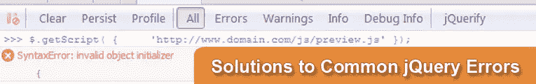

面对现实吧，人无完人！**每个人都会偶尔犯错**jQuery 也是如此——尽管他们有一个优秀的 bug 修复团队昼夜不停地修复错误和增强 jQuery，但错误还是会不时出现。

鉴于这一点，以及我已经用 jQuery 开发了相当长一段时间的事实，Firebug 控制台中时不时会显示一个错误，“我必须谷歌一下”。我想我会分享一些最常见的 jQuery 错误,这样当你遇到它们时，你可能会知道如何解决这个难题。

* * *

### 错误: "jquery.1.4.2.js 错误" a 为空" "

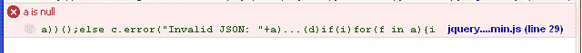


#### 可能的原因

```
a is null
[Break On This Error] a))();else c.error("Invalid JSON: "+a)...(d)if(i)for(f in a){if(b.apply(a[f],
jquery....min.js (line 29)
```

我在想，这可能与这条线失败有关，因为没有匹配。

```
$.each(rawData.match(secureQueryRegex), function(index, currentQuery)
```

然后，我想它可能是数据的大小，因为它有 69，443 个字符长…

#### 可能的解决方案

但是我最终发现数据字符串(直接从 HTML 中获取)中有坏字符。参见 [cleanHTML()函数](http://www.jquery4u.com/javascript/jquery-removing-bad-charaters-html)移除 HTML 中的不良字符。

```
rawData =  rawData.replace(/[^<>a-zA-Z 0-9]+/g,'');  /* clean up for match() statement */
```

#### 特定版本

参见 1.4.2

* * *

### 错误:“语法错误:无效的对象初始值设定项”


#### 可能的原因

对象声明语法错误。

```
$.getScript(
{
	'http://www.domain.com/js/preview.js'
});
```

运筹学

```
$("div").css(
{
    padding:'0',
    margin,'4px'
});
```

#### 可能的解决方案

去掉括号，只需 url 就可以调用 getScript()函数。这同样适用于任何其他对象声明或带有不接受对象的函数调用。

```
$.getScript('http://www.domain.com/js/preview.js');
```

将逗号改为分号。

```
$("div").css(
$("div").css(
{
    padding: '0',
    margin: '4px'
});
```

#### 特定版本

参见 1.4.2

* * *

### 错误:"未捕获的异常:语法错误，无法识别的表达式:[object HTMLLIElement]"


#### 可能的原因

这似乎是一个 jQuery 选择器错误。它似乎在 1.4.2 或更早的版本中出现得更频繁，所以请尝试更新到 jQuery 的最新版本。

```
$(this+' a').css(
```

```
var req = $("input[@name=required]").val();
```

#### 可能的解决方案

不确定，但是看看你的选择器，确保它们正常工作。首先尝试包含完整的 jQuery 版本，以获得更好的错误信息，了解可能导致问题的原因。

@是旧的选择器语法。

```
var req = $("input[name=required]").val();
```

#### 特定版本

参见 1.4.2

* * *

### 错误:"语法错误:参数列表"后缺少)

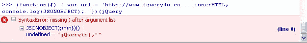

#### 可能的原因

缺少右括号或花括号。

```
})(jQuery
```

#### 可能的解决方案

```
})(jQuery);
```

#### 特定版本

参见 1.4.2

* * *

### 错误:"语法错误:缺少:在属性 id 之后"


#### 可能的原因

这是一个重复的对象初始化错误，但它是由使用不需要的花括号引起的。

```
$.getScript(
{
	'http://www.domain.com/js/preview.js', function(data, textStatus){
   console.log(data); //data returned
   console.log(textStatus); //success
   console.log('Load was performed.');
});
```

#### 可能的解决方案

```
$.getScript('http://www.domain.com/js/preview.js', function(data, textStatus)
	{
	   console.log(data); //data returned
	   console.log(textStatus); //success
	   console.log('Load was performed.');
	}
);
```

#### 特定版本

参见 1.4.2

* * *

### 错误:" type error:jssrcregex . exec(v)为空"

#### 可能的原因

由同一个 regex 上的 double exec 导致或由无效的 html“jssrcregex . exec(v)为 null”导致。

```
console.log(jsSrcRegex.exec(v));
console.log(jsSrcRegex.exec(v)[1]);
```

#### 可能的解决方案

首先检查 html:

```
if(jsSrcRegex.exec(html)){ 
	console.dir(jsSrcRegex.exec(html)[1]);
}
```

运筹学

使用重新编译正则表达式:

```
console.log(jsSrcRegex.exec(v));
jsSrcRegex.compile();
console.log(jsSrcRegex.exec(v)[1]);
```

#### 特定版本

不适用的

* * *

### 错误:“在不兼容的对象上调用了 XML 后代内部方法”

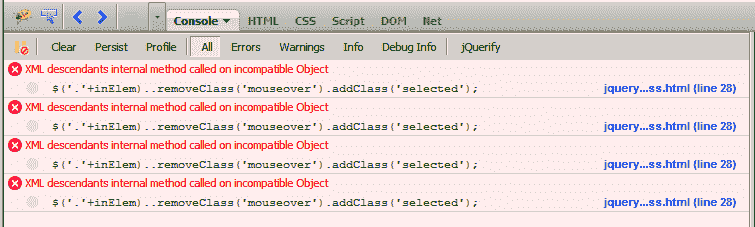

#### 可能的原因

jQuery 链命令中的双句号。

```
$('.'+inElem)..removeClass('mouseover').addClass('selected');
```

#### 可能的解决方案

要解决这个问题，只需去掉双句号。

#### 特定版本

不适用的

* * *

### 错误:“未确定的字符串文字”

你可能以前见过这个！:)
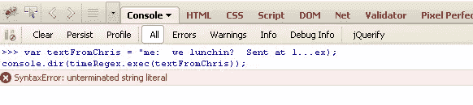

#### 可能的原因

许多可能的原因:可能是你把代码放在了选择器应该在的地方，或者是多行字符串，或者是错误的字符串格式(坏字符)，或者是尖括号等等。

#### 可能的解决方案

请参见 [jQuery 未确定字符串文字错误](http://www.jquery4u.com/testing/jquery-undetermined-string-literal-error/)以获得关于此错误的详细解释！

#### 特定版本

不适用的

* * *

### 错误:“语法错误:无法识别的表达式”

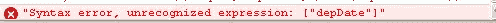

#### 可能的原因

选择器中缺少属性名。

```
$('input["depDate"]').val(departureDate);
```

#### 可能的解决方案

在选择器中添加名称属性(或 id、类等)。

```
$('input[name="depDate"]').val(departureDate);
```

#### 特定版本

不适用的

* * *

### 错误:“语法错误:语法错误”

[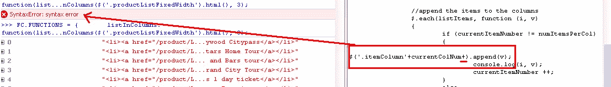](https://www.sitepoint.com/wp-content/uploads/jquery4u/2011/09/string-error2.png) 
(点击图像放大)

#### 可能的原因

这个错误很常见，可能有很多原因，但是在这个例子中，您可以清楚地看到它是由 jQuery 选择器中额外的“+”引起的。

```
$('.itemColumn'+currentColNum+).append(v);
```

#### 可能的解决方案

不幸的是，这一次你必须仔细检查你的语法，确保没有任何错误。尝试使用类似于 [jshint](http://jshint.com/) 或另一个 js 检查器来辅助。

```
$('.itemColumn'+currentColNum).append(v);
```

#### 特定版本

不适用的

* * *

### 错误: "(d || " ")。拆分不是功能

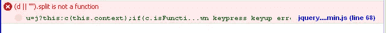

#### 可能的原因

不好意思，发现这个错误，截图了但是不记得怎么弄的了！我认为这可能是 jQuery 1.4.2 中的实时图像悬停错误，但不确定。

这里有一些我发现的类似的 bug 862(5 年前记录的)啊哈。

有时候你会看到类似的错误，比如“jquery 错误 d 未定义”或者类似的错误，我在 jQuery 1.5 中见过几次。

#### 可能的解决方案

更新至 jQuery 的最新版本。

#### 特定版本

参见 1.4.2

* * *

### 错误:“语法错误，无法识别的表达式:>”

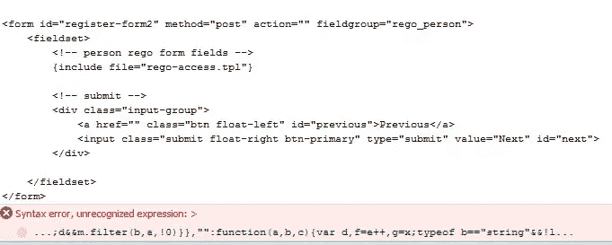

#### 可能的原因

```
if ($('#'+$form).length == 0)
{
    ...
}

if ($('#'+$form))
{
    ...
}
```

#### 可能的解决方案

不要试图使用 html 作为 jQuery 选择器元素。

#### 特定版本

参见 1.7.1

* * *

### 错误:"语法错误，无法识别的表达式:#[object Object]"

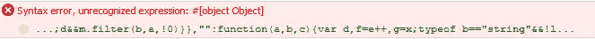

#### 可能的原因

使用 DOM 元素作为 jQuery 选择器元素。

```
$('#'+$form)
```

#### 可能的解决方案

检查 jQuery 选择器是否正确。

#### 特定版本

参见 1.7.1

* * *

### 错误:“语法错误，无法识别的表达式:名称”

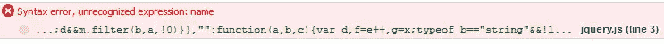

#### 可能的原因

```
var code = $(':input:name=["disCode"]').val();
```

#### 可能的解决方案

将方括号移到属性名之前。

```
var code = $(':input:[name="disCode"]').val();
```

#### 特定版本

见 1.7.2

* * *

### 错误:“对不兼容的对象调用了 XML 后代内部方法”

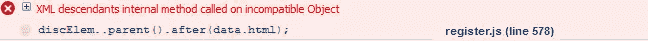

#### 可能的原因

```
discElem..parent().after(data.html);
```

#### 可能的解决方案

```
discElem.parent().after(data.html);
```

#### 特定版本

见 1.7.2

* * *

### 错误:"语法错误:无效标签"

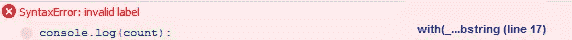

#### 可能的原因

在语句末尾使用冒号。

```
console.log(count):
```

#### 可能的解决方案

用分号代替冒号。

```
console.log(count);
```

#### 特定版本

见 1.7.2

* * *

### 错误:" type error:emails . match(/@/gim)为空"


#### 可能的原因

使用。没有匹配项的正则表达式上的长度函数。

```
var emails = '',
    count = emails.match(/@/igm).length;
```

#### 可能的解决方案

如果您在之后引用 length 属性，那么它只是返回 undefined 并且没有错误。如果您使用以下代码，您将看到错误:“类型错误:计数为空”。

```
var emails = '',
    count = emails.match(/@/igm),
    length = count.length;
```

如果在赋值前检查计数不为空，它不会出错，如果没有计数，它会给你 0。

```
var emails = '',
    regex = /@/igm,
    count = emails.match(regex),
    count = (count) ? count.length : 0;
```

#### 特定版本

见 1.7.2

* * *

### 错误:action script 中的错误。使用 try/catch 块查找错误。"

#### 可能的原因

对有错误的基于 Flowplayer 或 Flash 的对象使用调用。

```
$f('fms2').toggleFullscreen();
```

#### 可能的解决方案

尝试检查 Flash 对象的初始化代码。

#### 特定版本

见 1.7.2

* * *

在看到所有这些错误后，这里有一些让你振作起来的东西！


或者你可以在[官方 jQuery Bug 追踪器](http://bugs.jquery.com/query?status=assigned&status=new&status=open&status=reopened&component=!global&component=!templates&component=!datalink&component=!web&group=component&max=250&report=4&order=id)上看到更多的错误和 Bug。

如果您发现任何错误，请留下错误和解决方案的评论，我会将其添加到列表中！

干杯！

* * *

## 分享这篇文章