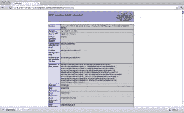
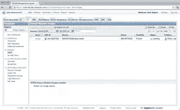
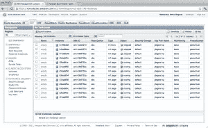

# 从零到云:设置 EC2 沙箱，第 3 部分

> 原文：<https://www.sitepoint.com/from-zero-to-cloud-3/>

这是一个由三部分组成的系列的最后一篇文章，重点是将 EC2 设置为应用程序开发人员的沙箱。我假设你在亚马逊有一个 AWS 账户；如果你没有，请阅读[第 1 部分](https://www.sitepoint.com/from-zero-to-cloud-1/ "From Zero to Cloud: Setting up an EC2 Sandbox, Part 1")，了解注册有多简单。我还假设您已经配置了开发环境并安装了 AMI 如果你还没有，请阅读[第二部](https://www.sitepoint.com/from-zero-to-cloud-2/ "From Zero to Cloud: Setting up an EC2 Sandbox, Part 2")。在这一期中，我们将学习如何在我们运行的 AMI 中安装 Apache、MySQL 和 PHP，然后克隆 AMI 来创建我们自己的 AMI。

## 设置灯组

现在，我们已经准备好安装灯组了。因为这超出了本文的范围，并且因为有许多关于最佳实践的观点，所以我们不打算建立一个多层次的生态系统。相反，我们将在我们的实例中安装 MySQL、Apache 和 PHP，因为我们知道当我们编写应用程序时，我们将确保构建代码，以便我们可以轻松地更改数据源。

首先，通过启动一个具有管理员权限的交互式 shell，确保我们可以在这个机器上做任何我们想做的事情。

```
ubuntu@ip-10-112-58-53:~$ sudo -i
```

接下来，通过`apt-get`安装 MySQL。在这个过程中，系统会提示我们选择并验证 MySQL 的根密码。

```
root@ip-10-112-58-53:~# apt-get install mysql-server mysql-client
```

然后通过`apt-get`安装 Apache。

```
root@ip-10-112-58-53:~# apt-get install apache2
```

当然我们也要安装 PHP 和相应的 Apache 模块。

```
root@ip-10-112-58-53:~# apt-get install php5 libapache2-mod-php5
```

最后，我们至少需要安装`php5-mysql`包。我喜欢多装几个…用`apt-cache search php5`找到你想要的包。

```
root@ip-10-112-58-53:~# apt-cache search php5
root@ip-10-112-58-53:~# apt-get install php5-mysql php-pear php5-cgi php5-cli php5-common php5-curl php5-gd php5-gmp php5-ldap php5-odbc php5-pgsql php5-snmp php5-sqlite php5-xmlrpc php5-xsl php5-imagick
```

安装完所有新的包后，重启 Apache。

```
root@ip-10-112-58-53:~# service apache2 restart
 * Restarting web server apache2
 ... waiting    ...done.
```

完成后，我们应该进行健全性检查，以确保一切配置正确。在 web 根目录下创建一个名为`phpinfo.php`的文件，内容如下:

```
<?php
phpinfo();
```

现在是关键时刻了。将我们之前使用的公共 DNS 条目粘贴到 web 浏览器中，并访问您刚刚创建的文件。希望我们能看到`phpinfo()`的输出。



## 支付的股息

我们还没完呢！我们已经努力构建了一个可靠的基线灯堆栈，所以让我们创建自己的 AMI，这样我们就可以启动一个与我们刚刚配置的实例完全相同的实例。为此，我们使用`ec2-create-image`。

```
MacBook-Pro:.ec2 john2$ ec2-create-image i-c795bfa6 -n lamp-starter
IMAGE	ami-43b5752a
```

在 EC2 管理控制台的 IMAGES 部分单击 AMIs，我们应该会看到我们的图像。



既然我们已经成功地从零过渡到了云，那么让我们找点乐子，假装我们已经构建了一个多层的 web 应用程序，这个应用程序已经上线并取得了巨大的成功。假设我们已经适当地构建了应用程序，并且忽略了必要的负载平衡设置，我们可以通过几次按键启动 10 个新的 web 服务器。

```
MacBook-Pro:.ec2 john2$ ec2-run-instances -k john2.kp --instance-type m1.large -n 10 ami-43b5752a
RESERVATION	r-4f433b20	582155754520	default
INSTANCE	i-2daa9f4c	ami-43b5752a			pending	john2.kp	0		m1.large	2011-08-22T04:49:45+0000	us-east-1a	aki-427d952b			monitoring-disabled					ebs				paravirtual	xen		sg-f5a0899c	default
INSTANCE	i-2faa9f4e	ami-43b5752a			pending	john2.kp	1		m1.large	2011-08-22T04:49:45+0000	us-east-1a	aki-427d952b			monitoring-disabled					ebs				paravirtual	xen		sg-f5a0899c	default
INSTANCE	i-31aa9f50	ami-43b5752a			pending	john2.kp	2		m1.large	2011-08-22T04:49:45+0000	us-east-1a	aki-427d952b			monitoring-disabled					ebs				paravirtual	xen		sg-f5a0899c	default
INSTANCE	i-33aa9f52	ami-43b5752a			pending	john2.kp	3		m1.large	2011-08-22T04:49:45+0000	us-east-1a	aki-427d952b			monitoring-disabled					ebs				paravirtual	xen		sg-f5a0899c	default
INSTANCE	i-35aa9f54	ami-43b5752a			pending	john2.kp	4		m1.large	2011-08-22T04:49:45+0000	us-east-1a	aki-427d952b			monitoring-disabled					ebs				paravirtual	xen		sg-f5a0899c	default
INSTANCE	i-37aa9f56	ami-43b5752a			pending	john2.kp	5		m1.large	2011-08-22T04:49:45+0000	us-east-1a	aki-427d952b			monitoring-disabled					ebs				paravirtual	xen		sg-f5a0899c	default
INSTANCE	i-3baa9f5a	ami-43b5752a			pending	john2.kp	6		m1.large	2011-08-22T04:49:45+0000	us-east-1a	aki-427d952b			monitoring-disabled					ebs				paravirtual	xen		sg-f5a0899c	default
INSTANCE	i-3daa9f5c	ami-43b5752a			pending	john2.kp	7		m1.large	2011-08-22T04:49:45+0000	us-east-1a	aki-427d952b			monitoring-disabled					ebs				paravirtual	xen		sg-f5a0899c	default
INSTANCE	i-3faa9f5e	ami-43b5752a			pending	john2.kp	8		m1.large	2011-08-22T04:49:45+0000	us-east-1a	aki-427d952b			monitoring-disabled					ebs				paravirtual	xen		sg-f5a0899c	default
INSTANCE	i-01aa9f60	ami-43b5752a			pending	john2.kp	9		m1.large	2011-08-22T04:49:45+0000	us-east-1a	aki-427d952b			monitoring-disabled					ebs				paravirtual	xen		sg-f5a0899c	default
```

你会看到这个动作反映在你的控制台上，你会明白为什么亚马逊事先要求你的信用卡信息。



这就结束了我们关于用 Amazon EC2 建立开发沙箱的三部分系列。我们以我们的头在云端开始，以云端的 AMI 结束。只要你注意自己的使用，亚马逊是一个出奇便宜的沙盒。不使用实例时，请将其关闭，并确保熟悉它们的[价格](http://aws.amazon.com/ec2/pricing/ "Amazon EC2 Pricing")。

<small>图片 via[light spring](http://www.shutterstock.com/gallery-540784p1.html "Stock Photos | Shutterstock: Royalty-Free Subscription Stock Photography & Vector Art")/[Shutterstock](http://www.shutterstock.com "Stock Photos and Royalty-Free Images by Subscription")</small>

## 分享这篇文章