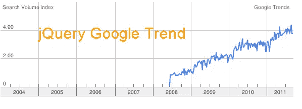

# jQuery 高居谷歌趋势榜首

> 原文：<https://www.sitepoint.com/jquery-tops-google-trends/>

规模基于 jQuery 所有年份的全球平均流量。有意思！

我想这说明了一切，jQuery 肯定是最受欢迎的！:)Ps——很难找到 prototype，因为它是一个非常流行的词，所以我用了 prototype js，也就是你在谷歌上输入的东西。

## 实时趋势结果

还可以使用以下方式查看实时(最新)趋势: **[JavaScript 框架对比](http://www.google.com/trends?q=mootools%2Cjquery%2Cprototype+js%2Cyui%2Cdojo&ctab=0&geo=all&date=all&sort=1)** 或 **[jQuery 最新趋势](http://www.google.com/trends/viz?q=jquery+js&date=all&geo=all&graph=weekly_img&sa=N)** 。

## 它是如何计算的

您可能已经注意到，对于不同的搜索，Y 轴上的比例会发生变化。数据是如何缩放的？

> 你在搜索量指数的 y 轴上看到的数字(你可以在登录谷歌账户后看到)并不是绝对的搜索流量数字。相反，Trends 会调整你输入的第一个词，使其在所选时间段内的平均搜索流量为 1.0；随后的项相对于第一项进行缩放。请注意，所有数字都是相对于总流量而言的。

## 喜欢吗？想要更多谷歌趋势？

[谷歌十大趋势](http://top10googletrends.com/)

## 分享这篇文章