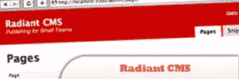

# 10 轻量级且易于使用的开源 CMS

> 原文：<https://www.sitepoint.com/10-light-easy-open-source-cms/>

拥有太多功能的内容管理系统(CMS)并不总是每个网页设计项目的最佳选择，有时你需要的只是一个更小、真正轻量级的系统。因此，我们为您和您的客户收集了一个“轻量级”(不是字面上的轻量级，而是更简单的系统)列表，以便和谐地管理内容！

显然， [WordPress](http://wordpress.org/) 在这里没有提到，但在我看来，它是目前最好的免费开源 CMS。

## 1.Zimplit CMS

极其轻量级，简单，可定制和开源。它非常容易安装，通过一个简单的网络界面易于使用，它只包含一个核心引擎文件。

## 2.CMS 从零开始

是一个快速、简单、开源的解决方案，让网页设计者给他们的客户一个他们可以自己编辑的网站。

[来源](http://cmsfromscratch.com/)

## 3.页面时间

是一个面向设计师、网络代理和网络开发者的托管内容管理系统(CMS)。它允许您通过登录托管在我们服务器上的 web 应用程序来管理网站上的文本、图像和文档。

[来源](http://www.pagelime.com/)

## 4.CMS 变得简单

是一个开源(GPL)包，使用 PHP 构建，为网站开发人员提供了一个简单易用的工具，允许构建小型(几十到几百页)、半静态的网站。

[来源](http://www.cmsmadesimple.org/)

## 5.CushyCMS

对于内容编辑者和设计者来说，它都是以易用性为原则从头开始构建的。这是一个非常简单的 CMS，一个网页设计师只需要不到 3 分钟就可以实现。

[来源](http://www.cushycms.com/en)

## 6.佐托尼

是一个快速、易用、开源的 CMS。它具有可扩展性和灵活性，是基于丰富的互联网应用程序和网络出版而构建的。它还可以作为一个框架，易于扩展和适应您的特定用途。

[来源](http://zotonic.com/)

## 7.新闻

是一个完全免费的、符合标准的、PHP 和 MySQL 驱动的内容管理系统。这是非常轻量级的，简单和可定制的。它易于安装，并且通过简单的网络界面易于使用。

[来源](http://snewscms.com/)

## 8.辐射 CMS

是一个为小型团队设计的开源 CMS，从头开始构建，尽可能简单，具有优雅的管理界面，围绕三个关键组件:页面、代码片段和布局。

[来源](http://radiantcms.org/)

## 9.皮克希

它使用最新的网络标准，所以无论你建立什么样的网站，所有的访问者都可以访问它，它是搜索引擎友好的，你会喜欢你所需要知道的就是 CSS 来定制你的网站。

[来源](http://www.getpixie.co.uk/)

## 10.交响乐

Symphony 利用了像 XML 和 XSLT 这样的开放标准，以及传统的 XHTML 和 CSS。甚至管理界面也采用了广泛使用的 jQuery 库，因此扩展开发人员在扩展后端时不必学习全新的框架。

[来源](http://symphony-cms.com/)

## 分享这篇文章