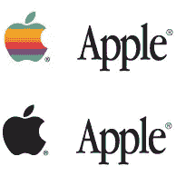
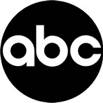
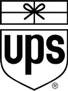
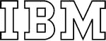

# 真实世界中幸存的标志设计:符号和文字标记

> 原文：<https://www.sitepoint.com/surviving-logo-design-in-the-real-world-symbols-and-wordmarks/>

*继续本系列文章的最后一部分“现实世界中幸存的标志设计”，Felix 写了标志的组成部分——符号和文字标记。*

作为设计师，我们都应该知道文字标志和基于符号的标志之间的区别。在设计标志时，设计师可能会渴望设计基于符号的标志——由于*低等级的设计噪音*,文字标记似乎更容易做到。除了符号，还有很多平庸的文字符号。原因大概是设计师觉得这样更有创意。然而，如果我们着眼于有效性，那么两者都是有效的和创造性的。

我们将通过两个例子来了解一个公司和认知度是如何影响一个标志的使用演变的。

### 基于符号的标志

 苹果是一个人人都听说过的组织。只有住在山洞里的人才能认出被咬了一口的苹果标志，或者苹果营销部门希望贴在车窗背面的白色小贴纸。

然而，这种认可是随着时间的推移——几十年来建立起来的。最初使用苹果标志时，伴随着一个“低功耗”的单词“苹果”,但随着对该公司的认知度提高到连 2 岁的孩子都能认出来，这一符号被取消了。

如果你希望为一个组织创造这样一个标志性的符号，它可能会也可能不会达到如此令人眼花缭乱的识别高度，你可以将你的标志性符号与文字标记搭配起来。这样，你就可以选择在组织发展到那一步的时候去掉文字标记。如果该组织从未达到这种认可水平，它有文字标志与之合作——这最终会给申请提供更多选择。

### 基于文字标记的徽标

 戴尔徽标是一个基于文字标记的徽标，包含了名称本身。目前的标志包括一个圆形的装置，基本上是装饰性的，更多的是应用而不是标志本身。然而，这个标志的力量是不可否认的。作为一个标志，全世界的人都能读懂公司的名字。没有什么玄机。如果有人不知道这家公司，很容易就能找到它是谁或它是什么。当使用高粗体字母时，字母“E”是倾斜的，并连接“D”和第一个“L”。

虽然这个标志看起来确实是基于 Arial Black(或类似的东西)，但倾斜的“E”赋予了它足够的独特性，使它成为一个不会被弄错的强大的文字标记。设计师可能知道，使用粗体大写字母会让观众觉得公司很大，很稳固，甚至是公司化的——这是在市场上与潜在客户建立信任的重要方面，包括大规模的企业运营。

### 不要轻视文字标记

一个好的商标将包含强大的设计理由以及公司名称——或者至少是其中的元素。

保罗·兰德创造了平面设计史上一些最有效的文字标记。

上述公司之所以强大，有很多原因——很多原因来自于该组织的运营方式，以及它们现在或过去有多成功，不管它们最初是由谁设计的。我们的工作是通过设计组织的标志，通过代表组织整体的单一元素的意义、推理和识别，为组织增添力量。

然而，问题依然存在——文字标记还是符号？对于设计师来说，这可能是一个艰难的决定。有时你需要给你的拇指指甲一个机会，只是涂鸦没有太多的议程-不要打折涂鸦的时间！

你对基于文字标记和符号的标志有什么看法？答案可能会反映你的设计风格。

## 分享这篇文章