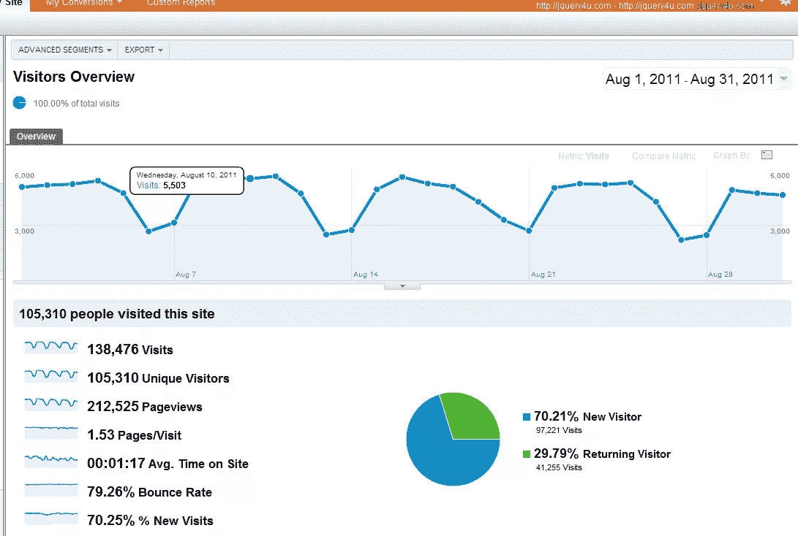
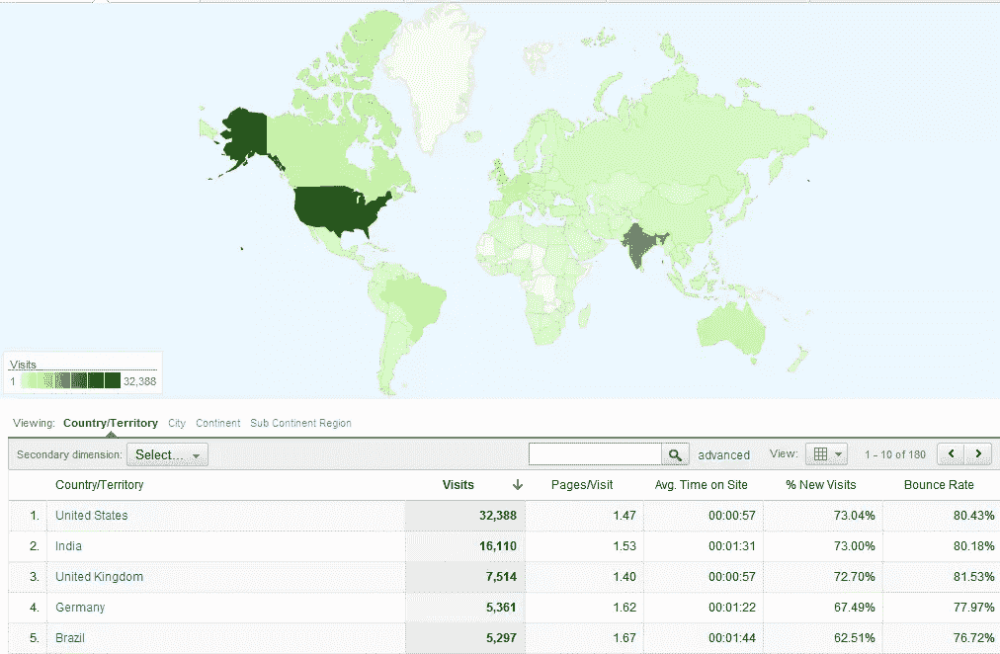
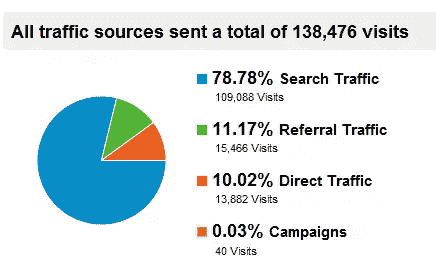
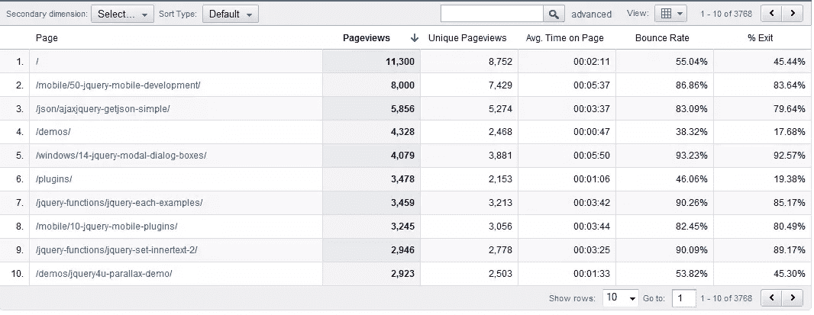
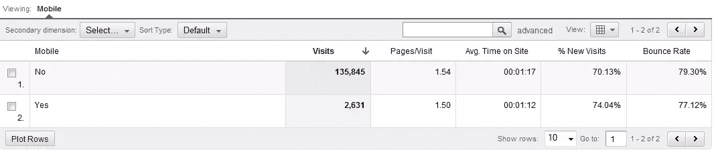
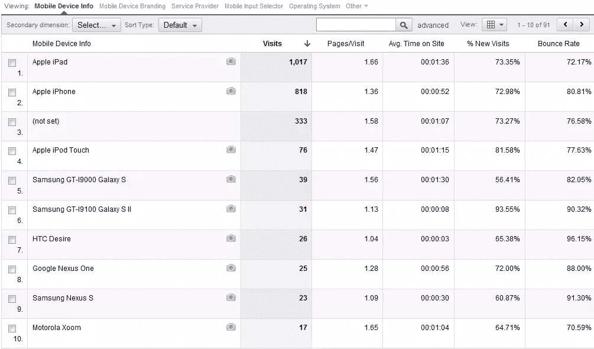
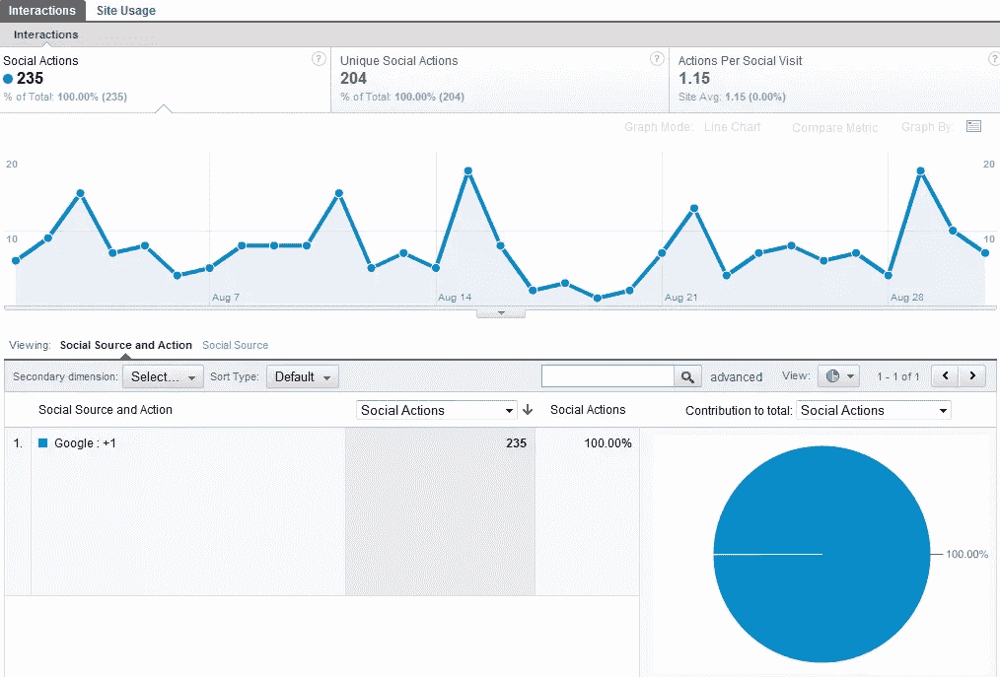

# 2011 年 8 月——jQuery 4u 谷歌分析统计

> 原文：<https://www.sitepoint.com/august-2011-jquery-4u-google-analytics-statistics/>

嗨，伙计们，这是这个月 Google Analytics 的统计数据，可能会对 jQuery 博客的具体数据感兴趣。一些统计数据非常有趣，尤其是移动统计数据！

## 每月访客–2011 年 8 月

我们每个月有 100，000+的独立访问者，这一点也不差！

## 每月访客(按位置)-2011 年 8 月

大多数博客读者来自美国

## 每月流量来源–2011 年 8 月

78.78%(不错的数字)的有机流量来自谷歌。

## 有机访客 FTW！

[")](https://www.sitepoint.com/wp-content/uploads/jquery4u/2011/09/traffic-sources-jquery4u-01-09-20112.png)

## 每月页面内容–2011 年 8 月

jQuery mobile tips 页面和曾经流行的 T2 jQuery 对话框 T3 一样做得非常好。

## 每月移动设备用户–2011 年 8 月

仍然只有 2%的人使用移动设备，但我预计这一数字将在未来几个月左右上升。也许更久一点。

## 每月移动设备细分–2011 年 8 月

苹果仍然在移动设备上领先，iPad 和 iPhone 获得了最多的博客浏览量。

## Google +1 月点击量–2011 年 8 月

Google Plus 还没有产生巨大的影响(真的在任何地方)，但我预计 Google 会像往常一样超越对手。可以帮忙:[在 Google +1 上加入我的圈子。](https://plus.google.com/i/vBpJojn3MLM:R0naUPjoETk)

## 分享这篇文章