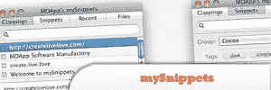
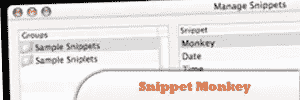
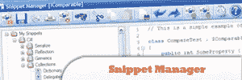
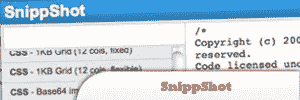
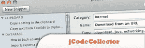

# 用于管理代码片段的 10 款免费桌面应用

> 原文：<https://www.sitepoint.com/10-free-amazing-desktop-apps-managing-code-snippets/>

Lets face it, copying and pasting pieces of code into text files etc is disorganized and a waste of time. Here we’ve collected **10 FREE amazing desktop apps for managing your code snippets**. These applications will make your development life much easier, so start checking out the list, and see which one would fit your style best. Have fun!

相关帖子:

*   [**jQuery 桌面 UI–ext js Web 界面门户**](http://www.jquery4u.com/tutorials/jquery-desktop-ui-ext-js/)
*   [**10 款面向设计师的免费 iPhone / iPad 应用**](http://www.jquery4u.com/mobile/20-free-iphone-ipad-apps-designers-developers/)

## 1.代码收集器专业版

让您使用简洁的类似 Mac 的界面轻松组织、使用和共享代码片段。您可以存储代码片段，并通过几次击键来检索它们。

[来源](http://www.mcubedsw.com/software/codecollectorpro)

## 2.我的小宝贝

是一个简洁的应用程序，让您的代码片段以及剪报和文件触手可及。你只需点击或按下一个键，你有你的片段。

[来源](http://myownapp.com/applications/mysnippets/index.html)

## 3.片段猴子

通过允许您为您经常键入的片段和短语创建快捷方式，节省您无数的时间。从剪贴板或通过易于使用的代码片段编辑器创建新的代码片段。

[来源](http://www.gideonsoftworks.com/snippetmonkey.html)

## 4.代码片段管理器

不要与下面的另一个代码片段管理器混淆，它是一个免费的简单但功能丰富的管理代码片段的应用程序。除了在本地存储代码段之外，您还可以选择在线存储代码段，以便从任何地方访问它们。

[来源](http://snippets.gabehabe.com/)

## 5.代码片段管理器

是一个免费的工具，用于管理各种语言的代码片段:VB，C++，C#，Java，SQL，ASP，PHP，HTML，甚至 COBOL，汇编和 Fortran。您还可以使用代码段管理器来管理纯 ASCII 文本数据。

[来源](http://www.snippetmanager.net/)

## 6.CodeDogg

是一个免费的、简单的、快速的程序，它存储了你的代码片段，所以你可以在任何地方使用它们。有了 CodeDogg，你可以在你所有的电脑和设备上同步代码片段，这样你就可以随时拥有最新版本的代码片段。

[来源](http://www.codedogg.com/code-snippet-manager-tool.html)

## 7.代码库

是一个免费的代码片段管理器，支持本地数据库和共享数据库。使用服务器端应用程序，您可以在多个用户之间共享代码片段库。

[来源](http://programs.edchipman.ca/applications/code-bank/)

## 8.Snippely

是一个免费的基本文本和代码组织工具。通过使用它，您可以在一个方便的位置保存、组织和检索您的代码片段。

[来源](http://code.google.com/p/snippely/)

## 9.截图

是一个免费的在线代码片段收集工具，界面简洁明了。这些片段存储在网上，因为它是基于网络的，你可以从任何计算机、平台和浏览器访问它们，而不需要安装软件。

[来源](http://snippshot.skyscarf.com/)

## 10.jCodeCollector

是一个免费的跨平台应用程序，可以帮助你管理你的代码片段。它是用 Java 写的。

[来源](http://www.alessandrococco.com/p/jcodecollector_22.html)

## 分享这篇文章