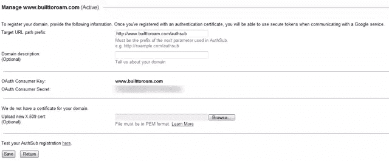
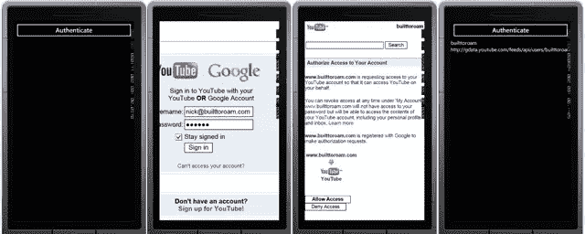
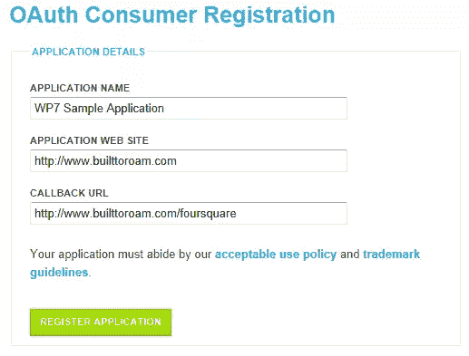
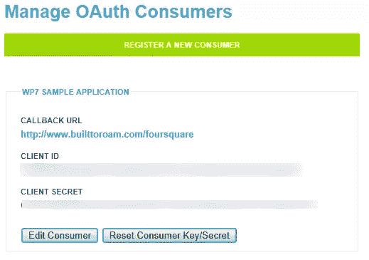

# 来自 Windows Phone 应用程序的 YouTube 和 FourSquare

> 原文：<https://www.sitepoint.com/youtube-and-foursquare-from-a-windows-phone-app/>

在这个关于 Windows Phone 应用程序认证的系列中，我想介绍的最后两个网站是 [YouTube](http://www.youtube.com/) 和 [FourSquare](https://foursquare.com/) 。前者使用 OAuth 1，而后者使用 OAuth 2。

### YouTube(即谷歌)。

由于我们已经介绍了许多使用 OAuth 1 的站点，所以我不会让您厌烦每一个步骤。然而，我想强调几个小要点。首先，你不需要去 YouTube 注册你的应用程序，你实际上需要去谷歌，特别是你可以管理你的谷歌域名的页面。

为了访问任何 Google APIs，您需要注册您的 web 应用程序所在站点的域名。当然，我们不会构建 web 应用程序，所以您只需要给它一个您自己的域(在我们的例子中是 www.builttoroam.com)。完成后，您应该会看到类似于图 1 的页面，其中包括您的 OAuth 消费者密钥和 OAuth 消费者秘密。


[](https://www.sitepoint.com/wp-content/uploads/2011/08/sp0013_011.png)

图 1

有了我们的密钥和秘密，我们就可以通过 OAuth 过程了。我们将使用与前几篇文章相同的页面布局，代码也基本相同。下面是执行身份验证的所有代码(避免您跳到前面的帖子)。

```
private const string OAuthConsumerKeyKey = "oauth_consumer_key";
private const string OAuthVersionKey = "oauth_version";
private const string OAuthSignatureMethodKey = "oauth_signature_method";
private const string OAuthSignatureKey = "oauth_signature";
private const string OAuthTimestampKey = "oauth_timestamp";
private const string OAuthNonceKey = "oauth_nonce";
private const string OAuthTokenKey = "oauth_token";
private const string OAuthTokenSecretKey = "oauth_token_secret";
private const string OAuthVerifierKey = "oauth_verifier";
private const string OAuthPostBodyKey = "post_body";

private const string RequestUrl = "https://www.google.com/accounts/OAuthGetRequestToken";
private const string AuthorizeUrl = "https://www.google.com/accounts/OAuthAuthorizeToken";
private const string AccessUrl = "https://www.google.com/accounts/OAuthGetAccessToken";

private string token;
private string tokenSecret;
private string pin;

private void AuthenticateClick(object sender, RoutedEventArgs e) {
    var parameters = new Dictionary<string, string>() { {"scope", "http://gdata.youtube.com" } };

    // Create the Request
    var request = CreateRequest("GET", RequestUrl,parameters);
    request.BeginGetResponse(result => {
        try {
            var req = result.AsyncState as HttpWebRequest;
            if (req == null) throw new ArgumentNullException("result", "Request parameter is null");
            using (var resp = req.EndGetResponse(result))
            using (var strm = resp.GetResponseStream())
            using (var reader = new StreamReader(strm)) {
                var responseText = reader.ReadToEnd();

                // Parse out the request token
                ExtractTokenInfo(responseText);

                // Navigate to the authorization Url
                var loginUrl = new Uri(AuthorizeUrl + "?" + OAuthTokenKey + "=" + token);
                Dispatcher.BeginInvoke(() => AuthenticationBrowser.Navigate(loginUrl));
            }
        }
        catch(Exception ex) {
            Dispatcher.BeginInvoke(() => MessageBox.Show("Unable to retrieve request token"));
        }
    }, request);
}

private const string OAuthVersion = "1.0";
private const string Hmacsha1SignatureType = "HMAC-SHA1";
private const string ConsumerKey = "<your_consumer_key>";
private const string ConsumerSecret = "<your_consumer_secret>";

private WebRequest CreateRequest(string httpMethod, string requestUrl, IDictionary<string, string> requestParameters = null) {
    if (requestParameters == null) {
        requestParameters = new Dictionary<string, string>();
    }

    var secret = "";
    if (!string.IsNullOrEmpty(token)) {
        requestParameters[OAuthTokenKey] = token;
        secret = tokenSecret;
    }

    if (!string.IsNullOrEmpty(pin)) {
        requestParameters[OAuthVerifierKey] = pin;
    }

    var url = new Uri(requestUrl);
    var normalizedUrl = requestUrl;
    if (!string.IsNullOrEmpty(url.Query)) {
        normalizedUrl = requestUrl.Replace(url.Query, "");
    }

    var signature = GenerateSignature(httpMethod, normalizedUrl, url.Query, requestParameters, secret);
    requestParameters[OAuthSignatureKey] = UrlEncode(signature);

    var sb = new StringBuilder();
    sb.Append(url.Query);
    foreach (var param in requestParameters) {
        if (sb.Length > 0) sb.Append("&");
        sb.Append(string.Format("{0}={1}", param.Key, param.Value));
    }
    if (sb[0] != '?') sb.Insert(0, "?");
    var request = WebRequest.CreateHttp(normalizedUrl + sb.ToString());
    request.Method = httpMethod;
    return request;
}

public string GenerateSignature(string httpMethod, string normalizedUrl, 
                                                           string queryString, IDictionary<string, string> requestParameters, 
                                                           string secret = null) {
    requestParameters[OAuthConsumerKeyKey] = ConsumerKey;
    requestParameters[OAuthVersionKey] = OAuthVersion;
    requestParameters[OAuthNonceKey] = GenerateNonce();
    requestParameters[OAuthTimestampKey] = GenerateTimeStamp();
    requestParameters[OAuthSignatureMethodKey] = Hmacsha1SignatureType;

    string signatureBase = GenerateSignatureBase(httpMethod, normalizedUrl, 
                                                                                         queryString, requestParameters);

    var hmacsha1 = new HMACSHA1();
    var key = string.Format("{0}&{1}", UrlEncode(ConsumerSecret),
                            string.IsNullOrEmpty(secret) ? "" : UrlEncode(secret));
    hmacsha1.Key = Encoding.UTF8.GetBytes(key);

    var signature = ComputeHash(signatureBase, hmacsha1);
    return signature;
}

private static readonly Random Random = new Random();
public static string GenerateNonce() {
    // Just a simple implementation of a random number between 123400 and 9999999
    return Random.Next(123400, 9999999).ToString();
}

public static string GenerateTimeStamp() {
    var now = DateTime.UtcNow;
    TimeSpan ts = now - new DateTime(1970, 1, 1, 0, 0, 0, 0);
    return Convert.ToInt64(ts.TotalSeconds).ToString();
}

public static string GenerateSignatureBase(string httpMethod, string normalizedUrl, string queryString, IDictionary<string, string> requestParameters) {
    var parameters = new List<KeyValuePair<string, string>>(GetQueryParameters(queryString)) {
                                new KeyValuePair<string, string>(OAuthVersionKey, requestParameters[OAuthVersionKey]),
                                new KeyValuePair<string, string>(OAuthNonceKey, requestParameters[OAuthNonceKey]),
                                new KeyValuePair<string, string>(OAuthTimestampKey,
                                                                requestParameters[OAuthTimestampKey]),
                                new KeyValuePair<string, string>(OAuthSignatureMethodKey,
                                                                requestParameters[OAuthSignatureMethodKey]),
                                new KeyValuePair<string, string>(OAuthConsumerKeyKey,
                                                                requestParameters[OAuthConsumerKeyKey])
                            };

    if (requestParameters.ContainsKey(OAuthVerifierKey)) {
        parameters.Add(new KeyValuePair<string, string>(OAuthVerifierKey, requestParameters[OAuthVerifierKey]));
    }

    if (requestParameters.ContainsKey(OAuthTokenKey)) {
        parameters.Add(new KeyValuePair<string, string>(OAuthTokenKey, requestParameters[OAuthTokenKey]));
    }

    foreach (var kvp in requestParameters) {
        if (kvp.Key.StartsWith("oauth_") || kvp.Key == OAuthPostBodyKey) continue;
        parameters.Add(new KeyValuePair<string, string>(kvp.Key,UrlEncode(kvp.Value)));
    }

    parameters.Sort((kvp1, kvp2) => {
        if (kvp1.Key == kvp2.Key)
        {
            return string.Compare(kvp1.Value, kvp2.Value);
        }
        return string.Compare(kvp1.Key, kvp2.Key);
    });

    var parameterString = BuildParameterString(parameters);

    if (requestParameters.ContainsKey(OAuthPostBodyKey)) {
        parameterString += "&" + requestParameters[OAuthPostBodyKey];
    }
    var signatureBase = new StringBuilder();
    signatureBase.AppendFormat("{0}&", httpMethod);
    signatureBase.AppendFormat("{0}&", UrlEncode(normalizedUrl));
    signatureBase.AppendFormat("{0}", UrlEncode(parameterString));

    return signatureBase.ToString();
}

private static IEnumerable<KeyValuePair<string, string>> GetQueryParameters(string queryString) {
    var parameters = new List<KeyValuePair<string, string>>();
    if (string.IsNullOrEmpty(queryString)) return parameters;

    queryString = queryString.Trim('?');

    return (from pair in queryString.Split('&')
            let bits = pair.Split('=')
            where bits.Length == 2
            select new KeyValuePair<string, string>(bits[0], bits[1])).ToArray();
}

private static string BuildParameterString(IEnumerable<KeyValuePair<string, string>> parameters) {
    var sb = new StringBuilder();
    foreach (var parameter in parameters) {
        if (sb.Length > 0) sb.Append('&');
        sb.AppendFormat("{0}={1}", parameter.Key, parameter.Value);

    }
    return sb.ToString();
}

/// <summary>
/// The set of characters that are unreserved in RFC 2396 but are NOT unreserved in RFC 3986.
/// </summary>
private static readonly string[] UriRfc3986CharsToEscape = new[] { "!", "*", "'", "(", ")" };
private static readonly char[] HexUpperChars = new[] { '0', '1', '2', '3', '4', '5', '6', '7', '8', '9', 'A', 'B', 'C', 'D', 'E', 'F' };

public static string UrlEncode(string value) {
    // Start with RFC 2396 escaping by calling the .NET method to do the work.
    // This MAY sometimes exhibit RFC 3986 behavior (according to the documentation).
    // If it does, the escaping we do that follows it will be a no-op since the
    // characters we search for to replace can't possibly exist in the string.
    var escaped = new StringBuilder(Uri.EscapeDataString(value));

    // Upgrade the escaping to RFC 3986, if necessary.
    foreach (string t in UriRfc3986CharsToEscape) {
        escaped.Replace(t, HexEscape(t[0]));
    }

    // Return the fully-RFC3986-escaped string.
    return escaped.ToString();
}

public static string HexEscape(char character) {
    var to = new char[3];
    int pos = 0;
    EscapeAsciiChar(character, to, ref pos);
    return new string(to);
}

private static void EscapeAsciiChar(char ch, char[] to, ref int pos) {
    to[pos++] = '%';
    to[pos++] = HexUpperChars[(ch & 240) >> 4];
    to[pos++] = HexUpperChars[ch & 'x000f'];
}

private static string ComputeHash(string data, HashAlgorithm hashAlgorithm)
{
    byte[] dataBuffer = Encoding.UTF8.GetBytes(data);
    byte[] hashBytes = hashAlgorithm.ComputeHash(dataBuffer);

    return Convert.ToBase64String(hashBytes);
}

private IEnumerable<KeyValuePair<string, string>> ExtractTokenInfo(string responseText) {
    if (string.IsNullOrEmpty(responseText)) return null;

    var responsePairs = (from pair in responseText.Split('&')
                            let bits = pair.Split('=')
                            where bits.Length == 2
                            select new KeyValuePair<string, string>(bits[0], bits[1])).ToArray();
    token = responsePairs.Where(kvp => kvp.Key == OAuthTokenKey).Select(kvp => kvp.Value).FirstOrDefault();
    tokenSecret = responsePairs.Where(kvp => kvp.Key == OAuthTokenSecretKey).Select(kvp => kvp.Value).FirstOrDefault();

    return responsePairs;
}

private void BrowserNavigated(object sender, System.Windows.Navigation.NavigationEventArgs e) {
    if (AuthenticationBrowser.Visibility == Visibility.Collapsed) {
        AuthenticationBrowser.Visibility = Visibility.Visible;
    }
    if (e.Uri.AbsoluteUri.ToLower().Contains("oauth_token_authorized")) {
        // The request token is now "authorized", so just convert it to the access token
        RetrieveAccessToken();
        AuthenticationBrowser.Visibility = Visibility.Collapsed;
    }
}

public void RetrieveAccessToken() {
    var request = CreateRequest("GET", AccessUrl);
    request.BeginGetResponse(result => {
        try
        {
            var req = result.AsyncState as HttpWebRequest;
            if (req == null) throw new ArgumentNullException("result", "Request is null");
            using (var resp = req.EndGetResponse(result))
            using (var strm = resp.GetResponseStream())
            using (var reader = new StreamReader(strm))
            {
                var responseText = reader.ReadToEnd();

                ExtractTokenInfo(responseText);
                RetrieveProfile();
            }
        }
        catch
        {
            Dispatcher.BeginInvoke(() => MessageBox.Show("Unable to retrieve Access Token"));
        }
    }, request);
}

private void RetrieveProfile() {
    var request = CreateRequest("GET",
                            "https://gdata.youtube.com/feeds/api/users/default?alt=json");
    request.BeginGetResponse(result =>{
        try {
            var req = result.AsyncState as HttpWebRequest;
            if (req == null) throw new ArgumentNullException("result", "Request is null");
            using (var resp = req.EndGetResponse(result))
            using (var strm = resp.GetResponseStream()) {
                var serializer = new DataContractJsonSerializer(typeof(YouTubeProfileResponse));
                var profileResponse = serializer.ReadObject(strm) as YouTubeProfileResponse;

                Dispatcher.BeginInvoke(() => {
                    MessageBox.Show("Access granted");

                    UserIdText.Text = profileResponse.Entry.Id.Text;
                    UserNameText.Text =profileResponse.Entry.Username.Text;
                });
            }
        }
        catch {
            Dispatcher.BeginInvoke(() => MessageBox.Show("Unable to retrieve Access Token"));
        }
    }, request);
}

[DataContract]
public class YouTubeProfileResponse {
    [DataMember(Name = "entry")]
    public YouTubeEntry Entry { get; set; }

    [DataContract]
    public class YouTubeEntry {
        [DataMember(Name="id")]
        public GoogleText Id { get; set; }

        [DataMember(Name="yt$username")]
        public GoogleText Username { get; set; }
    }

    [DataContract]
    public class GoogleText {
        [DataMember(Name="$t")]
        public string Text { get; set; }
    }
} 
```

您会注意到我们使用 HTTP GET 请求，参数(包括 OAuth 参数和签名)是 URL 的一部分，而不是授权头。谷歌实际上支持许多不同的机制，所以你可以选择哪一个最适合。

您可能已经注意到的另一件事是，当请求用户资料时，URL 以`alt=json`结尾。这是用 JSON 请求响应，而不是默认的 XML。我们选择使用 JSON 格式，因为它比等效的 XML 更紧凑，解析起来也更快。如果运行这段代码，您应该会看到类似于图 2 的验证序列。


[](https://www.sitepoint.com/wp-content/uploads/2011/08/sp0013_021.png)

图 2

### 坚定的

FourSquare 的好处是我们回到了 OAuth 2-land，这使得一切都变得简单多了。当然，首先要做的是注册一个应用程序。登录后，导航到 [FourSquare OAuth](https://foursquare.com/oauth/) ，在这里您可以完成关于您的应用程序的信息(图 3)。


[](https://www.sitepoint.com/wp-content/uploads/2011/08/sp0013_031.png)

图 3

由于我们正在构建一个移动应用程序，您可能会认为我们不需要回调 URL。不幸的是，它是一个必需的参数，应用程序网站也是如此。只要使用一个你有的域名和一个你知道**不存在**的回调 URL。在认证/授权过程结束时，web 浏览器将被重定向回这个回调 URL。但是，您的应用程序会截获这个导航，以便您可以解析访问令牌。用户将永远不会看到 web 浏览器无法导航到该页面。

注册后，您应该会看到一个类似于图 4 的页面，其中包括客户端 ID 和客户端密码。在认证/授权过程中，您只需要客户端 ID。


[](https://www.sitepoint.com/wp-content/uploads/2011/08/sp0013_041.png)

图 4

因此，剩下的就是实现认证/授权过程的代码了。因为我们已经讨论过这个问题了(见脸书的帖子),我将简单地把工作代码放在这里供你参考。

```
private void AuthenticateClick(object sender, RoutedEventArgs e) {
    var uriParams = new Dictionary<string, string>() {
                {"client_id", "<your_client_ID>"},
                {"response_type", "token"},
                {"scope", "user_about_me, offline_access, publish_stream"},
                {"redirect_uri", "<your_callback_URL>"},
                {"display", "touch"}
            };

    StringBuilder urlBuilder = new StringBuilder();
    foreach (var current in uriParams) {
        if (urlBuilder.Length > 0) {
            urlBuilder.Append("&");
        }
        var encoded = HttpUtility.UrlEncode(current.Value);
        urlBuilder.AppendFormat("{0}={1}", current.Key, encoded);
    }
    var loginUrl = "https://foursquare.com/oauth2/authenticate?" + urlBuilder.ToString();
    AuthenticationBrowser.Navigate(new Uri(loginUrl));
    AuthenticationBrowser.Visibility = Visibility.Visible;
}

public string AccessToken { get; set; }
private void BrowserNavigated(object sender, NavigationEventArgs e) {
    if (string.IsNullOrEmpty(e.Uri.Fragment)) return;
    if (e.Uri.AbsoluteUri.ToLower().StartsWith("<your_callback_URL>")) {
        string text = HttpUtility.HtmlDecode(e.Uri.Fragment).TrimStart('#');
        var pairs = text.Split('&');
        foreach (var pair in pairs) {
            var kvp = pair.Split('=');
            if (kvp.Length == 2) {
                if (kvp[0] == "access_token") {
                    AccessToken = HttpUtility.UrlDecode(kvp[1]);
                    MessageBox.Show("Access granted");
                    RequestUserProfile();
                }
            }
        }

        if (string.IsNullOrEmpty(AccessToken)) {
            MessageBox.Show("Unable to authenticate");
        }

        AuthenticationBrowser.Visibility = System.Windows.Visibility.Collapsed;
    }
}

private void RequestUserProfile() {
    var profileUrl = string.Format("https://api.foursquare.com/v2/users/self?oauth_token={0}",
                                                            HttpUtility.UrlEncode(AccessToken));

    var request = HttpWebRequest.Create(new Uri(profileUrl));
    request.Method = "GET";
    request.BeginGetResponse(result => {
        try
        {
            var resp = (result.AsyncState as HttpWebRequest).EndGetResponse(result);
            using (var strm = resp.GetResponseStream()) {
                var serializer = new DataContractJsonSerializer(typeof(FourSquareProfileResponse));
                var profile = serializer.ReadObject(strm) as FourSquareProfileResponse;
                this.Dispatcher.BeginInvoke(
                    (Action<FourSquareProfileResponse>)((user) => {
                        this.UserIdText.Text = user.Response.User.Id;
                        this.UserNameText.Text = user.Response.User.FirstName + " " + user.Response.User.LastName;
                    }), profile);
            }
        }
        catch (Exception ex) {
            this.Dispatcher.BeginInvoke(() =>
                MessageBox.Show("Unable to attain profile information"));
        }
    }, request);
}

[DataContract]
public class FourSquareProfileResponse {
    [DataMember(Name = "response")]
    public ProfileResponse Response { get; set; }

    [DataContract]
    public class ProfileResponse {
        [DataMember(Name="user")]
        public ResponseUser User { get; set; }

        [DataContract]
        public class ResponseUser {
            [DataMember(Name = "id")]
            public string Id { get; set; }
            [DataMember(Name = "firstName")]
            public string FirstName { get; set; }
            [DataMember(Name = "lastName")]
            public string LastName { get; set; }
        }
    }

}

private void PostStatusUpdate(string status, Action<bool, Exception> callback) {
    var request = HttpWebRequest.Create("https://api.foursquare.com/v2/checkins/add");
    request.Method = "POST";
    request.ContentType = "application/x-www-form-urlencoded";
    request.BeginGetRequestStream((reqResult) => {
        using (var strm = request.EndGetRequestStream(reqResult))
        using (var writer = new StreamWriter(strm)) {
            writer.Write("oauth_token=" + AccessToken);
            writer.Write("&shout=" + HttpUtility.UrlEncode(status));
            writer.Write("&broadcast=private");
        }

        request.BeginGetResponse((result) => {
            try {
                var response = request.EndGetResponse(result);
                using (var rstrm = response.GetResponseStream()) {
                    using (var reader = new StreamReader(rstrm))
                    {
                        var txt = reader.ReadToEnd();
                    }
                    callback(true, null);
                }
            }
            catch (Exception ex) {
                callback(false, ex);
            }
        }, null);
    }, null);
}

private void PostUpdateClick(object sender, RoutedEventArgs e) {
    PostStatusUpdate(this.StatusText.Text, (success, ex) => {
        this.Dispatcher.BeginInvoke(() => {
            if (success && ex == null) {
                MessageBox.Show("Status updated");
            }
            else {
                MessageBox.Show("Unable to update status");
            }
        });
    });
} 
```

所以你有它。如果您一直关注本系列，您将会看到我们如何在各种不同的社交网络和新媒体网站上使用非常相似的方法来使用 OAuth 1 或 2 进行身份验证。我相信这里有很多我们没有涉及的网站——如果有的话，你想让我看一看，请在下面留下评论。

## 分享这篇文章