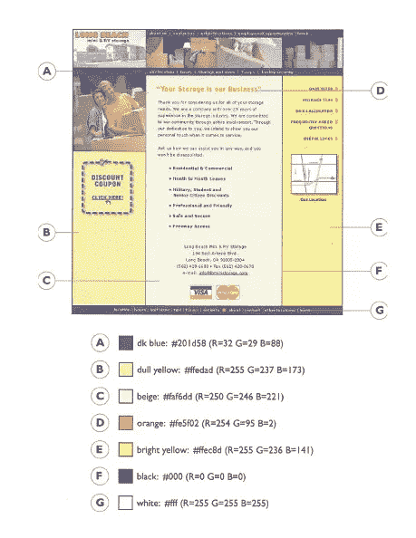
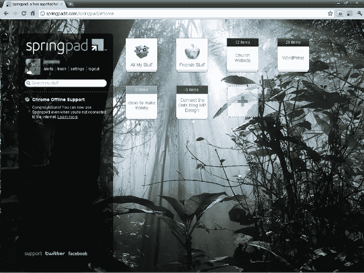
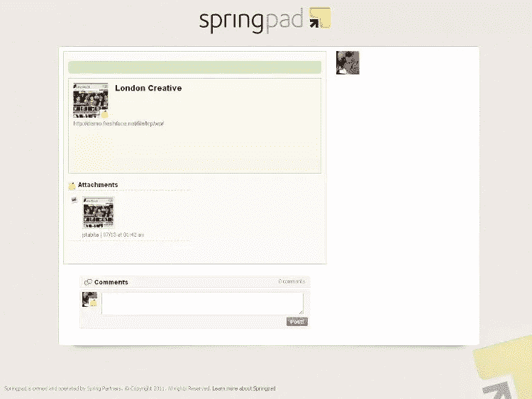
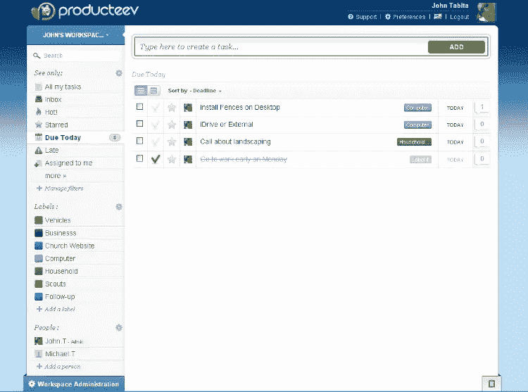

# 自由职业者，管好自己！

> 原文：<https://www.sitepoint.com/freelancer-manage-thyself/>

上周，我给了你一些关于如何控制你的桌面和待办事项清单的建议。本周，我将向您展示一些管理包含多个步骤的任务的方法，这些任务被亲切地称为“项目”

## 任务还是项目？

区分任务和项目是很重要的。任何需要一个以上的步骤来完成的任务都是项目。虽然我完全是在利用技术，但有时普通的笔和纸也能很好地工作。我过去常常把与每项工作相关的每件东西都放在一个三环活页夹里。我指的是每个项目的*，例如:*

*   签署的合同
*   建议书或项目简介
*   客户完成的需求分析问卷
*   重要电子邮件往来的打印输出
*   客户原始文件光盘
*   网站风格指南

每个项目活页夹都放在我的书桌抽屉里，以便快速取用。我发现浏览几页组织有序的页面比点击收件箱里的大量电子邮件来寻找客户三天前发来的一条信息要快得多，这条信息要求我改变背景颜色。

### 什么是风格指南，我为什么需要它？

企业在他们的标志和印刷品中使用某些颜色和字体。为了确保他们的企业形象在整个组织和所有的广告中都是一致的，大公司会制作一个企业形象手册或品牌风格指南，每个人都必须遵守。这样，会计部的梅布尔就不能改变公司徽标的颜色来匹配她为公司野餐传单选择的纸张。

我为我正在设计的每个网站创建了一个类似的文档——不是为了品牌的目的，而是因为我不记得我在侧边栏上用了什么颜色，或者我把标题图像或页面宽度做得有多宽。当我把一个网站从实体模型转换成一个工作网页时，我发现自己打开并重新打开我的 Photoshop 文件，点击一个元素来查找它的属性。为了避免浪费时间，我开始打印客户认可的带有注释的模型，如下所示:

在我工作的时候，身边有这份印刷的风格指南可以大大加快工作速度。

## 使用当今的项目管理工具

那么，我该如何利用当今的技术来管理项目呢？老实说，我可能会坚持用三环活页夹装好的旧印刷页，因为它非常好用。但更有可能的是，我会对一些应用程序进行测试。我一直在用 [Springpad](http://springpadit.com/) 来跟踪一些正在进行的项目。Springpad 在 iOS 和 Android 上都有。没有桌面应用，但他们的网站有同样的内置功能。Springpad 还可以同步到多个设备。

Springpad 允许你创建任意数量的“笔记本”，在这些笔记本中，你可以有单独的笔记、书签或任务。有一个浏览器书签(称为“Clipper”)，允许你添加任何这些内容，而不必去 Springpad 网站或应用程序。

你可以很容易地用 Springpad 的笔记本取代我的三环活页夹系统——每个项目一个。链接到硬盘上相应文件的笔记或任务可以取代打印的页面。我最近有机会在我设计的 WordPress 网站上测试这一点。

我首先用书签标记了一些 WordPress 主题来展示给客户。我通过截图快速模拟了我的三个收藏夹，然后放入它们的徽标和一个合适的标题图像。我把每一个模型都附在了相应的 Springpad 书签上。从我客户的电脑上，我登录到我的 Springpad 账户，打开项目笔记本，给他看我加了书签的每一个设计。当他挑选了他最喜欢的，我打开了附加的样机给他看。

我可以分享每个书签主题作为链接，而不是与客户见面。客户会看到一个网页，链接到主题和我附加的 jpeg 模型:

您还可以用不同的标签来标记项目。我发现这有助于我对需要完成的任务进行分类。例如，我将任务*不能让作者插件工作*标记为“调整”，将*需要视觉页面的副本*标记为“内容”这让我可以按类别过滤我的任务，一次完成一种类型的任务——比如小调整。

## 其他值得一提的

如果不提及其他几个生产力应用程序，那我就失职了。我一直在尝试的一个是 [Producteev](http://www.producteev.com/) ，它允许你创建多个工作区，并向这些工作区添加任务。就像 Springpad 的笔记本一样，每个工作区都可以代表一个特定的项目。

如果你是团队中的一员，Producteev 可以作为一个协作工具。使用 Springpad，任务只能共享，但 Producteev 可以让你将任务分配给不同的团队成员。

上周文章的[评论里提到的一个 app 也值得一提。我还没有尝试过，但是](https://www.sitepoint.com/my-desk-has-exploded/) [Todolist](http://todoist.com/) 允许你创建子项目和子任务——这是 Springpad 和 Producteev 都没有的。

你呢？你有最喜欢的应用程序来帮助你管理项目吗？你有一个工作流程来及时完成它们吗？如果没有，为什么没有？

[*形象功劳*](http://www.flickr.com/photos/hamed/)

## 分享这篇文章