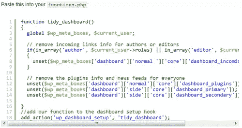
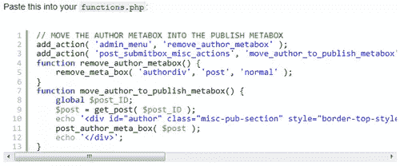
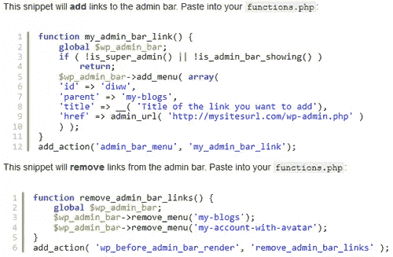
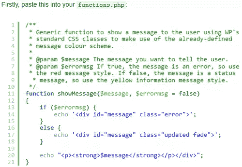
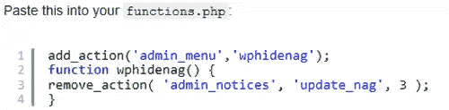
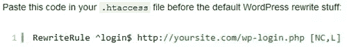
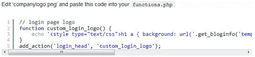
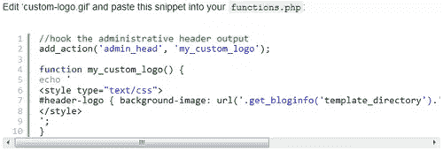

# 让 WordPress 对用户友好的 20 个片段(第二部分)

> 原文：<https://www.sitepoint.com/9-snippets-hacks-wordpress-user-friendly-clients/>

正如我们所承诺的，这里有更多这些令人敬畏的 WordPress 片段，让你的网站对你的客户更友好。相信我，当我说 PHP 也很有趣的时候！尽情享受吧！

相关帖子:

*   

 **## 1.按角色添加、删除和重新排序仪表板小部件

这段代码将为作者和编辑去掉“传入链接”小部件，然后为每个人清理一些其他的框。

[来源](http://erisds.co.uk/wordpress/snippet-wordpress-admin-tidy-dashboard-widgets-by-role)

## 2.移除作者元框/选项并移动到发布元框

这段代码将删除作者元框和筛选选项，然后将这些选项添加到发布元框中。

[来源](http://wordpress.stackexchange.com/questions/1567/best-collection-of-code-for-your-functions-php-file?page=2&tab=votes#tab-top)

## 3.添加或删除新的 WP 管理栏的链接

新的管理栏让你可以快速访问你网站的所有主要区域，比如创建新的帖子或页面，审核评论或修改小部件。下面的片段将允许您添加或删除任何链接。

[来源](http://www.doitwithwp.com/customize-wordpress-admin-bar/)

## 4.在 WP 管理中显示紧急消息

这个代码片段将允许您向任何登录用户显示自定义消息。如果你需要通知一个客户/用户他们做错了什么，这是非常有用的。

[来源](http://www.wprecipes.com/how-to-show-an-urgent-message-in-the-wordpress-admin-area)

## 5.隐藏 WordPress 升级消息

对于那些客户，使用这个片段，你可以隐藏 WordPress 升级消息。

[来源](http://www.wpbeginner.com/wp-tutorials/how-to-hide-the-wordpress-upgrade-message-in-the-dashboard/)

## 6.更简单的登录 URL

登录你的 WordPress powered 网站的默认网址是:http://yoursite.com/wp-login.php.为了让事情更简单，或者至少更容易记住，你需要一个更简洁的网址，比如:http://yoursite.com/login

## 7.更改仪表板页脚文本

这个小片段将帮助你为你的客户建立一个网站，它可以用来定制仪表板页脚文本。

[来源](http://www.wprecipes.com/wordpress-tip-how-to-change-the-dashboard-footer-text)

## 8.更改 WP 登录标志

WordPress 的标志没有任何问题，但是很少有客户会关心他们使用的是什么 CMS。为什么不使用他们的标志或品牌？在本教程中，你将学习如何让这一切发生。

[来源](https://www.sitepoint.com/make-wordpress-easier-for-clients-branding/)

## 9.添加自定义仪表板徽标

定制 WPs 后端的下一步是替换仪表板徽标。您将需要创建一个透明的(。gif 或者。png)30 x 31 px 的图像。然后，将该图像保存在主题的图像文件夹(/WP-content/themes/theme-name/images)中，并随意命名。

[来源](http://www.wpbeginner.com/wp-themes/adding-a-custom-dashboard-logo-in-wordpress-for-branding/)

## 分享这篇文章**