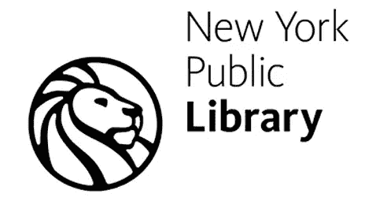

# 真实世界中幸存的标志设计:语境与意义

> 原文：<https://www.sitepoint.com/surviving-logo-design-in-the-real-world-context-and-meaning/>

标志的主要目的是传达一个品牌。如果处理得当，标志应该是该组织的独特代表，也是品牌基础的一个元素。再者，一个 logo 甚至可以呼应一个公司的方向，或者表现一种公司想要表现的性质。

它不仅应该体现上述内容，而且应该是一个单一的、可识别的符号，可以附加崇敬，或者传达核心的信念或意义。说说高调吧！

上述定义呼应了我的平面设计导师多愁善感的理想主义。以上都是事实，但是对于现实世界中的设计师来说，这有多容易呢？

人们可以听到平面设计的“保守派”已经在抱怨了。“哈！桑尼，你有什么希望？现实世界充满了低级设计师制造的低级噪音！”

## 低级噪声

我不敢像一些老派设计师那样反对平面设计教育体系，但是一些设计学校训练他们的设计师非常好，你可以看看他们的作品就知道他们是在哪里训练的！

因此，如果低级噪音如此明显和普遍，那么在郊区努力谋生的普通平面设计师还有什么希望呢？你会有机会为一家大型跨国公司设计标志吗？很可能你不会。更有可能的是，你会为当地的比萨饼店或咖啡馆设计。如果你幸运的话，当地的连锁商店。

设计 logo 的时候，你要明白 logo 需要代表什么(除了别的以外)。在接下来的几周里，我的目标是涵盖几个关键因素，在设计不同的徽标时要牢记在心，以避免增加低级噪音。

## 有背景和意义的设计

你设计的任何标志的一个重要因素和可能的英雄是背景和意义。看看你的客户在其环境中的运作，无论是一个为当地啤酒饮用警察服务的当地比萨饼店，还是另一个已知的机构。知道 logo 针对谁是关键因素。标志必须与目标受众对话。

了解组织/企业所处的环境是成功的关键。这可能意味着你设计的 logo 不像你想的那样简洁明了，而是老套或陈词滥调。不要想你的对开本。

毕竟，奶酪是披萨的重要成分！

对于大多数人来说，标识可能是陌生的，但是对于目标受众来说，它们可以成为独特的、可识别的符号。让我们来看看实际情况。

## 真实世界的例子

纽约公共图书馆在 2009 年更新了他们的标志，虽然这是一个漫长的过程，但他们决定对他们的旧标志进行现代化的重申。

作为一个局外人，戴上一顶设计师的评论帽，我看到这个标志，没有什么能代表一个图书馆。事实上，甚至有几个因素困扰着我。不均匀的黑色笔划、与非洲艺术的潜在联系、狮子王电影、使用狮子的力量象征以及圆形图案都可能混淆信息或阻碍标志的成功。显然，我们不知道选择过程是如何进行的，最终，客户选择了最终的设计。我们只能判断成品 logo。

似乎有很多事情可以做来“改善”标志——放弃圆形装置将是一个开始。然而，最重要的因素——或者说英雄——似乎是成功的标志在当地环境中的含义——标志在上下文中的含义。

我不是纽约人。我没有被带到学校的图书馆远足，即使这样的事情发生。我从未走过大理石狮子雕像。图书馆对我来说太远了，不能成为会员。我不适合图书馆的环境，所以我只能看到断章取义的标志。

说白了，这个标志很可能对一个纽约人有(或发展出)强烈的意义，而不是对另一个州的人，更不用说另一个国家了。

## 衡量成功

保罗·兰德总结道:“不要尝试创新。*试试*好了。”

衡量成功的真正标准不是设计师是否认为它呼应了众多其他标志，而是当地和潜在受众的认可。虽然我确实相信作为设计师，我们应该希望在一个标志中注入更多的东西，但背景和意义是设计师应该考虑的一个主要因素——尤其是在用拇指钉的时候。

图片来自[奥莱克西·伊日霍夫](http://www.shutterstock.com/gallery-705172p1.html) / [摄影记者](http://shutterstock.com)

## 分享这篇文章