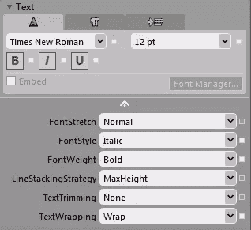
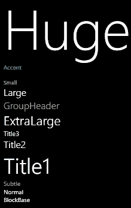
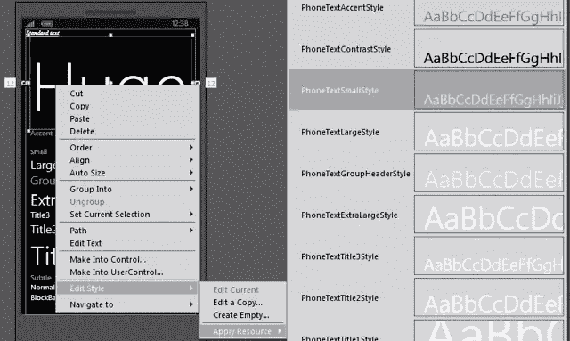
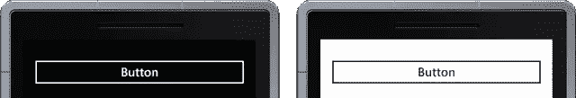
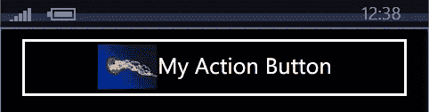
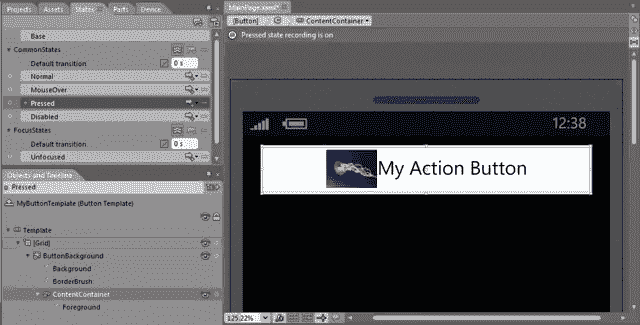

# Windows Phone 控件基础

> 原文：<https://www.sitepoint.com/windows-phone-controls/>

Visual Studio 和 Expression Blend 的结合使得设计和开发 Windows Phone 应用程序变得相对简单。然而，这也使得在不了解标准控件全部功能的情况下使用标准控件变得容易。在本帖中，我们将更详细地了解 SDK 附带的一些 Windows Phone 控件。

### 文本块

让我们从 TextBlock 开始，它用于在 Windows Phone 应用程序中显示文本。下面的 XAML 使用 TextBlock 显示文本“示例文本”。它还指定文本的字体系列和字体大小，并使文本加粗、倾斜和加下划线。最后一个属性 TextWrapping 用于在文本到达 TextBlock 控件的边缘时强制文本换行。

```
<TextBlock Text="Sample text"  FontFamily="Segoe WP Semibold" 
                     FontSize="16" FontWeight="Bold" FontStyle="Italic" 
                     TextDecorations="Underline" TextWrapping="Wrap" />
```

这些属性中的每一个都可以使用 Expression Blend 中的设计者体验来设置，如图 1 所示。


[](https://www.sitepoint.com/wp-content/uploads/2011/08/sp0005_01.png)

图 1

您可以在样式资源中定义这些属性，而不是在整个应用程序中的每个 TextBlock 实例上设置这些属性，使它们看起来相同。例如，下面的代码包含一个样式资源 MyTextBlockStyle，它包含相同的属性，以及引用该样式的两个 TextBlock 控件。

```
<phone:PhoneApplicationPage.Resources>
    <Style x:Key="MyTextBlockStyle" TargetType="TextBlock" >
        <Setter Property="FontFamily" Value="Times New Roman"/>
        <Setter Property="FontSize" Value="16" />
        <Setter Property="FontWeight" Value="Bold"/> 
        <Setter Property="FontStyle" Value="Italic" />
        <Setter Property="TextDecorations" Value="Underline" />
        <Setter Property="TextWrapping" Value="Wrap"/>
    </Style>
</phone:PhoneApplicationPage.Resources>

<TextBlock Text="Sample text" Style="{StaticResource MyTextBlockStyle}" />
<TextBlock Text="Another  text" Style="{StaticResource MyTextBlockStyle}" />
```

Windows Phone 用户界面具有非常独特的风格。微软不遗余力地不仅要确保整个核心平台的一致性，还要让开发人员能够构建一致的应用程序。Windows Phone 附带了许多预定义的样式，您可以在应用程序中使用它们。图 2 展示了可用的 TextBock 样式。


[](https://www.sitepoint.com/wp-content/uploads/2011/08/sp0005_02.png)

图 2

在 Expression Blend 中，对控件应用样式非常简单，只需右键单击控件，选择编辑样式应用资源，然后选择要应用的样式资源。这如图 3 所示，其中选择了 PhoneTextSmallStyle。


[](https://www.sitepoint.com/wp-content/uploads/2011/08/sp0005_031.png)

图 3

TextBlock 可能不太明显的一点是，它可以包含多个文本部分以及换行符。文本的每个部分都可以独立调整，例如，使一个部分加粗，加下划线，甚至改变字体大小或系列。例如，下面的代码包含三段文本，其中有些部分是粗体并带有下划线。

```
<TextBlock TextWrapping="Wrap">
    On the Insert tab, the galleries include items that are designed to coordinate 
    with the <Run FontWeight="Bold">overall look of your document.</Run> 
    <LineBreak />You can easily change the formatting of 
              <Run FontStyle="Italic">selected text</Run> in the document text by choosing a 
              look for the selected text from the Quick Styles gallery on the Home tab. 
    <LineBreak />To change the overall look of your document, choose new 
              Theme elements on the Page Layout tab. To change the 
              <Run TextDecorations="Underline">looks available in the Quick Style gallery</Run>, 
              use the Change Current Quick Style Set command. 
</TextBlock>
```

### 纽扣

当你在 Windows Phone 应用程序的页面中添加一个按钮时，它已经带有一个隐式的样式。这种风格内置了对主题化的支持，如图 4 所示，图中显示了深色主题(左图)和浅色主题(右图)中的一个按钮。


[](https://www.sitepoint.com/wp-content/uploads/2011/08/sp0005_041.png)

图 4

该样式还包括可视状态，这些状态定义了当用户与按钮交互时，按钮外观如何变化。我们在这里超越了自己，让我们向后跳一点，看看我们如何调整按钮中的内容。在大多数情况下，你只是想调整按钮中显示的文本。这只是在按钮的 XAML 中设置内容属性，或者添加文本作为按钮元素的值。下面的代码演示了这两个选项。

```
<Button Content="My Action Button"/>
<Button>My Action Button</Button>
```

有时您可能想要在文本旁边包含一个图像或图标。为此，您必须向按钮的内容添加一个图像控件。内容属性无法做到这一点；相反，您必须添加图像作为按钮的子元素。如果您试图简单地在现有文本旁边添加这个控件，您将会得到一个编译错误。这是因为 Content 属性只能接受单个控件。解决方法是将图像和文本包装到一个内容容器控件中，比如 Grid 或 StackPanel。在这种情况下，我们将使用 StackPanel 来水平堆叠控件。

```
<Button>
    <StackPanel Orientation="Horizontal">
        <Image Source="/Jellyfish.jpg" />
        <TextBlock VerticalAlignment="Center">My Action Button</TextBlock>
    </StackPanel>
</Button>
```

您还会注意到，我们将实际的文本包装在 TextBlock 中——当文本是唯一的元素时，这是不需要的，因为存在从文本到 TextBlock 的隐式转换。我们还将文本垂直居中，使其与图像的中间对齐。结果是一个如图 5 所示的按钮。


[](https://www.sitepoint.com/wp-content/uploads/2011/08/sp0005_05.png)

图 5

好了，现在回到视觉状态。右键单击按钮并选择编辑模板编辑副本，指定新模板的名称，然后单击确定。这将带您进入模板编辑模式。找到“状态”窗口，尝试选择不同的状态。您应该会看到按钮的外观根据您选择的状态而变化。例如，图 6 示出了按压状态。


[](https://www.sitepoint.com/wp-content/uploads/2011/08/sp0005_061.png)

图 6

您会注意到，当您选择了任何可视状态时，设计图面周围会出现一个红色边框。这是一个警告，让您知道您正处于状态记录模式，您所做的任何更改都只会影响该状态的外观。要退出状态记录，请在状态窗口中选择基本状态。

选择按下状态后，从“对象和时间轴”窗口中选择 ContentContainer 节点。在“属性”窗口中，找到“转换”部分中的“缩放”选项卡。将 X 和 Y 比例因子都调整为 0.6。您应该会看到按钮的内容在设计图面中收缩，反映出它们在运行时的外观。现在运行应用程序，您会看到当您单击按钮时，内容会收缩，就像在状态记录模式下一样。

在这篇文章中，你看到了 TextBlock 和 Button 控件的几个方面，应该可以帮助你构建更好的 Windows Phone 应用程序。调整按钮控件的视觉状态只是混合表达能力的一个例子。请继续关注更多关于充分利用 Windows Phone 控件的提示。

## 分享这篇文章