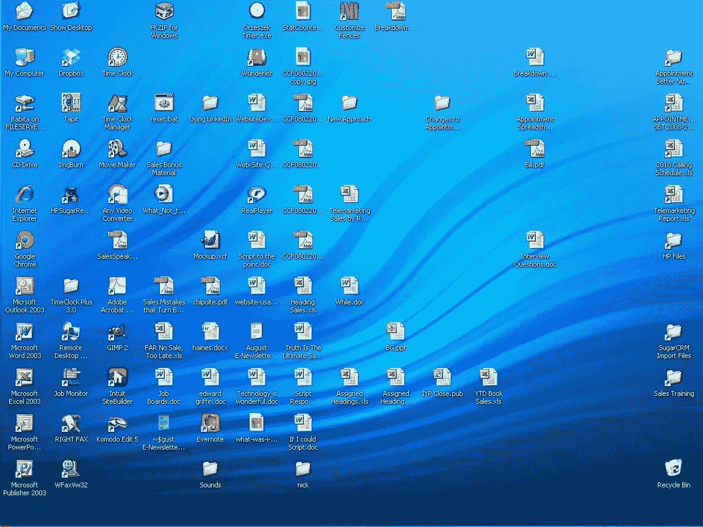
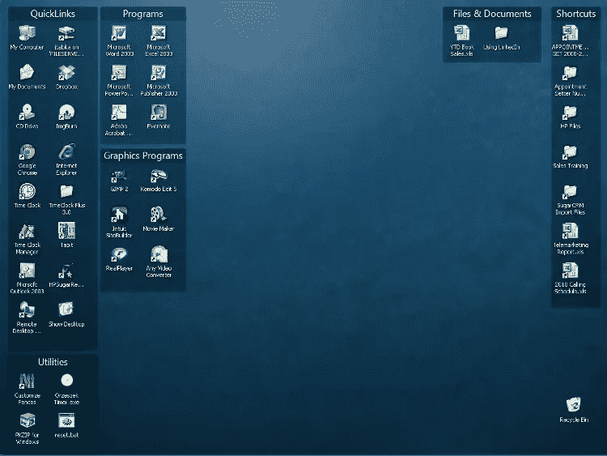
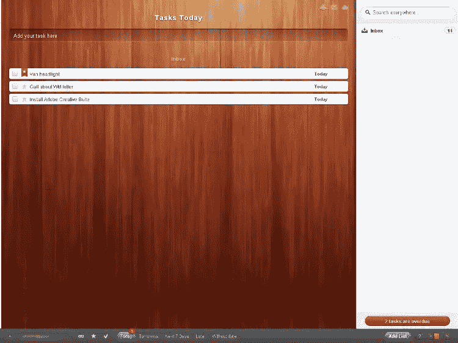

# 救命啊！我的桌子爆炸了:组织灾难

> 原文：<https://www.sitepoint.com/my-desk-has-exploded/>

当我看着我的桌子变得凌乱不堪时，我想起了我在美国电话电报公司工作时，我的桌子是多么的井井有条——井井有条，以至于不止一个销售经理对此发表了评论。今天我坐在这里想知道…到底发生了什么？

我也想知道为什么我家里的桌子从来不像我在 T2 工作的地方。然后我意识到(事实上，就在我写这篇文章的前几分钟),在 AT & T，我只有一个任务要完成——销售——围绕这个唯一的目的来组织我的桌子是很容易的。

但是我居住过的每一个其他的工作空间都包含了多项任务和项目。就在上周，我正在准备一份电子表格并分配区域。我也在为我的老板做一个小的副业项目。在下一次培训课之前，我正在修改我们的销售手册。明白了吗？这些项目中的每一个都成了我办公桌上的一层文件。(我有没有提到我真的不擅长整理东西？)

因为我的使命是变得更有条理和更有效率，所以我考虑把这篇文章叫做“完全掌控自己生活的 10 个步骤”但是说实话，我应该去读这样的文章，而不是去写它们。当我写[防弹网页设计合同](https://www.sitepoint.com/bulletproof-web-design-contract/ "Bulletproof Web Design Contracts")的时候，我不得不加上一个免责声明，说我不是律师，所以我警告过你…

> 声明:我不是，从来不是，也可能永远不会是个人生产力蔻驰或时间管理顾问；本文也不是要取代专业帮助。不要在家里尝试这个(其实你*可以*在家里尝试这个)。咨询合格的专业人员。

## 将“要做的事”变成“要做的事”

我的组织问题的一部分是在想，“我会把这一堆文件放在这里，提醒我完成这个项目”…当把文件归档并列出‘待办事项’清单会更有效。我听说某些性格类型的人非常喜欢把事情从他们的“待办事项清单”上划掉。不幸的是，我不是那种性格的人。

我不是不列清单。只是我忘了看清单——尤其是当它被埋在我桌子上的杂物下面的时候。(我很确定‘干净的桌子’是我清单上的一项。)我的另一个败笔是，尽管我会在记事本上写任务，但我会忘记带着它，所以我最终会在便利贴上草草写下任务，回家后还没来得及写在记事本上就把笔记放错了地方。

让我们面对现实吧。我们都有不喜欢做的任务。我真的不需要把“写下周的 SitePoint 文章”列在我的任务清单上，因为这是我喜欢做的事情。但是，改变货车的前大灯可能会被忽视(特别是如果我正忙于下周的文章)。一旦我们创业或开始自由职业，我们一生中养成的坏习惯不会神奇地消失。作为一名自由职业的网页设计师，有我喜欢的东西，也有我绝对讨厌的东西——比如支付账单。不幸的是，忘记付账会给你带来麻烦。所以我开始思考，如何利用科技让处理我的待办事项清单变得更愉快？因为我自认是一个应用程序上瘾者(僵尸探测器到底做了什么，我为什么要下载它？)我觉得在我的 iPad 上更新我的待办事项清单会比纸和笔有趣得多。但首先，我有另一个问题要解决。

## 竖起一些栅栏

我不知道你，但是我有把文件保存到我的桌面的习惯，打算把它们归档到一个合适的文件夹，但是不知何故我从来没有这样做。你可以想象一下过一段时间我的桌面是什么样子。

我碰巧发现了一个非常光滑的程序，叫做 [Fences](http://download.cnet.com/Fences/3000-2072_4-10909535.html) ，它将你所有的图标组织到这些看起来很酷的半透明容器中，你可以根据自己的喜好对它们进行标记和排列。几分钟内，我从完全混乱的桌面…

…对整个组织而言:

现在，如果我能找到一个能对我的物理桌面做同样事情的程序…

接下来，我需要一个任务管理应用程序，它可以同步到多种设备，即我的工作电脑、iPad 和笔记本电脑。问题不在于*找到了*这样一款应用；问题是*在众多免费和高级的可用软件中选择一个*。我最终选定了[神童列表](http://www.6wunderkinder.com/wunderlist/)，我喜欢它的简单和易用。(它的价格是免费的。Wunderlist 在桌面和移动应用中都有，但我发现桌面应用有点多余，因为我可以直接在他们的网站上做同样的事情。

爱因斯坦曾经说过，一切都应该尽可能简单，而不是更简单——一位哲学神童似乎已经接受了他们的设计:

菜单栏让你在不同的视图中看到你的列表(今天，明天，全部，等等)。)并且侧边栏会提醒您过期的任务。您还可以设置电子邮件提醒。哦，我说过这是无广告的吗？

现在我没有借口找不到我的“待办事项”清单了。我是对的——我不再忘记每天检查清单，而且我发现我实际上*做*喜欢在每个完成的项目旁边打上勾号…

下周，我将谈论管理项目而不仅仅是任务。

*[形象功劳](http://www.flickr.com/photos/alismith44/)*

## 分享这篇文章