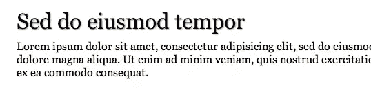
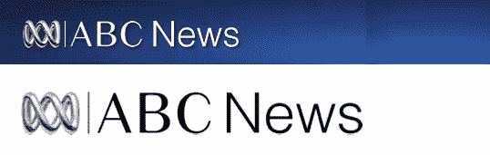
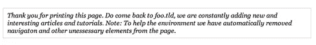

# 访问者打印时–关于打印样式表

> 原文：<https://www.sitepoint.com/when-visitors-print-about-that-print-stylesheet/>

给自己拿一杯饮料，点击打印，阅读那些当访问者打印时会产生巨大影响的简单事情。但这不全是关于纸张的，受 Safari Reader 的启发，我们看看曾经令人恐惧的打印预览的现代版本。

这是不是很有趣，不管你为客户设计一个新网站付出了多少努力，他们的第一直觉就是把它打印出来！接下来，那些不愿意花时间欣赏你花在设计上的时间，而是去打印内容并在其他地方欣赏的访问者。

你说得对，这太戏剧化了，不是每个人都来到你的网站并点击打印按钮，但当他们真的覆盖了你的网站时？

# 访客为什么要打印？

在我们继续之前，让我们看看为什么有人可能会在今天的世界打印您的网站。让我们以我自己为例。我是澳大利亚最大的开源 ECMS 供应商的顾问。我每天一整天都在阅读、研究、试验和谈论网络。大部分时间，我都是在屏幕前或我拥有的几个科技产品上度过的。那我为什么要打印呢？

*   我可以随心所欲地在纸上涂鸦。
*   我可以从我的书桌上逃到阳光明媚的阳台上，呼吸新鲜空气，手里拿着一本好书。
*   我能够在纸上比在屏幕上更容易地发现内容问题(我审查了很多内容)
*   你可以说我浪费，但是在电脑上呆了一整天后，纸的感觉和新印刷的墨水的味道是不可抗拒的。
*   我经常给同事和客户发报告、文章等等。
*   我打印大量的文章，在上下班的电车/火车上阅读。

当然，我是一个特例，但是访问者，就像我一样，经常把网站上的内容打印成纸和 PDF。谷歌文档等应用程序中的评论、地图/方向、电子表格、Basecamp 等应用程序中的待办事项列表、电子商务交易确认屏幕等都位于列表的顶部。

请继续阅读，逐步完成快速打印样式表的创建，这将使访问者在走向打印机时更加开心。为了与众不同，我们还将从 Safari Reader 中获得灵感，看看现代印刷预览。

# 快速创建打印样式表

## 改过自新

我发现创建打印样式表的最佳方法是从头开始，将所有屏幕样式与打印样式分开，如下所示:

```
<link rel="stylesheet" href="css/screen.css" type="text/css" media="screen" />
<link rel="stylesheet" href="css/print.css" type="text/css" media="print" />
```

–一个屏幕文件和一个打印文件

注意:如果您决定通过在上面的屏幕样式表链接元素上使用 media="all "来将屏幕样式继承到打印样式表中，请确保覆盖任何背景图像替换并取消任何绝对定位。这是因为许多浏览器禁用了所有背景属性(图像和颜色),并且遇到了元素定位的问题。

## 清除杂物，保护环境

当访问者打印网页时，他们是为了内容。帮他们和环境一个忙，去掉任何不会被阅读的元素:导航、照片库、转盘控件、社交媒体链接、搜索表单、小工具等等都变成一张纸上的杂物。

把所有不相关的东西都记在纸上，轻轻一扫就能删除:

```
``/* -- Hide screen specific elements -- */
nav,
footer .footer-links,
feature a.prev,
feature a.next {
display: none;
}``
```

## 让阅读成为一种乐趣

人们经常提到，虽然无衬线字体很适合在屏幕上阅读，但打印时更好的选择是衬线字体。不一定要用 Times New Roman，也可以用更多的 Times New Roman，这里有一个例子，它使用了简单的间距、乔治亚和一些 CSS3 风格来增加页面的趣味:

```
``/* -- Typography -- */
body {
    background: #FFF;
    color: #000;
    font-family: Georgia, serif;
    line-height: 1.2;
}</p>

p, table, ul, ol, dl, blockquote, pre, code, form {
    margin: 0 0 1em;
}

    h1,h2,h3,h4,h5 {
    font-weight: normal;
    margin: 2em 0 0.5em;
    text-shadow: rgba(0, 0, 0, 0.44) 1px 1px 2px;
}

h1 { font-size: 2em; margin: 2em 0 0.25em; }
h2 { font-size:1.7em; }
h3 { font-size:1.5em; }
h4 { font-size:1.2em; }
h5 { font-size:1em; }``
```

[](https://www.sitepoint.com/wp-content/uploads/2011/08/serif-example.png)

上面的代码在起作用

## 品牌宣传

如果你想在你的网站上增加一点商标，为什么不引入一个友好的印刷版本呢？这里的关键是要记住，今天所有的浏览器都会去掉背景图片，这意味着不能使用图片替换。

ABC 新闻(澳大利亚广播管理局新闻)有一个很好的例子，他们包括了一个印刷版本的徽标，当有人印刷时，就可以拿起它:

等待合适时机的 ABC 徽标的打印版:

```
<a href="/news/" id="news-logo">
    
    
</a>
```

隐藏打印友好标志的 ABC 屏幕样式表摘录:

```
.print {
    position: absolute;
    top: -32768px;
    left: -32768px;
}
```

[](https://www.sitepoint.com/wp-content/uploads/2011/08/abc-news-logos.jpg)

ABC 新闻徽标(abc.net.au/news)的屏幕版本和印刷版本分别见上图和下图

或者，你可以一直保持简单，让你的页眉稍微大一点，加粗一点，就像这样:

```
#header strong {
    color: #000;
    display: block;
    font-weight: normal;
    font-size: 3em;
    margin: 0 0 1em;
    padding: 0;
    text-shadow: rgba(0, 0, 0, 0.44) 1px 1px 2px;
}
```

保持标题简单，带有一点天赋

## 你不能点击一张纸

在某些时候，你可能会发现自己在阅读一篇印刷的文章，当你看到一个引人入胜的部分，其中包含了更多信息的链接。一个带蓝色下划线的链接在那里戏弄你。如果没有鼠标或苹果最新的界面，你就没有机会找到链接，除非你回到屏幕上的原始文章。

不可点击链接的解决方案很容易部署。使用一些 CSS 打印出链接的位置，否则链接会被隐藏:

```
<p>``#content a:link:after,</p>

content a:visited:after {

  content: " (" attr(href) ") ";
  font-size: 80%;
  text-decoration: none;
}``
```

一种解决不可点击链接的方法，由 Eric Meyer 在 2002 年首次提出，至今仍然很流行。
注意，上面的 CSS 限制了内容中的所有链接。所以像徽标周围的链接这样的东西不会显示出来。

## 把这些访问者带回你的网站

[](https://www.sitepoint.com/wp-content/uploads/2011/08/print-message.png)

仅在印刷品上显示的消息示例

当你瞄准屏幕上的访问者时，鼓励他们点击其他页面或通过 RSS、电子邮件或时事通讯订阅是非常简单的。但是那些打印的人呢？只需一点额外的 CSS 就可以很容易地添加有用的信息，这也是帮助他们回到网站的机会。

```
#content:before {
    content: "Thank you for printing this page. Do come back to foo.tld, we are constantly adding new and interesting articles and tutorials. Note: To help the environment we have automatically removed navigation and other unnecessary elements from the page.";
    display: block;
    border: 1px solid #ccc;
    font-style: italic;
    margin: 0 0 1em;
    padding: 8px 10px;
}
```

–上面的 CSS 在页面顶部打印一条消息，带有边框和一些填充。这个消息可以根据网站的受众更改为任何合适的内容。

注意:上面的 CSS 还添加了一个注释来提醒访问者和客户，你已经删除了不必要的混乱，如导航，有助于减少从屏幕到纸张的过渡中的混乱。

## 容纳互动元素

那么，那些进入照片库和标签页等内容的花哨的 JavaScript 驱动元素呢？这些元素通常添加内联样式来循环显示内容，这可能是一个简单的

```
display: none;
```

隐藏未显示内容的声明。

本文前面提到的在屏幕和打印之间划分样式的部分好处是，征服这些元素可以归结为识别 JS 控制交互/动画元素添加了什么内联 CSS。

让我们以一个图片库为例。前往 jQuery Tools 站点观看他们的可滚动图库的演示。如果你打开 Firebug 或者你最喜欢的同类软件，把目标指向包含照片的元素，你会看到 jQuery Tools 滚动插件正在添加一个内联的“left”声明，它可以左右推拉图库。

```
``<div class="scrollable"> <br />
   <!-- root element for the items -->

<div class="items">
      <!-- 1-5 -->
      <div>
         
         Y
      </div>
      <!-- 5-10 -->
      <div>
         
         Y
      </div>
      <!-- 10-15 -->
      <div>
         
         Y
      </div>
   </div>

</div>``
```

现在为了以合适的方式打印它，让我们从一个声明开始，声明中有一个重要的语句覆盖了这种内联样式:

```
.scrollable .items {
    left: auto !important;
}
```

有了这个，照片就会一张一张地打印出来。让我们通过将它们并排浮动来将它们带回到更多的照片库布局中:

```
.scrollable .items {
    left: auto !important;
    overflow: hidden;
}
```

```
.scrollable .items div {
    float: left;
    margin: 0 10px 0 0;
}
```

# 带样式的打印预览

自从我第一次看到 [Safari 的阅读器](http://www.webmonkey.com/2010/06/safari-5s-reader-simplifies-the-web/)以来，我一直想知道如果访问者点击一个打印链接，看到一张 A4 纸在屏幕上滑动，包括他们将要打印的预览，那会是什么样子。然后我开始思考 jQuery 插件的优点，这种插件很容易在任何有打印样式表的网站上推出。在访问者打印之前向他们展示他们将要打印的内容，而不需要网站的“打印版本”。

所以我就是这么写的。引入了一个名为[打印预览](https://github.com/etimbo/jquery-print-preview-plugin)的 jQuery 插件，它完全按照罐头上所说的做，并带有一个[演示](http://etimbo.github.com/jquery-print-preview-plugin/example/index.html)来启动。
点击右上角的打印预览按钮，或者点击键盘上的“P”键获得额外奖励。

### 分三步进行设置:

1.  设置打印样式表
2.  包括 jQuery 插件和一点 CSS(打包)来设计滑动灯箱/模态窗口。
3.  添加打印预览链接并初始化插件

要获得完整的使用说明，请前往 jQuery 打印预览插件 Github 页面。

### 你还在等什么？

这就是生成一个健壮的打印样式表所需的全部内容，它将为打印页面的任何人带来可读性和内容焦点。如果你是那种愿意付出更多努力的人，这里有一些更进一步的想法:

*   样式附加元素，如表格。要获得一些想法，请阅读 Jonathan Snook 在 Sitepoint 上发表的题为[关于 CSS 的恐怖故事](https://www.sitepoint.com/article/terrific-tables-css)的文章。
*   如果将打印样式表应用到带有注释的站点，为什么不看看“分页之前:总是；将所有评论推至新页面–为访问者提供打印时删除最后页面的选项
*   通过覆盖任何 JS 驱动的样式(如不透明度)来适应 JS。参见上面的演示，了解一些想法。

这篇文章中的所有观点都可以在这个演示中看到。

你还对打印样式表做了什么？你见过人们从网上打印出哪些疯狂的东西？你认为在纸上涂鸦的艺术在未来几年将会失传吗？

## 分享这篇文章