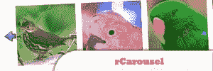
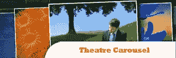
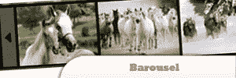
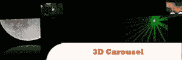
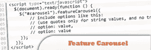

# 10 个令人惊叹的 jQuery Carousel 插件

> 原文：<https://www.sitepoint.com/10-amazing-jquery-carousel-plugins/>

10 个令人惊叹的 jQuery Carousel 插件来满足你的胃口，让你的网站看起来令人兴奋！旋转木马基本上是一个持续旋转的媒体展示。例如，以一定时间间隔显示的图像，以便每个图像都在前面。玩得开心！

## 1.rCarousel

连续的 jQueryUI 旋转木马。

## 2.剧院旋转木马

惊人的旋转木马。你可以把它放在你的页面上，在这个教程中学习如何做。

[来源](http://www.webdevelopers.eu/jquery/theatre/demo)

## 3.巴罗塞尔

一个 jQuery 插件，可以很容易地生成简单的传送带，每张幻灯片由一张图片+任何类型的相关内容定义。

[来源](http://labs.juliendecaudin.com/barousel/)

## 4.三维旋转木马

从一系列图像中创建了一个 3D 旋转木马，带有倒影并根据鼠标位置制作动画。

[来源](http://interface.eyecon.ro/docs/carousel)

## 5.液体转盘插件

一个用于液体设计的 jQuery 插件。每次调整转盘容器的大小时，列表中的项目数都会改变以适应新的宽度。

[来源](http://www.nikolakis.net/liquidcarousel/)

## 6.卡罗弗瑞德塞尔

一个将任何类型的 HTML 元素变成旋转木马的插件。它可以同时滚动一个或多个项目，水平或垂直，无限和循环，自动或通过用户交互。

[来源](http://caroufredsel.frebsite.nl/)

## k3dcarousel 第七代

在本教程中了解如何操作。

[来源](http://verens.com/2010/10/07/jquery-k3dcarousel-plugin/)

## 8.jQuery 特性转盘

这个插件本来是用来在网站的主页上显示专题故事的，但是它可以用于任何目的，并且是高度可定制的。它将总是同时显示三个图像，其余的都隐藏在中间的图像后面。

[来源](http://www.bkosborne.com/jquery-feature-carousel)

## 9.伊卡洛斯尔

一个开源(免费)的 javascript 工具，用于创建类似圆盘传送带的小部件..

[来源](http://zendold.lojcomm.com.br/icarousel/)

## 10.比利:一个优雅的旋转木马插件

开箱即用，billy 是一个基本的滚动转盘，可以非常容易地实现。一个对 html 或 javascript 知之甚少的人可以让 billy 在几分钟内完成一个页面。

[来源](http://plugins.jquery.com/project/billy)

## 分享这篇文章