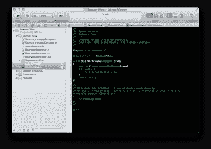
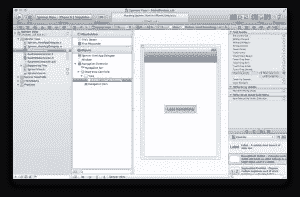
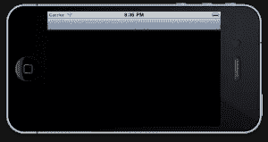
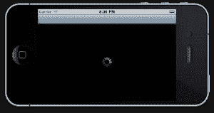
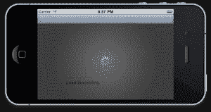

# iOS 的通用加载视图

> 原文：<https://www.sitepoint.com/all-purpose-loading-view-for-ios/>

加载屏幕是数字生活的必需品。

当你开始一个你的应用程序必须等待响应的过程时，给用户提供反馈是很重要的。如果用户按下一个按钮，让他们知道他们所采取的行动已经被执行是很重要的。

今天我将向你展示如何制作一个可重复使用的加载屏幕，带有一个活动指示器(这是其中一个旋转器)和一个渐变背景。

这就是它的样子！

<iframe height="480" width="640">
 
<a href="https://vimeo.com/28181568"> iOS 加载微调器</a>从<a href="https://vimeo.com/buildmobile"> BuildMobile </a>到<a href="http://vimeo.com"> Vimeo </a>上。
 
开始之前，有一些先决条件。你需要了解一些关于 iOS 开发的知识，比如窗口、视图和控制器的层次结构是如何组合在一起的。我们有一些优秀的教程，如果你还不太熟悉，可以帮助你快速掌握。查看 iOS 编程系列的<a href="https://www.sitepoint.com/mobile/ios/">介绍。</a>
 
还要注意我用的是 Xcode 4.1。如果你在不同的版本上，有些东西可能看起来有点不同，但是因为我们正在做一些非常基本的东西，所以应该不会太离谱！
 <h1>一步步来。让我们从一个项目开始</h1> 
我要开始一个新项目，但是你可能已经有了一个计划使用它的项目，所以这一步对你来说可能是多余的。这只是一个简单的基于导航的项目，使用所有的 Xcode 默认设置。
 
真正的第一步是为我们的 spinner 视图创建一个新类。这将需要子类 UIView，所以 cmd + N，选择'目标-C 类'并点击下一步。确保它是 UIView 的子类，然后再次点击 Next。最后，选择一个名称来保存您的类，我将把我的命名为 SpinnerView。
 
您现在应该有一个看起来有点像这样的项目(除非您正在使用一个现有的项目，在这种情况下，它很可能看起来不像这样)。
 

 
使用微调视图应该是一个简单的任务。这里的目标是能够在一行代码中加载一个微调视图。因此，我们要做的第一件事是创建一个方法，该方法接受一个 UIView，并分配一个 SpinnerView 类的新实例，然后将其自身添加为子视图。
 
转到 SpinnerView 头文件，在@end 之前插入一个方法定义
 <pre class="language-"><code class="language-">+(SpinnerView *)loadSpinnerIntoView:(UIView *)superView;</code></pre> 
 
 
接下来，我们需要定义实际的方法。这个方法将负责创建一个包含内容的视图，并将其放入传递的 superView 中。
 <pre class="language-"><code class="language-">+(SpinnerView *)loadSpinnerIntoView:(UIView *)superView{ // Create a new view with the same frame size as the superView SpinnerView *spinnerView = [[[SpinnerView alloc] initWithFrame:superView.bounds] autorelease]; // If something's gone wrong, abort! if(!spinnerView){ return nil; } // Just to show we've done something, let's make the background black spinnerView.backgroundColor = [UIColor blackColor]; // Add the spinner view to the superView. Boom. [superView addSubview:spinnerView]; return spinnerView; }</code></pre> 
 
 
这段代码将创建一个非常基本的黑色背景视图，并将其插入到提供的主视图中。
 
我们已经有了足够的代码，可以测试我们是否在运行，所以现在我们需要设置一些代码来实际使用它！
 
转到您的根视图控制器，定义一个新的 IBAction 方法，当我们按下一个按钮时调用这个方法。
 <pre class="language-"><code class="language-">// In the RootViewController header definition -(IBAction)didPressSpinnerButton:(id)sender; // In the RootViewController class file, don't forget to #import "SpinnerView.h" -(IBAction)didPressSpinnerButton:(id)sender{ // Load a new spinnerView into the current view [SpinnerView loadSpinnerIntoView:self.view]; }</code></pre> 
 
 
因此，我们创建了一个方法，当调用该方法时，它会将新的 spinnerView 加载到控制器的视图中。接下来，我们将在 xib 中添加一个按钮，并连接它来调用我们创建的 IBAction。
 
打开 MainWindow.xib(如果你使用自己的项目，也可以打开任何一个 xib)。从对象检查器中，在“根视图控制器”下拖放一个新视图，然后在新创建的视图中拖放一个圆形矩形按钮。在你的按钮上贴一个标签，这样你就知道它会做什么。我的描述性标签是“加载一些东西”。最后选择按钮，在连接检查器(opt + cmd + 6 切换)中，从“Touch Up Inside”旁边的圆圈拖动到左侧的“根视图控制器”上。当您放开时，您应该能够选择您创建的 IBAction。一旦你完成了，它应该看起来像这样，现在你应该已经把按钮连接到方法上了。
 

 
考验的时候到了！
 

 
好吧。我们已经证明了我们可以将一个视图添加到另一个视图中。了不起。现在，让我们确保完成后可以删除它！
 
在 SpinnerView 类中定义一个新方法 removeSpinner。
 <pre class="language-"><code class="language-">// .h file -(void)removeSpinner; // .m file -(void)removeSpinner{ // Take me the hells out of the superView! [super removeFromSuperview]; }</code></pre> 
 
 
removeSpinner 非常简单。它只是将视图从超级视图中移除。简单。
 
我们可以通过在 didPressSpinnerButton 方法中添加一个计时器来看到这一点。我们还需要将微调器放入一个变量中来完成这项工作。这是我们更新的 didPressSpinnerButton 方法。
 <pre class="language-"><code class="language-">-(IBAction)didPressSpinnerButton:(id)sender{ SpinnerView * spinner = [SpinnerView loadSpinnerIntoView:self.view]; [NSTimer scheduledTimerWithTimeInterval:2.0 target:spinner selector:@selector(removeSpinner) userInfo:nil repeats:NO]; }</code></pre> 
 
 
现在构建应用程序并按下按钮将导致黑色视图被插入，然后在 2 秒钟后再次移除。
 <h1>基金会。检查！</h1> 
我们已经完成了 spinner 视图类的基础。剩下的只是糖衣。我说的糖衣是指用户界面和设计。
 
我要做的第一件事是在视图中添加一个活动指示器，这样很明显这是一个加载页面，并让用户知道这是一个临时解决方案，他们应该期待很快会发生一些事情。
 
在我们的 loadSpinnerIntoView 方法中，在 SpinnerView.m 文件中，我们将创建并插入活动指示器。
 <pre class="language-"><code class="language-">if(!spinnerView){ return nil; } // This is the new stuff here ;) UIActivityIndicatorView *indicator = [[[UIActivityIndicatorView alloc] initWithActivityIndicatorStyle: UIActivityIndicatorViewStyleWhiteLarge] autorelease]; // Set the resizing mask so it's not stretched indicator.autoresizingMask = UIViewAutoresizingFlexibleTopMargin | UIViewAutoresizingFlexibleRightMargin | UIViewAutoresizingFlexibleBottomMargin | UIViewAutoresizingFlexibleLeftMargin; // Place it in the middle of the view indicator.center = superView.center; // Add it into the spinnerView [spinnerView addSubview:indicator]; // Start it spinning! Don't miss this step [indicator startAnimating];</code></pre> 
建造它，看看它看起来怎么样。希望它看起来有点(完全)像这样。
 

 <h1>你知道我们需要什么吗？渐变！</h1> 
该是我们对那个可怕的黑色背景做些什么的时候了。该是我们径向梯度的时候了。我打赌你期待我说“打开 photoshop…”但是我没有。我们要用代码写梯度，有两个原因。首先，我们不必担心创建两个图像(一个用于旧手机，另一个用于 iPhone 4 retina 显示屏)——这将是一个痛苦的更新！其次，如果我们在代码中这样做，那么我们不会给我们的应用程序增加任何文件大小。保持苗条的人。这是应用程序的 BuildMobile 健身房。
 <h1>那么…我该怎么做呢？</h1> 
梯度嗯？我敢打赌，iOS sdk 有一个漂亮的简单 API 来为我们创建渐变。正确！但也是不正确的。
 
iOS SDK 有一个有用的方法来创建线性渐变，使用<a href="http://developer.apple.com/library/ios/#documentation/GraphicsImaging/Reference/CAGradientLayer_class/Reference/Reference.html" target="_blank"> CAGradientLayer </a>，但它没有提供一个快速简单的方法来生成径向渐变，这正是我们想要的。要做到这一点，我们必须更深入一点，开始使用核心图形框架。
 
我们实际上要做的是定义一个返回 UIImage 对象的方法，一个我们要用代码从头开始创建的对象！代码很棒。
 
代码看起来有点吓人，所以查看注释会有意义。或者只是复制粘贴它，然后忘记它。
 <pre class="language-"><code class="language-">- (UIImage *)addBackground{ // Create an image context (think of this as a canvas for our masterpiece) the same size as the view UIGraphicsBeginImageContextWithOptions(self.bounds.size, YES, 1); // Our gradient only has two locations - start and finish. More complex gradients might have more colours size_t num_locations = 2; // The location of the colors is at the start and end CGFloat locations[2] = { 0.0, 1.0 }; // These are the colors! That's two RBGA values CGFloat components[8] = { 0.4,0.4,0.4, 0.8, 0.1,0.1,0.1, 0.5 }; // Create a color space CGColorSpaceRef myColorspace = CGColorSpaceCreateDeviceRGB(); // Create a gradient with the values we've set up CGGradientRef myGradient = CGGradientCreateWithColorComponents (myColorspace, components, locations, num_locations); // Set the radius to a nice size, 80% of the width. You can adjust this float myRadius = (self.bounds.size.width*.8)/2; // Now we draw the gradient into the context. Think painting onto the canvas CGContextDrawRadialGradient (UIGraphicsGetCurrentContext(), myGradient, self.center, 0, self.center, myRadius, kCGGradientDrawsAfterEndLocation); // Rip the 'canvas' into a UIImage object UIImage *image = UIGraphicsGetImageFromCurrentImageContext(); // And release memory CGColorSpaceRelease(myColorspace); CGGradientRelease(myGradient); UIGraphicsEndImageContext(); // … obvious. return image; }</code></pre> 
 
 
还和我在一起吗？没有吗？该死的。
 
主要要注意的是 CGFloat 组件，它定义了渐变的颜色，以及浮动 myRadius，它允许你调整渐变的大小。
 
如果您在标题中添加了该方法及其适当的方法定义，我们现在就可以从 loadSpinnerIntoView 方法中调用它，并在背景中弹出它，而不是普通的黑色背景。
 
删除使背景变黑的线条
 <pre class="language-"><code class="language-">spinnerView.backgroundColor = [UIColor blackColor];</code></pre> 
 
 
并在之前的<em>中添加该活动指示器代码(否则它将在活动指示器上方。不太好。</em>
 <pre class="language-"><code class="language-">// Create a new image view, from the image made by our gradient method UIImageView *background = [[UIImageView alloc] initWithImage:[spinnerView addBackground]]; // Make a little bit of the superView show through background.alpha = 0.7; [spinnerView addSubview:background];</code></pre> 
现在，如果你建立你的应用程序，你应该看到一个非常漂亮的旋转器！
 

 
这就是所有的努力。唯一剩下的就是在顶部加入樱桃；淡入淡出微调器视图。这非常简单——除了你必须在 QuartzCore 框架中添加。
 
对于那些已经忘记添加框架步骤的人来说:进入项目设置，选择目标(在我的例子中是“Spinner View”)-&gt;构建阶段-&gt;链接二进制文件和库，点击加号并找到 QuartzCore.framework。
 
确保您正在导入，然后在从 loadSpinnerIntoView 方法返回之前添加它。
 <pre class="language-"><code class="language-">// Create a new animation CATransition *animation = [CATransition animation]; // Set the type to a nice wee fade [animation setType:kCATransitionFade]; // Add it to the superView [[superView layer] addAnimation:animation forKey:@"layerAnimation"];</code></pre> 
 
 
在 removeSpinner 函数中，代码几乎相同。
 <pre class="language-"><code class="language-">// Add this in at the top of the method. If you place it after you've remove the view from the superView it won't work! CATransition *animation = [CATransition animation]; [animation setType:kCATransitionFade]; [[[self superview] layer] addAnimation:animation forKey:@"layerAnimation"];</code></pre> 
 
 
祝贺你，你现在已经有了一个旋转视图，淡入，看起来不错，淡出。它可以反复使用，并根据它所在视图的大小调整大小。
 
薄荷。
 
<aside class="flex space-x-4"><h2 class="text-lg my-2 mr-2">分享这篇文章</h2><button aria-label="Share Sitepoint on facebook" data-network="facebook" class="social-share-button mr-2 cursor-pointer transform transition duration-200 hover:scale-125 text-primary-700"><svg aria-hidden="true" focusable="false" data-prefix="fab" data-icon="facebook-square" class="svg-inline--fa fa-facebook-square fa-w-14 fa-lg share-icon" role="img" viewbox="0 0 448 512"><path fill="currentColor" d="M400 32H48A48 48 0 0 0 0 80v352a48 48 0 0 0 48 48h137.25V327.69h-63V256h63v-54.64c0-62.15 37-96.48 93.67-96.48 27.14 0 55.52 4.84 55.52 4.84v61h-31.27c-30.81 0-40.42 19.12-40.42 38.73V256h68.78l-11 71.69h-57.78V480H400a48 48 0 0 0 48-48V80a48 48 0 0 0-48-48z"/></svg></button><button aria-label="Share Sitepoint on reddit" data-network="reddit" class="social-share-button mr-2 cursor-pointer transform transition duration-200 hover:scale-125 text-primary-700"><svg aria-hidden="true" focusable="false" data-prefix="fab" data-icon="reddit" class="svg-inline--fa fa-reddit fa-w-16 fa-lg share-icon" role="img" viewbox="0 0 512 512"><path fill="currentColor" d="M201.5 305.5c-13.8 0-24.9-11.1-24.9-24.6 0-13.8 11.1-24.9 24.9-24.9 13.6 0 24.6 11.1 24.6 24.9 0 13.6-11.1 24.6-24.6 24.6zM504 256c0 137-111 248-248 248S8 393 8 256 119 8 256 8s248 111 248 248zm-132.3-41.2c-9.4 0-17.7 3.9-23.8 10-22.4-15.5-52.6-25.5-86.1-26.6l17.4-78.3 55.4 12.5c0 13.6 11.1 24.6 24.6 24.6 13.8 0 24.9-11.3 24.9-24.9s-11.1-24.9-24.9-24.9c-9.7 0-18 5.8-22.1 13.8l-61.2-13.6c-3-.8-6.1 1.4-6.9 4.4l-19.1 86.4c-33.2 1.4-63.1 11.3-85.5 26.8-6.1-6.4-14.7-10.2-24.1-10.2-34.9 0-46.3 46.9-14.4 62.8-1.1 5-1.7 10.2-1.7 15.5 0 52.6 59.2 95.2 132 95.2 73.1 0 132.3-42.6 132.3-95.2 0-5.3-.6-10.8-1.9-15.8 31.3-16 19.8-62.5-14.9-62.5zM302.8 331c-18.2 18.2-76.1 17.9-93.6 0-2.2-2.2-6.1-2.2-8.3 0-2.5 2.5-2.5 6.4 0 8.6 22.8 22.8 87.3 22.8 110.2 0 2.5-2.2 2.5-6.1 0-8.6-2.2-2.2-6.1-2.2-8.3 0zm7.7-75c-13.6 0-24.6 11.1-24.6 24.9 0 13.6 11.1 24.6 24.6 24.6 13.8 0 24.9-11.1 24.9-24.6 0-13.8-11-24.9-24.9-24.9z"/></svg></button><button aria-label="Share Sitepoint on twitter" data-network="twitter" class="social-share-button mr-2 cursor-pointer transform transition duration-200 hover:scale-125 text-primary-700"><svg aria-hidden="true" focusable="false" data-prefix="fab" data-icon="twitter-square" class="svg-inline--fa fa-twitter-square fa-w-14 fa-lg share-icon" role="img" viewbox="0 0 448 512"><path fill="currentColor" d="M400 32H48C21.5 32 0 53.5 0 80v352c0 26.5 21.5 48 48 48h352c26.5 0 48-21.5 48-48V80c0-26.5-21.5-48-48-48zm-48.9 158.8c.2 2.8.2 5.7.2 8.5 0 86.7-66 186.6-186.6 186.6-37.2 0-71.7-10.8-100.7-29.4 5.3.6 10.4.8 15.8.8 30.7 0 58.9-10.4 81.4-28-28.8-.6-53-19.5-61.3-45.5 10.1 1.5 19.2 1.5 29.6-1.2-30-6.1-52.5-32.5-52.5-64.4v-.8c8.7 4.9 18.9 7.9 29.6 8.3a65.447 65.447 0 0 1-29.2-54.6c0-12.2 3.2-23.4 8.9-33.1 32.3 39.8 80.8 65.8 135.2 68.6-9.3-44.5 24-80.6 64-80.6 18.9 0 35.9 7.9 47.9 20.7 14.8-2.8 29-8.3 41.6-15.8-4.9 15.2-15.2 28-28.8 36.1 13.2-1.4 26-5.1 37.8-10.2-8.9 13.1-20.1 24.7-32.9 34z"/></svg></button><button aria-label="Share Sitepoint on linkedin" data-network="linkedin" class="social-share-button mr-2 cursor-pointer transform transition duration-200 hover:scale-125 text-primary-700"><svg aria-hidden="true" focusable="false" data-prefix="fab" data-icon="linkedin" class="svg-inline--fa fa-linkedin fa-w-14 fa-lg share-icon" role="img" viewbox="0 0 448 512"><path fill="currentColor" d="M416 32H31.9C14.3 32 0 46.5 0 64.3v383.4C0 465.5 14.3 480 31.9 480H416c17.6 0 32-14.5 32-32.3V64.3c0-17.8-14.4-32.3-32-32.3zM135.4 416H69V202.2h66.5V416zm-33.2-243c-21.3 0-38.5-17.3-38.5-38.5S80.9 96 102.2 96c21.2 0 38.5 17.3 38.5 38.5 0 21.3-17.2 38.5-38.5 38.5zm282.1 243h-66.4V312c0-24.8-.5-56.7-34.5-56.7-34.6 0-39.9 27-39.9 54.9V416h-66.4V202.2h63.7v29.2h.9c8.9-16.8 30.6-34.5 62.9-34.5 67.2 0 79.7 44.3 79.7 101.9V416z"/></svg></button><button aria-label="Share Sitepoint on email" data-network="email" class="social-share-button mr-2 cursor-pointer transform transition duration-200 hover:scale-125 text-primary-700"><svg aria-hidden="true" focusable="false" data-prefix="fas" data-icon="envelope" class="svg-inline--fa fa-envelope fa-w-16 fa-lg share-icon" role="img" viewbox="0 0 512 512"><path fill="currentColor" d="M502.3 190.8c3.9-3.1 9.7-.2 9.7 4.7V400c0 26.5-21.5 48-48 48H48c-26.5 0-48-21.5-48-48V195.6c0-5 5.7-7.8 9.7-4.7 22.4 17.4 52.1 39.5 154.1 113.6 21.1 15.4 56.7 47.8 92.2 47.6 35.7.3 72-32.8 92.3-47.6 102-74.1 131.6-96.3 154-113.7zM256 320c23.2.4 56.6-29.2 73.4-41.4 132.7-96.3 142.8-104.7 173.4-128.7 5.8-4.5 9.2-11.5 9.2-18.9v-19c0-26.5-21.5-48-48-48H48C21.5 64 0 85.5 0 112v19c0 7.4 3.4 14.3 9.2 18.9 30.6 23.9 40.7 32.4 173.4 128.7 16.8 12.2 50.2 41.8 73.4 41.4z"/></svg></button></aside> </body> </html></iframe>