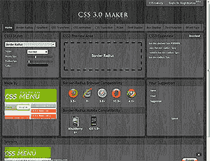
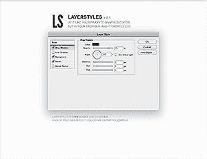
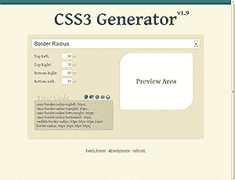
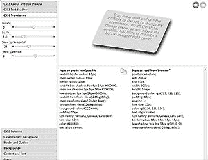
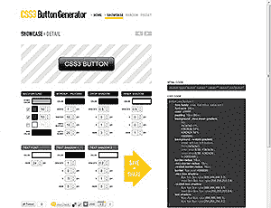
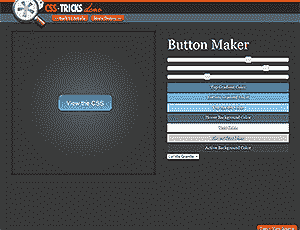
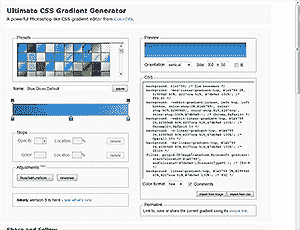

# 10 款最佳 CSS3 代码生成器

> 原文：<https://www.sitepoint.com/10-best-css3-code-generators/>

*这篇文章写于 2011 年，至今仍是我们最受欢迎的帖子之一。如果你渴望了解更多关于 CSS3 的知识，你可能会对这篇关于转换技术的文章很感兴趣。*

我对 CSS2.1 有着美好的回忆。圆角可能会导致数小时的 Photoshopping 悲伤，但这很简单。大多数开发商可以回忆起几十处房产，而不用每两分钟查阅一下参考书。

CSS3 改变了一切。有 116 个新属性*具有多个供应商前缀和不同的语法。没有人指望你记住所有东西。幸运的是，有一些免费的在线工具可以帮助你创建现代的 CSS3 代码并粘贴到你的样式表中…

## [CSS 3.0 制作者](https://css3maker.com/)

CSS 3.0 Maker 是一个神话般的工具。您可以通过调整几个滑块来定义框半径、渐变、文本阴影、框阴影、变换、过渡和旋转。预览区域显示结果，并指出哪些桌面和移动浏览器支持这些属性。

CSS 代码可以从 Codeview 框中复制并下载到一个演示该效果的 HTML 文件中。

## [LayerStyles.org ](http://layerstyles.org/)

Photoshop 用户会喜欢图层样式。CSS3 效果是使用图层样式对话框定义的，任何使用 Adobe 产品的人都会立即熟悉这个对话框。它简单、有逻辑性，使用起来很愉快。

可以从屏幕左下角的动态更新的“CSS 代码”查看器中复制代码。

## [CSS3 发生器](https://www.css3generator.com/)

CSS3 生成器使用类似向导的方法来定义样式。从各种效果中进行选择，包括边框半径、文本阴影、方框阴影、多列、变换和过渡。然后，完成几个框，将它们应用到预览元素。

CSS3 生成器突出显示了哪些浏览器和版本支持该效果，并在可能的情况下提供了特定于 IE 的过滤器代码。

## [CSS3 游乐场](https://css3.mikeplate.com/)

CSS3 Playground 由自由开发者[麦克·普拉特](https://www.mikeplate.com/)创建。除了支持一系列 CSS3 属性之外，它还是唯一一个允许你预览多个元素的效果并改变盒子内容的工具。太神奇了。

## [CSS3 按钮生成器](https://css3button.net/)

CSS3 效果可以生成没有图像的好看的按钮。CSS3 按钮生成器允许你使用向上/向下控件来调整字体、填充、边框、背景渐变、内部阴影、投影和文本阴影，这比滑块更容易也更合理。

除了提供跨浏览器的 CSS3 代码，该工具还允许您存储样式并与其他人共享。您可以浏览展示的按钮并调整属性以供自己使用。

## [CSS 花样按钮制作者](https://css-tricks.com/examples/ButtonMaker/)

Button Maker 由 [CSS Tricks](https://css-tricks.com/) 的 Chris Coyier 开发。虽然它的目的是作为一个技术演示，但这并不妨碍它对 CSS3 开发人员有用！

Button Maker 不支持一些更极端的 CSS3 属性，但它是唯一显示悬停效果的工具之一。

## [终极 CSS 渐变生成器](https://www.colorzilla.com/gradient-editor/)

如果推送，连我都能回忆起文字阴影属性。CSS3 渐变？没有机会。渐变可能很强大，但是它们很复杂，而且直到最近，webkit 浏览器还在使用不同的语法。除非你正在创建一个非常简单的背景，否则渐变生成器是必不可少的。

终极 CSS 渐变生成器是终极渐变生成器。它使用与 Photoshop 类似的界面，并创建包含 IE 过滤器的跨浏览器代码。最后，梯度可以保存和共享一个独特的链接。你一定会想把这个工具收藏起来。

我错过了你最喜欢的 CSS3 代码生成器吗？

* *新房产的数量完全是编造的。我不知道这是否正确，但听起来很合理。我怀疑会有人反驳…除非有哪个 CSS 学究有几个小时的空闲？*

## 分享这篇文章