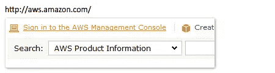
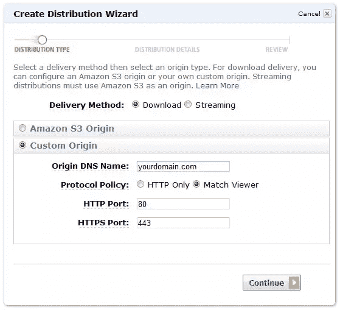

# 使用 CloudFront 实现动态图像交付

> 原文：<https://www.sitepoint.com/dynamic-image-delivery-with-cloudfront-2/>

图片会让 web 应用程序开发人员非常头疼，尤其是当你的应用程序允许用户上传自己的图片时。它们存在问题有两个原因:

**图像体积庞大**
与你存储的大多数其他类型的数据(除了视频)相比，图像占用的空间最大。

**图像需要调整大小**
出于美观和性能的原因，图像必须调整大小，以便在应用程序的不同部分使用。你需要图片的缩略图、标题、内嵌浮动和详细的缩放版本。

过去，我想出了各种办法来解决这个问题。我最初的解决方案是存储每张图片的 10 种不同大小，每张图片都是在上传时创建的。这工作得很好，但它是磁盘空间的杀手，它并不总是像我需要的那样灵活。如果我需要一个新的图像尺寸，我必须调整系统中每个现有图像的尺寸。多痛苦啊。

## 更好的解决方案

有了 CloudFront，就有了更好的方法。我将向您展示如何将它组合在一起，但首先我想向您展示您将如何使用它(这是有趣的部分，对吗？)

场景是这样的:你上传一张 1024 x 768 像素的图片到你的服务器上，名为“Penguins.jpg”。你想把这个图像作为一个 80 像素见方的缩略图，你该怎么做？


用原图显然不行。只是太大了。

使用我将演示的解决方案，您只需在源代码中引用以下 URL:

```

```


那很容易！只需在图像名称前加上“maxD_80”即可自动将其最长边的最大宽度缩小到 80 像素。

这没问题，但如果你想使用一个正方形缩略图作为背景图像，并且你想确保宽或高的图像没有空白的边缘呢？简单的解决方案:

```

```


现在我们正在谈话！使用“minD_80”而不是“maxD_80”会产生尽可能小的图像，但保持最小的边至少为 80 像素。现在看起来很完美！

## 酷…但是怎么做呢？

您会惊讶于解决方案是如此简单——这都归功于云计算。这是你需要的东西。

*   启用了 CloudFront 的 Amazon Web Services 帐户
*   运行 Apache 的 web 服务器(您也可以在 Windows 上做一些额外的工作)
*   一点点 PHP 技能(可以复制粘贴吗？)

## Web 服务器安装

目录:imagestore
首先在你的网站根目录下创建一个名为“imagestore”的目录。这是您将要存储所有“原始”图像的地方。您可以在该文件夹中随意组织它们。现在，放几个大的 jpg 文件在那里进行测试。

**。htaccess 文件**
中需要添加几行。网站根目录下的 htaccess 文件(如果不存在，只需创建该文件):

```
RewriteEngine On 
RewriteCond %{QUERY_STRING} (.*) 
RewriteRule ^([^/]*)/imagestore/(.*).(jpg|jpeg)$ image.php?format=$1&amp;path=imagestore/$2.$3
```

这段代码告诉服务器将对“imagestore”目录(或其任何子目录)中的 jpg 图像的任何请求发送到“image.php”文件(我们接下来将创建该文件)。

PHP 文件:image.php
在你的站点的根目录下创建这个文件。这个文件将完成处理格式化图像请求的所有工作。

## 代码

让我们一步一步来。为了简单起见，我们假设你所有的图片都是 jpg 格式。以下所有代码片段都可以在您刚刚创建的 image.php 文件中运行。

让我们从选择 querystring 变量(格式和路径)开始，这些变量是由我们之前添加到。htaccess 文件:

```
$path = $_GET['path'];
$formats = explode(',', $_GET['format']);
```

我们正在创建一个数组(使用 explode)。这将允许我们通过在 URL 中用逗号分隔每个命令，在单个图像上附带任意数量的格式化命令。

现在使用我们刚刚创建的$path 变量创建图像对象:

```
$image = imagecreatefromjpeg($path);
```

添加一些重要的标题。这些标题告诉浏览器，您提供的文件是一个 jpg 图像，它将过期时间设置为很久以后，因此浏览器会尽可能长时间地缓存该图像:

```
header("Content-Type: image/jpeg"); 
header("Cache-control: Public"); 
$headerTimeOffset = 60 * 60 * 24 * 30; 
$headeExpire = "Expires: ".gmdate("D, d M Y H:i:s",time()+$headerTimeOffset)." GMT"; 
header ($headeExpire);
```

接下来，我们将遍历之前创建的格式数组，并应用我们即将创建的图像格式化函数(formatImage)。

```
foreach ($formats as $format) { 
	$image = formatImage($format, $image); 
}
```

最后，输出图像并销毁对象:

```
imagejpeg($image, Null, 100); 
imagedestroy($image);
```

好吧…我们越来越接近了。让我们来看三个简单的函数，它们协同工作来获得我们想要的结果。我添加了一些评论，这样你可以浏览一下，看看发生了什么，但如果你只是想让它工作，你需要做的就是复制和粘贴:

```
// Translates commands (like maxD_80 or minD_40) from your URL
// into the correct resampling functions.
function formatImage($format, $image) {
	// Get the original image sizes.
	$curW = imagesx($image);
	$curH = imagesy($image);
	// Split the format into parts separeted by "_"
	$formatParts = explode("_", $format);
	switch ($formatParts[0]) {
		// If the format command is maxD, resize the image
		// so that the largest side is the specified
		// number of pixels ($formatParts[1])
		case "maxD":
			if ($curW &gt; $curH) {
				$ratio = $curH / $curW;
				$newW = (int) maxProtect($formatParts[1]);
				$newH = (int) (maxProtect($formatParts[1]) * $ratio);
			} else {
				$ratio = $curW / $curH;
				$newW = (int) (maxProtect($formatParts[1]) * ratio);
				$newH = (int) maxProtect($formatParts[1]);
			}
			$image = resizeImage($image, $newW, $newH);
			break;
		// If the format command is minD, resize the image
		// so that the smallest side is the specified
		// number of pixels ($formatParts[1])
		case "minD":
			if ($curW  800) $value = 800;
	return $value;
}
```

咻！我们完成编码了吗？是的。

## 测试时间到了

只需在 imagestore 文件夹中浏览您网站上的图像。现在，在您的 URL 中，添加带有 maxD 或 minD 命令的前缀。请记住，这些命令后面需要一个用下划线分隔的值。示例:maxD_55

**所以如果你的原始图片网址是这样的:**http://yourownwebsite.com/imagestore/Penguins.jpg

您的新网址将如下所示:【http://yourownwebsite.com/maxD_55/imagestore/Penguins.jpg 

## 云呢？

虽然通过简单地改变你的图片 URL 来动态地创建图片大小很有趣，但是就此打住是不现实的。调整图像大小是非常耗费处理器资源的，一直处理对所有图像的所有请求会让你的服务器陷入困境。

CloudFront 提供了一个极其简单的解决方案。它旨在允许您通过边缘位置的全球网络以低延迟轻松分发内容。换句话说，它会自动减轻服务器的负担，让您的内容离客户更近(在地理上)。

我们将使用 CloudFront 来保存已调整大小的图像的缓存版本，这样我们的服务器只需定期处理新大小的请求——而不是每次都需要服务。设置 CloudFront 非常简单:

首先登录到您的 Amazon Web Services 管理控制台:


在管理控制台中找到 CloudFront 选项卡，然后点击“创建分发版”:

会弹出创建分发版向导。您在此输入的内容非常重要。首先，选择“自定义原点”。在“原始 DNS 名称”中，输入托管 imagestore 目录和 image.php 文件的域名。在协议策略下，我建议选择匹配查看器。



您可以轻松浏览接下来的两个部分(分发详细信息和评论)。之后，您只需要等待大约 15 分钟，AWS 就会创建您的发行版。

一旦您创建了您的发行版，您将获得一个 DNS 名称来使用。它看起来像:abcdefg1234.cloudfront.net

现在是时候完成解决方案了。而不是创造这样的图像:


现在，您将像这样引用您的图像:

```

```

就这样，你完成了！现在，无论何时请求该图像，请求都会发送到 CloudFront。第一次请求映像时，CloudFront 将从您的服务器请求它。之后，它会将它保存在缓存中，并为新的请求立即提供它。当它过期时，它会再次从您的服务器请求它。

## 下一步是什么？

要让这个系统更好地为您的应用程序服务，您还有很多工作要做。这里有一些想法:

**处理 404s**

**处理其他图像格式**
设置系统处理 jpegs、png、gif 和您使用的任何其他图像格式。

添加更多滤镜
下面的完整例子包括我创建的一堆有用的滤镜，包括将你的图像转换成灰度和添加像素效果的例子。使用 php GD，您有许多可用的选项。查看 ImageMagick，了解更多操作图像的选项。

**水印、裁剪等等！**
这种类型的系统有如此多的可能性。很容易设置它添加一个水印到每张图像或裁剪图像到一个特定的大小比例。

**整合亚马逊 S3**
在你的服务器上存储原件开始还可以，但实际上你应该使用亚马逊 S3 或其他云存储服务来存储你的原件。进行这一更改可确保您永远不必担心备份或可扩展性。

**使用 cloudfront.net 域名的 CNAME**
不喜欢提供图片？没问题，你可以像 cdn.yourdomain.com 一样配置 CloudFront 使用你自己的域。

**增加安全性**
这种类型的系统允许人们“摆弄”你的图像。如果有人是恶意的，他们实际上可以使用这个系统真正陷入你的服务器(拒绝服务攻击)。你可以用许多不同的方法来防止这种情况。我最喜欢的方法是对图片 URL 的格式部分使用编码和加密。这增加了一点工作量，但是它阻止了人们无限制地请求无限大小的图像来访问您的服务器。还有很多其他的方法来防止滥用…最主要的是要记住你需要把一些东西放在适当的位置。

## 好好享受吧！

这个解决方案改变了我在 web 应用程序中使用图像进行设计和开发的方式。我再也不用担心图像大小和格式的刻板场景了。我可以在前端设计我想要的任何东西，我永远不用担心磁盘空间、性能或创建例程来批量转换图像。希望你会发现这个概念也很有用。

如果您对如何改进或增强该系统有任何建议，请在下面发表您的评论。当然，如果您有问题，请提问！

* * *

## 常见问题

**如果我需要访问我图像的原始版本，该怎么办？**
没问题！使用任意前缀即可。我喜欢用“o”代表原创。因此，我的原始图片网址将如下:
http://dynamiccdn.example.com/o/imagestore/Penguins.jpg

为什么我不能在图片后使用 querystring 变量来指定格式？
那会很酷…但是亚马逊 CloudFront 忽略了那些变量。

这个例子只适用于 jpg 文件。我更爱 pngs。怎么回事？？
为了使代码尽可能简单，这个例子只处理 jpg 文件。但是您可以调整脚本来处理您可能使用的任何图像格式。

**为什么你引用的图片以“//”开头，而不是“http://”?**
好问题。使用“//”强制 URL 引用与用户当前查看的页面相同的协议(http 或 https)。这真的很方便，可以防止一些浏览器弹出“不安全内容”的警告。

## 完整脚本示例

这是完整的 image.php 剧本。它包括许多额外的方便格式选项。整个事情不到 100 行代码！

```
$path = $_GET['path'];
$formats = explode(',', $_GET['format']);
$image = imagecreatefromjpeg($path);
header('Content-Type: image/jpeg');
header('Cache-control: Public');
$headerTimeOffset = 60 * 60 * 24 * 30;
$headeExpire = "Expires: " . gmdate ("D, d M Y H:i:s", time() + $headerTimeOffset) . " GMT";
header ($headeExpire);

foreach ($formats as $format) {
    $image = formatImage($format, $image);
}

imagejpeg($image, Null, 100);
imagedestroy($image);

function resizeImage($originalImage,$toWidth,$toHeight) {
    $width = imagesx($originalImage);
    $height = imagesy($originalImage);
    $imageResized = imagecreatetruecolor($toWidth, $toHeight);
    imagecopyresampled($imageResized, $originalImage, 0, 0, 0, 0, $toWidth, $toHeight, $width, $height);
    return $imageResized;
}

function formatImage($format, $image) {
    $curW = imagesx($image);
    $curH = imagesy($image);
    $formatParts = explode('_', $format);
    switch ($formatParts[0]) {
        case 'filterGray':
            #### Make it Grayscale
            imagefilter($image, IMG_FILTER_GRAYSCALE);
            break;
        case 'filterBlur':
            #### Blur It Up
            imagefilter($image, IMG_FILTER_GAUSSIAN_BLUR);
            break;
        case 'maxD':
            #### Maximum Either Dimension - maxD_100
            if ($curW &gt; $curH) {
$ratio = $curH / $curW;
$newW = (int) maxProtect($formatParts[1]);
$newH = (int) (maxProtect($formatParts[1]) * $ratio);
            } else {
$ratio = $curW / $curH;
$newW = (int) (maxProtect($formatParts[1]) * ratio);
$newH = (int) maxProtect($formatParts[1]);
            }
            $image = resizeImage($image, $newW, $newH);
            break;
        case 'minD':
            #### Minimum Smallest Dimension - maxD_100
            if ($curW  800) $value = 800;
    return $value;
}
```

图片来自马克·迪特里希 / [摄影爱好者](http://shutterstock.com)

## 分享这篇文章