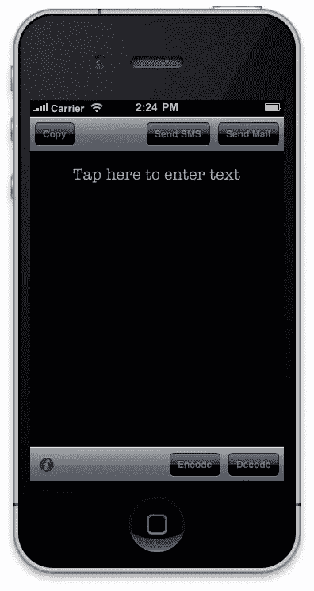
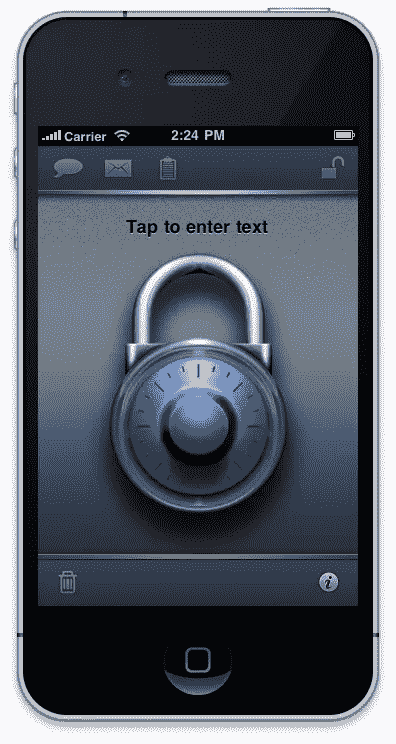

# 特色应用:秘密

> 原文：<https://www.sitepoint.com/featured-app-secret/>

我对密码很着迷。西蒙·辛格写了一本关于密码破解的巨著，名为《密码本:从古埃及到量子密码术的秘密科学》。这本书充满了历代人们用来隐藏秘密信息的不同编码方法。这本书启发了我想做的一个应用程序——允许你从大量的方法中选择一种编码方法，并对一条消息进行编码，以便另一个接收到该消息的人可以对其进行解码(用正确的密钥)。我甚至为这种应用取了一个名字:“解码环”——基于 20 世纪初放入圆环的简单循环替代密码，主要用于孩子们相互写秘密消息。

我的商业伙伴 Elroy——一位才华横溢的平面艺术家，也有其他技能——和我一直在寻找一个新的合作项目。我向 Elroy 提出了这个想法，并建议他可以开始考虑这个应用程序的图形设计，我将开始构建它。Elroy 和我讨论了界面和应用程序的一些功能，但我们也忙于其他许多事情，所以直到我们最初的讨论结束近一年后，我们才真正开始取得进展。

## 目标

我使用 Objective-C 编写 Mac 应用程序已经很多年了，所以 Objective-C 对我来说并不陌生。此外，Elroy 和我已经开发了一段时间的 iPhone 象棋应用程序(它从未出现过)，所以 iPhone 开发对我们来说并不新鲜。我们还合作开发了一款有趣的小 iPhone 应用程序，名为[“倒立”，已经在 App Store](http://itunes.apple.com/br/app/id354900325?mt=8) 上架。

发展开始了。对于那些了解 Objective-C 基础知识的人，我首先在 NSString 上创建了一个 Objective-C 类别——它将扩展 NSString，允许您使用密码和加密方法对字符串进行编码和解码。我决定的第一个解决方法是 [Vigenère 密码](http://en.wikipedia.org/wiki/Vigen%C3%A8re_cipher)——一种来自 16 世纪的有趣而聪明的密码。我很快就为此编写了代码，基本的应用程序在几天内就完成了。它只有一种编码方法，没有图形或图标。你输入了一条信息。你按了编码。你输入了密码。你在屏幕上看到了编码信息。你是通过电子邮件或短信发送的。

[](https://www.sitepoint.com/wp-content/uploads/2011/08/first-version.jpeg)

## 测试

当我开始研究其他加密方法时，一些问题暴露了出来。当向朋友演示原始软件时，很明显大多数人对历史上所有不同类型的加密方法都不感兴趣。他们只想给别人传递一个秘密信息。他们不想知道细节，只知道消息是安全的。虽然我认为多种方法的想法非常酷，但显然只有热爱密码的极客才会感兴趣。所以我们不得不重新思考。

## 研究

Vigenère 密码不是特别安全，但就简单的编码方法而言，还不算太差。但是它有一个主要的缺陷——它只适用于罗马字母表。我意识到的一件事是，用日语打字没用。你也不能在 iPhone 上输入表情符号。这在很大程度上只适用于英语字母表。它对数字也不起作用。突然间，这种方法似乎不是一个很好的选择。

那不会解决问题的。Elroy 和我已经决定，我们不仅要做一个伟大的、简单的、漂亮的、实用的应用程序，而且我们希望它能在非英语语言中工作，并且最初为界面本身提供大量的语言选择。我们住在澳大利亚的墨尔本，这是一个多元文化的社会。我们有来自世界各地的朋友，他们会帮助我们的应用程序国际化。

人们说，在 iPhone 上开发成功的应用程序的方法是从简单的东西开始，然后“润色它”。这就是我们决定要做的。

我回到绘图板，研究加密方法。与其用旧的，我决定用新的。我选择了[高级加密标准](http://en.wikipedia.org/wiki/Advanced_Encryption_Standard)——美国政府采用的对称密钥加密标准，密钥为 128 位。这将更安全地加密信息，并适用于任何文本，而不仅仅是英语。它速度很快，完全符合我们的需求。

## 测试

早期的研究表明，大多数用户不想在选择编码方法上浪费时间，这意味着该应用的重点从编码转移到更安全地将信息发送给朋友。随着这种转变，我们开始觉得“解码器环”这个名字不太合适，所以埃尔罗伊开始致力于用户界面设计，我们更倾向于“安全”或“安全”去掉多种编码方法的概念也意味着 UI 需求得到了极大的简化。

## 用户界面

因此，Elroy 开始研究应用程序的外观和感觉。他制作了图片并发送给我，我给出了反馈，我们反复讨论，直到我们有了一个我们认为最适合这个应用程序的外观。我们最终决定在 UI 中使用挂锁和金属纹理，来代表力量和安全。纸质打印样式的文本区域保持了我们认为合适的老派间谍技术的感觉。我们还决定让用户界面尽可能无文本，而不是依赖(希望)直观的图标来实现删除、短信、电子邮件、剪贴板等功能。埃尔罗伊致力于图标和图形，并建议显示文本的方法。

[](https://www.sitepoint.com/wp-content/uploads/2011/08/final-release.jpeg)

## 本地化

通过使用 Apple 的本地化方法，应用程序中显示给用户的所有字符串都放在一个文件“Localizable.strings”中。要本地化一种不同的语言，您只需获取文件，用另一种语言替换文本，并告诉 Xcode 新文本代表哪种语言。对于日语，该文件以如下代码结束:

```
/* Dialog buttons */  

"OK" = "OK";  
"Cancel" = "キャンセル";  

/* Encode dialog */  

"Encoding Key" = "暗号化パスワード";  
"Enter key to encode message." = "パスワードを入力。";
```

在很短的时间内，我们实现了英语、法语、日语、马来语、印度尼西亚语、韩语、中文、西班牙语、意大利语和希腊语的本地化。iPhone 负责显示用户语言的正确文本。

## 用户界面

Elroy 希望加密后的文本不仅能在屏幕上改变，还能以某种方式显示出来。我们实验了几个动画。我们尝试的一个动画是把纸从屏幕上撕下来，然后一条新的加密信息滚下页面。虽然很酷，但这感觉不太对，最后我们使用了当前的动画，页面被收回，然后加密返回。这个动画的目的是在将用户发送到手机的短信或电子邮件客户端之前，向用户表明应用程序正在运行，而不是简单地在没有警告的情况下将他们踢出应用程序。我们还添加了一些简单的音效(可以选择关闭)。我们真的打磨了界面，直到它看起来和感觉都很棒。

## 测试

对于所有的软件来说，花费时间最多的领域之一(通常被低估)就是测试。该应用程序有 10 种语言，必须经过大量志愿者的彻底测试，以确保它按预期工作，并正确显示文本。经常会做一些小的调整，然后一个新的版本会被发送出去测试。同时，我们需要为应用程序取一个名字。每个人都有一个建议——“解码器”、“编码器”、“SecretKeeper”、“TalkSecret”、“Enkrypt”。我们想要简单的东西——一个单词——当我检查并发现“Secret”这个名字仍然可以在 iTunes 应用商店中使用时，我们感到惊讶。我们很快向苹果注册了它，以确保在我们完成图形时没有其他人使用它。

## 释放；排放；发布

最后，我们决定软件可以发布了。

可惜苹果不这么想。嗯，实际上不是苹果，是美国政府。你看，根据美国政府的规定，我们选择使用的加密方法是不可出口的。他们认为它太强了。这意味着软件需要改变。

因此，在最后一分钟进行了更改，使用 64 位密钥的数据加密标准。这是美国政府允许的极限。

现在，一些读到这里的人可能会想，为什么美国政府说什么很重要？在欧洲他们没有这种限制，所以为什么欧洲人不能有更强的加密？

问题是，即使我们把软件交付给欧洲人，它也是从苹果在美国的服务器上下载的。所以美国政府说了算。我们本可以向美国政府要求一个例外，但这将涉及我们把所有的源代码送到美国政府检查，然后等待一个潜在的长时间的回应。最后还是用 DES 比较容易。大多数人会说，对于这个应用来说，这已经足够安全了。

## 学习

最后一分钟的改变实际上产生了一个 bug，这个 bug 在一段时间后被修补了。这就是最后一分钟更改的麻烦所在——测试没有发现错误。但最终这个问题被解决了,《秘密》从 2011 年 1 月开始发布，反馈非常积极。有趣的是，它在日本非常受欢迎，这向其他开发者表明，花时间进行国际化是有回报的。

**App** : [秘密](http://itunes.apple.com/lv/app/secret/id405805873?mt=8)

## 分享这篇文章