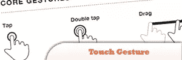
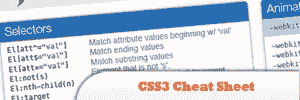
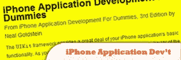
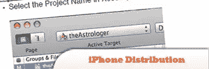
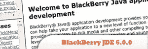
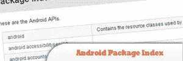

# 用于移动开发的 10 个移动备忘单

> 原文：<https://www.sitepoint.com/10-mobile-cheat-sheets-iphone-android-blackberry-app-development/>

In this post we have rounded up a selection of useful cheat sheets, references, quick recipes and code snippet resources specifically for Android, Blackberry and iPhone app development. No developer should work without these.

## 1.触摸手势参考指南(PDF)

一组独特的资源，面向从事基于触摸的用户界面的软件设计人员和开发人员。

来源

## 2.W3C 移动网络最佳实践(MWBP) Flipcards (PDF)

总结移动网络最佳实践 1.0 文档。这些翻页卡片是对说明书

[来源](https://www.w3.org/2007/02/mwbp_flip_cards.html)

中详细解释的六十条准则的有用提醒

## 3.CSS3 备忘单(PDF)

来源

## 4.硬汉 CSS3 媒体查询(HTML)

来源

## 5.面向傻瓜的 iPhone 应用程序开发备忘单(HTML)

来源

## 6.iPhone 发行版本备忘单(PDF)

来源

## 7.黑莓 Java SDK 快速参考指南(PDF)

来源

## 8.BlackBerry JDE 6.0.0 API 参考(HTML)

来源

## 9.Android 食谱和片段(HTML)

来源

## 10.Android 包索引(HTML)

来源

## 分享这篇文章